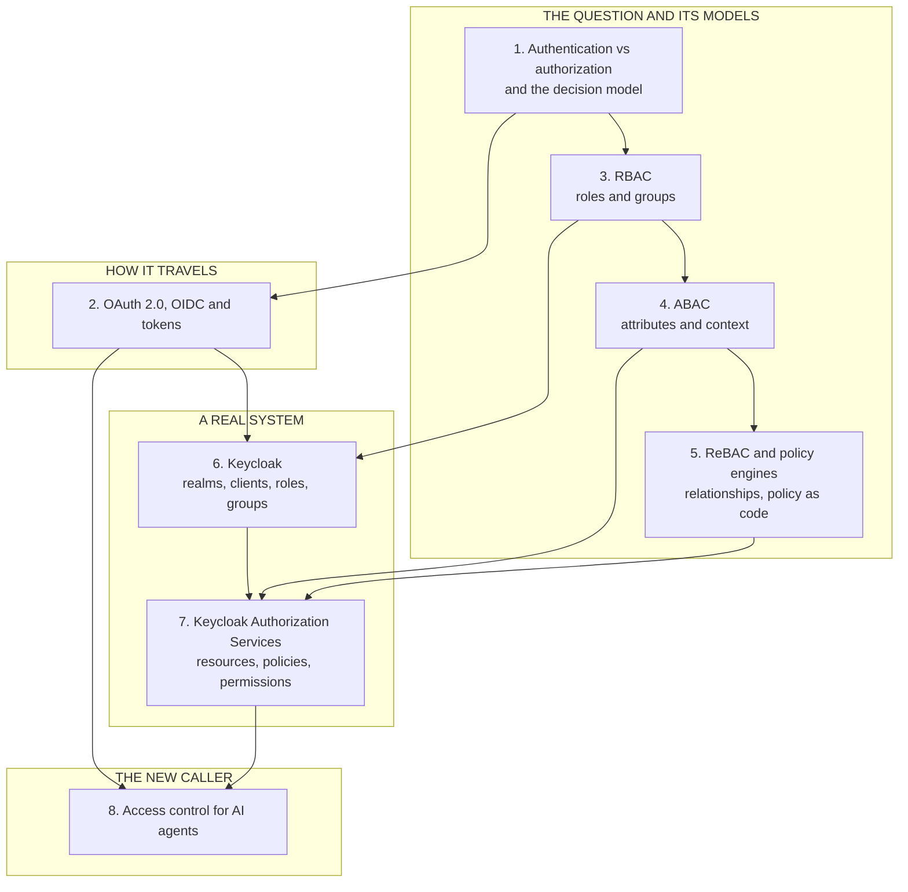

# Access control for the technical PM

*A standalone module: RBAC, ABAC, relationship-based access, and Keycloak.*

Every product answers one question thousands of times a day: **may this person do this to that, right now?** Get it wrong in one direction and users cannot work. Get it wrong in the other and one user reads another's data. The login can be perfect while the check is missing.

This module teaches the models for answering that question, and a real identity server, Keycloak, that puts them into practice. It is written for technical product managers and for engineers who work with them. Each lesson has a plain-language body for decisions, and an "Under the hood" section for the mechanism.

**A note on scope.** Nothing else in this curriculum teaches these models. Neighbouring lessons cover pieces of the topic for specific settings.
[Tool permissions, blast radius & the trust boundary](../tool-calling/permissions-blast-radius-and-the-trust-boundary.md) covers what an AI tool may do.
[Memory: session, user & organizational](../memory-and-context/session-user-and-organizational-memory.md) covers boundaries for memory.
[Multi-tenant isolation](../content/05-safety-multitenancy/multi-tenant-isolation.md) covers keeping tenants apart. This module supplies the models underneath them. It stays at the decision level and shows the mechanism where it helps.

The Keycloak lessons were checked by running Keycloak 26.7.5 locally. Where a claim comes from that run, the lesson says so. The Cedar and Rego examples were run too. Standards and some vendor pages could not be opened from the build environment, and the lessons label those claims.

## Where the depth lives

| If you want the full depth on | Read |
| --- | --- |
| What an AI tool may do, and tiers of risk | [Tool permissions, blast radius & the trust boundary](../tool-calling/permissions-blast-radius-and-the-trust-boundary.md) |
| Prompt injection and defences | [Safety, security & governance](../agentic-ai/safety-security-and-governance.md) |
| Keeping tenants apart | [Multi-tenant isolation](../content/05-safety-multitenancy/multi-tenant-isolation.md) |
| Run limits, approval gates and the kill switch | [Running an agent in production](../ai-agents/running-an-agent-in-production.md) |
| Memory boundaries and deletion | [Memory & context](../memory-and-context/README.md) |
| The wider security instincts | [Security & privacy sense](../technical-product-sense/security-and-privacy.md) |
| HTTP and API basics under tokens | [The request-response contract](../api-integrations/the-request-response-contract.md) |

## The knowledge graph

Read it in four passes. **The models:** how to decide, and which model fits. **How it travels:** how identity and permissions cross systems as tokens. **A real system:** how Keycloak implements both. **The new caller:** why an AI agent needs the same rules, with less trust.

## The lessons

- [**Authentication, authorization and the access-control model**](./authentication-authorization-and-the-access-control-model.md) — the one question every system answers, and the four parts that answer it.
- [**OAuth 2.0, OpenID Connect and tokens**](./oauth-openid-connect-and-tokens.md) — delegation, login, the three tokens, and what an API must check.
- [**RBAC: roles, groups and where it breaks**](./rbac-roles-groups-and-where-it-breaks.md) — the default model, and role explosion.
- [**ABAC: deciding with attributes and context**](./abac-deciding-with-attributes-and-context.md) — rules over facts, and the cost of trusting attributes.
- [**ReBAC and policy engines**](./rebac-and-policy-engines.md) — sharing as a graph, and policy as code with OPA and Cedar.
- [**Keycloak: realms, clients, roles, groups and tokens**](./keycloak-realms-clients-roles-groups-and-tokens.md) — the parts, what a real token carries, and what running it costs.
- [**Keycloak Authorization Services**](./keycloak-authorization-services.md) — resources, scopes, policies and permissions, with real decisions.
- [**Access control for AI agents**](./access-control-for-ai-agents.md) — the agent carries the user's authority and no more.

Each lesson has a **🎯 For the technical PM** briefing, a labelled worked example, an "Under the hood" section for engineers, and a Sources list.

**📌 Close out the module:** [Recap & real-world examples](./recap.md), which ends with a self-test.
