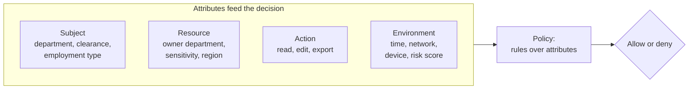

# ABAC: deciding with attributes and context

*Part of [Access control for the technical PM](./README.md)*

*Last reviewed: 2026-10 · Volatility: stable*

## TL;DR

**Attribute-based access control (ABAC)** decides each request by looking at facts. The facts are attributes of the person, the object, the action and the situation. A rule might say: "A user may edit a report if the report's department equals the user's department, and the request comes during working hours."

NIST defines ABAC as a method where authorization is decided "by evaluating attributes associated with the subject, object, requested operations, and, in some cases, environment conditions against policy, rules, or relationships."

ABAC fixes the two weaknesses of roles. It can talk about a specific object, and it can use context. It costs more. Every attribute must be accurate, every rule must be understood, and a "why was I denied?" question needs an answer.

> 🎯 **For the technical PM**
>
> **Why it matters** — Most real requirements are about objects and conditions: your own records, your region, your clearance, a managed device. Roles alone cannot express them, so teams invent more roles or hard-code the rules.
>
> **What it changes in your decisions** — You decide which attributes you will trust and who keeps them correct. You also decide who can read and change the rules.
>
> **Ask yourself** — *"For each attribute a rule depends on, who sets it, how fresh is it, and what happens when it is missing?"*
>
> **Risk if ignored** — A rule trusts an attribute that users can edit themselves. Or an attribute is empty for a new user and the rule quietly allows everything.

## The mental model: four bags of attributes



A policy is a set of rules over these attributes. Here is one in words:

> Allow **edit** on a **report** if `subject.department == report.department` **and** `report.sensitivity <= subject.clearance`.

No role is named. The same rule covers every department, present and future.

## RBAC and ABAC side by side

| Question | RBAC | ABAC |
| --- | --- | --- |
| Basis | Role held by the user | Attributes of user, object, action, context |
| "Only your own department's records" | Needs one role per department | One rule |
| "Only during working hours" | Cannot say | One condition |
| Easy to explain | Yes | Depends on the rule |
| Easy to audit "who can do X?" | Yes, list the role holders | Harder, you must evaluate the rules |
| Debugging a denial | Check the role | Check every attribute used |
| Best for | Stable jobs, coarse access | Object and context limits |

Most real systems use both. Roles give coarse access. Attributes narrow it. A common pattern is "must be an editor **and** must be in the same department."

## What attributes are worth using

Good attributes are accurate, owned and hard for the user to forge.

- **Subject:** department, region, employment type, clearance. These come from an HR or identity system.
- **Resource:** owner, sensitivity label, department, region. These come from the data itself.
- **Action:** read, create, edit, delete, export.
- **Environment:** time of day, network zone, device compliance, a risk score.

A rule is only as good as the weakest attribute in it. If a user can edit their own `department` on a profile screen, a rule built on it is open.

## Worked example: the same rule, two ways

*This example is invented, to show the method.*

Requirement: "Editors may edit reports only in their own department. Only the finance department may delete reports."

**With roles only:**

| Role | Allows |
| --- | --- |
| `editor-finance` | Edit finance reports |
| `editor-support` | Edit support reports |
| `editor-legal` | Edit legal reports |
| `finance-deleter` | Delete reports |

A new department means a new role. A person who moves needs a role swapped. The role list grows with the org chart.

**With roles plus attributes:**

| Role | Rule |
| --- | --- |
| `editor` | Edit a report where `report.department == user.department` |
| `editor` | Delete a report where `user.department == "finance"` |

Two rules cover every department. A new department needs only new data, not new policy. A person who moves just has a new `department` attribute.

The cost is real. The team must make sure `department` comes from a trusted source, that it is present for every user, and that a test covers the case where it is missing.

## A test of this on a real system

*This note reports a local test against Keycloak 26.7.5 on 2026-10-01.*

The test set a custom `department` attribute on two users through the admin API. The attribute did not appear in their tokens at first. Keycloak's documentation explains why. By default it "will only recognize the attributes defined in your user profile configuration" and "the server ignores any other attribute not explicitly defined there." After the attribute was declared in the user profile, and a mapper added to the client, `department` appeared in the token as `"finance"` for one user and `"support"` for the other.

Lesson for a PM: an attribute is a managed field with a schema, an owner and a way into the token. It is not free text on a user. Treat adding an attribute like adding a column to a table that security depends on.

In the same test, Keycloak's built-in regex policy matched `^finance$` against the `department` claim. The finance user was allowed to delete a report. A support user and an editor with no department were denied. See [Keycloak Authorization Services](./keycloak-authorization-services.md).

## Tradeoffs

- **Expressive vs. explainable.** Rich rules fit real needs. Many rules together become hard to reason about.
- **Central vs. local attributes.** Pulling attributes from one source keeps them consistent. It adds a dependency and a lookup.
- **Fresh vs. cached.** Fresh attributes are accurate and slower. Cached ones can be stale after a change.
- **Policy in code vs. policy as data.** Code is easy to start. A policy language is easier to review and test across services. See [lesson 5](./rebac-and-policy-engines.md).

## Failure modes

- **Forgeable attributes.** Users or partner systems can set the attribute a rule trusts.
- **Missing attribute treated as allow.** A new user has no `department`, and the rule passes.
- **Stale attributes.** A person moves teams and keeps the old access until the cache expires.
- **Rule sprawl.** Hundreds of overlapping rules, with no test that says what should be denied.
- **No decision log.** A denial cannot be explained, so support cannot help.
- **Attribute drift between systems.** HR says "Finance." The app says "finance." The rule compares exact strings.

## Under the hood

An ABAC decision is a function over four inputs. This sketch is illustrative. Note the default and the missing-attribute handling.

```python
def decide(subject, action, resource, env):
    # Rule 1: editors edit reports in their own department.
    if action == "edit" and resource.type == "report":
        if "editor" in subject.roles:
            dept = subject.attrs.get("department")
            if dept is None:
                return Deny("subject has no department")        # missing attribute = deny
            if dept == resource.attrs.get("department"):
                return Allow("same department")
    # Rule 2: only finance may delete reports.
    if action == "delete" and resource.type == "report":
        if subject.attrs.get("department") == "finance":
            return Allow("finance may delete")
    # Environment condition example.
    if env.get("device_compliant") is False:
        return Deny("unmanaged device")
    return Deny("no rule matched")                                # default deny
```

Four habits matter.

- **Return a reason with every decision.** It powers the audit log and the "why was I denied?" screen.
- **Treat a missing attribute as a deny.** Never as an allow.
- **Test the denials.** Write the cases where the rule must say no.
- **Keep attribute names and values controlled.** Use a list of allowed values, not free text.

## Practitioner checklist

- [ ] For each attribute in a rule, do we know who sets it and whether a user can change it?
- [ ] Is a missing attribute a deny?
- [ ] Is the default "deny" when no rule matches?
- [ ] Does every decision return a reason we can log and show?
- [ ] Do we have tests for the denials, not only the allows?
- [ ] Do attribute values come from controlled lists?
- [ ] Do we know how stale an attribute can be, and is that acceptable?
- [ ] Can we answer "who can edit this report?" without running every rule by hand?

## Related lessons

- [RBAC: roles, groups and where it breaks](./rbac-roles-groups-and-where-it-breaks.md) — the model ABAC extends.
- [ReBAC and policy engines](./rebac-and-policy-engines.md) — relationships, and keeping policy as code.
- [Keycloak Authorization Services](./keycloak-authorization-services.md) — policies, permissions and a regex rule on a claim.
- [Memory: session, user & organizational](../memory-and-context/session-user-and-organizational-memory.md) — scoping data by user and organization, with attribute checks in the store.

## Sources

- NIST, Special Publication 800-162, *Guide to Attribute Based Access Control (ABAC) Definition and Considerations* (Jan 2014): the quoted definition and the four kinds of attribute. The NIST page could not be opened when this lesson was written. The text is from search-result excerpts of the publication.
- Keycloak documentation source, *Unmanaged attributes* (`server_admin/topics/users/user-profile.adoc`, main branch): the quoted sentences on undeclared attributes. Checked 2026-10.
- The attribute and regex-policy behaviour comes from a local test against Keycloak 26.7.5 on 2026-10-01. The two-way comparison, the roles and the code sketch are invented and illustrative.
