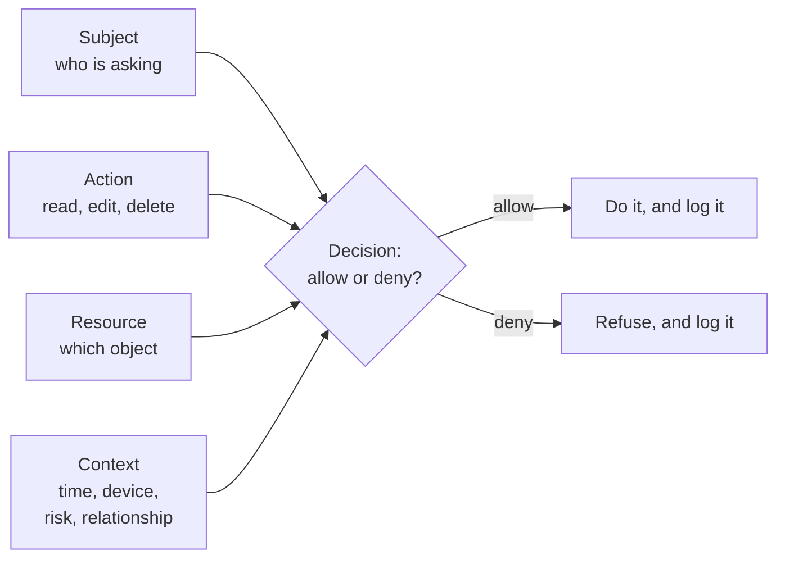
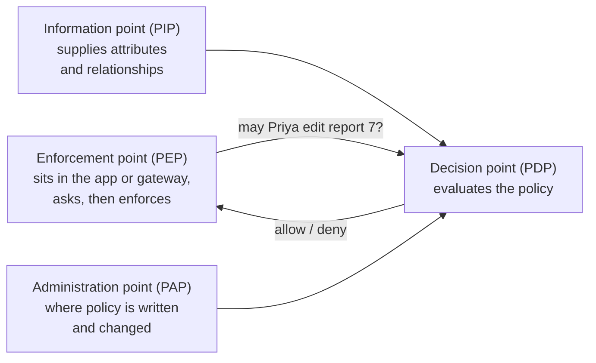

# Authentication, authorization and the access-control model

*Part of [Access control for the technical PM](./README.md)*

*Last reviewed: 2026-10 · Volatility: stable*

## TL;DR

Two questions guard every system. **Authentication** asks "who are you?" **Authorization** asks "what may you do here?" They are different jobs. A product can get the first right and the second wrong, and that is a common way data leaks happen.

Authorization is one decision, asked many times. Can this **subject** perform this **action** on this **resource**, in this **context**? Every access-control model, from a simple role to a policy engine, is a way to answer that question.

Four rules apply to all of them. Deny by default. Grant the least access that works. Decide on the server, never in the client. Log every decision.

> 🎯 **For the technical PM**
>
> **Why it matters** — Access control is a product feature. It sets who can see what, who can share, and who can be blamed. It is also expensive to change once customers depend on it.
>
> **What it changes in your decisions** — You specify permissions like any other behaviour: who, what, on which objects, under which conditions. You do not leave it to "whatever the framework does."
>
> **Ask yourself** — *"For our most sensitive object, can we say exactly who may read it, who may change it, and where that rule is enforced?"*
>
> **Risk if ignored** — A user reads or changes another user's data by editing an id in a request. The login worked. The check was missing.

## The mental model: one question, four parts

Every access request has the same shape.



The models in this track differ in what they put into the decision.

| Model | The decision uses | Covered in |
| --- | --- | --- |
| RBAC (role-based) | The subject's roles | [Lesson 3](./rbac-roles-groups-and-where-it-breaks.md) |
| ABAC (attribute-based) | Attributes of subject, resource, action and context | [Lesson 4](./abac-deciding-with-attributes-and-context.md) |
| ReBAC (relationship-based) | The path of relationships between subject and resource | [Lesson 5](./rebac-and-policy-engines.md) |

## Authentication is not authorization

**Authentication** proves an identity. A password, a passkey, or a login with a company account all do this. The result is a verified subject, such as a user id.

**Authorization** uses that identity to decide. It needs the action and the resource as well. A verified user is not a permitted user.

| | Authentication | Authorization |
| --- | --- | --- |
| Question | Who are you? | What may you do? |
| Output | A verified identity | An allow or deny |
| Happens | Once per session, roughly | On every request |
| Typical failure | Weak login, stolen credential | Missing check, wrong rule |

Teams often build the first carefully and the second by habit. The OWASP Top 10 ranked broken access control first in its 2021 edition, and it is still ranked first in the 2025 edition. It is the failure that survives a good login.

## The four parts of an authorization system

The NIST guide to attribute-based access control describes a common reference architecture. The same four parts appear in many systems, whatever the model.



- **Policy enforcement point (PEP).** The code that stops or allows the request. It lives next to the resource.
- **Policy decision point (PDP).** The logic that returns allow or deny. It can be code in your app, or a separate service.
- **Policy information point (PIP).** The source of facts the decision needs, such as a user's department or a document's owner.
- **Policy administration point (PAP).** Where people write and review the rules.

Why this matters to a PM: each part has an owner and a failure mode. The PEP can be missing from one endpoint. The PDP can be slow. The PIP can be stale. The PAP can be edited without review.

## Four rules that hold in every model

1. **Deny by default.** If no rule says yes, the answer is no. A new endpoint should be locked until someone opens it.
2. **Least privilege.** Give each subject the smallest access that lets it do its job. Review it as jobs change.
3. **Enforce on the server.** Hiding a button is not a control. The check must run where the data lives.
4. **Log every decision.** Record who, what, which object, and the result. You need it for audits and for incidents.

## Worked example: the missing check

*This example is invented, to show the method.*

A team builds a billing portal. Login works. After login, the page loads invoices from a URL like `/invoices/4821`.

| Step | What happens | Authentication | Authorization |
| --- | --- | --- | --- |
| 1 | Maya logs in | Verified as Maya | Not asked |
| 2 | Maya opens `/invoices/4821`, her own | Verified | App checks the invoice belongs to Maya's account. Allowed. |
| 3 | Maya edits the URL to `/invoices/4822` | Still verified as Maya | **No check.** The server returns another customer's invoice. |

The fix is a rule in the PEP: "a user may read an invoice only if the invoice's account matches the user's account." The team also adds a test that tries step 3 and expects a denial. Without that test, the gap returns the next time someone adds an endpoint.

## Tradeoffs

- **Central or local decisions.** One decision service gives one place to audit and change. It adds a network call and a dependency. Local checks are fast and scattered.
- **Coarse or fine rules.** Coarse rules are easy to understand. Fine rules match real needs and cost more to manage.
- **Strict or convenient.** Tight access protects data and slows people down. Loose access ships faster until the first incident.
- **Stateless or fresh.** Roles inside a token are cheap to check. They can be out of date until the token expires.

## Failure modes

- **Authentication mistaken for authorization.** "They are logged in" is treated as "they may do this."
- **Client-side enforcement.** The interface hides a button, and the API behind it is open.
- **Missing check on one endpoint.** The rule exists in nine places and is absent in the tenth.
- **Default allow.** New features ship open because nobody wrote a rule.
- **No audit trail.** After an incident nobody can say who accessed what.
- **Permission drift.** People change jobs and keep old access.

## Under the hood

An enforcement point is a small function that asks and then acts. This sketch shows the shape. It is illustrative, not a library.

```python
def require(subject, action, resource, context=None):
    decision = pdp.check(subject=subject, action=action,
                         resource=resource, context=context or {})
    audit.write(subject=subject.id, action=action,
                resource=resource.id, allowed=decision.allowed,
                reason=decision.reason)            # log allows AND denies
    if not decision.allowed:
        raise Forbidden()                           # deny is the default path
    return decision

def get_invoice(user, invoice_id):
    invoice = db.get_invoice(invoice_id)
    require(user, "read", invoice)                  # check BEFORE returning data
    return invoice
```

Three habits keep this honest.

- **Check after loading the object, before returning it.** The decision often needs the object's owner or tenant.
- **Make the safe path the easy path.** A framework that denies unless a rule matches beats a code review that hopes to catch a gap.
- **Test the denial.** For each sensitive endpoint, a test that expects "forbidden" for the wrong user.

## Practitioner checklist

- [ ] Can we state, for each sensitive object, who may read, change and delete it?
- [ ] Is every decision enforced on the server, on every endpoint?
- [ ] Is the default "deny," so a new endpoint starts locked?
- [ ] Do we know where the decision point lives, and who owns each of the four parts?
- [ ] Are decisions logged, including denials?
- [ ] Is there a test for the wrong-user case on each sensitive endpoint?
- [ ] Do we review access when someone changes role?

## Related lessons

- [OAuth 2.0, OpenID Connect and tokens](./oauth-openid-connect-and-tokens.md) — how identity and permissions travel between systems.
- [RBAC: roles, groups and where it breaks](./rbac-roles-groups-and-where-it-breaks.md) — a model many teams start with.
- [Tool permissions, blast radius & the trust boundary](../tool-calling/permissions-blast-radius-and-the-trust-boundary.md) — the same ideas applied to what an AI tool may do.
- [Multi-tenant isolation](../content/05-safety-multitenancy/multi-tenant-isolation.md) — keeping tenants apart.
- [Security & privacy sense](../technical-product-sense/security-and-privacy.md) — the wider security instincts.

## Sources

- NIST, Special Publication 800-162, *Guide to Attribute Based Access Control (ABAC) Definition and Considerations* (Jan 2014): the enforcement, decision, information and administration points, and the subject, object, action and environment attributes. The NIST page could not be opened when this lesson was written. It is described from search-result excerpts.
- OWASP, *Top 10:2021* and *Top 10:2025*, A01 Broken Access Control: ranked first in both editions. The 2025 edition's A01 page says Broken Access Control "maintains its position at #1" (OWASP Top10 repository on GitHub, read by an independent reviewer). Check the current edition.
- The billing portal scenario and the code sketch are invented and illustrative.
