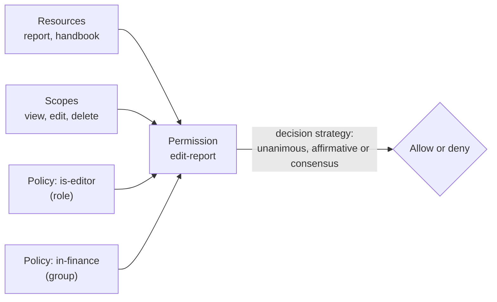

# Keycloak Authorization Services

*Part of [Access control for the technical PM](./README.md)*

*Last reviewed: 2026-10 · Volatility: fast*

## TL;DR

Roles in a token answer coarse questions. **Keycloak Authorization Services** answers finer ones: "May this user *edit* this *report*?" It lets you describe protected **resources** and the **scopes** (actions) on them, write **policies** (conditions), and bind them with **permissions**. Keycloak then decides.

It is a policy decision point built into the identity server. It can do role-based rules, and attribute-style rules through claim, group and time policies. It does not replace a full policy engine for complex cases.

This lesson explains the pieces and shows real decisions from a test on Keycloak 26.7.5. It also says when to use it and when to put the decision somewhere else.

> 🎯 **For the technical PM**
>
> **Why it matters** — If you already run Keycloak, its authorization services let you centralise "who may do what to which object" without a second system. That is attractive. It also ties your permission model to your identity server.
>
> **What it changes in your decisions** — You decide whether fine-grained rules live in Keycloak, in your application, or in a separate engine. You also choose how an application asks Keycloak, and what happens when Keycloak is slow or down.
>
> **Ask yourself** — *"If we put object-level rules in Keycloak, how many of our services will depend on it for every request, and what do we do when it is unreachable?"*
>
> **Risk if ignored** — Rules spread across Keycloak policies and application code. Nobody can say which decides what. Keycloak becomes a hot path with no failure plan.

## The mental model: resources, scopes, policies, permissions

Keycloak's documentation defines the vocabulary.

| Term | Definition in the docs | In plain words |
| --- | --- | --- |
| **Resource server** | "the server hosting the protected resources and capable of accepting and responding to protected resource requests" | Your API, registered as a Keycloak client |
| **Resource** | "part of the assets of an application and the organization" | The thing protected: a report, a handbook |
| **Scope** | "a bounded extent of access that is possible to perform on a resource" | The verbs: view, edit, delete |
| **Policy** | "defines the conditions that must be satisfied to grant access to an object" | A condition: "is an editor", "in Finance" |
| **Permission** | Associates a protected object with policies: X can do Y on resource Z | The binding of what to which conditions |



## Policy types

In the test, Keycloak 26.7.5 offered these policy types out of the box: **role**, **group**, **user**, **client**, **client scope**, **time**, **regex**, **aggregate**, plus resource-based and scope-based permission types. A script-based (JavaScript) policy was **not** available by default.

| Policy type | Decides on | Use for |
| --- | --- | --- |
| Role | Roles the user holds | RBAC rules |
| Group | Group membership | "Members of Finance" |
| User | A named user | Owner-only rules |
| Client / client scope | The calling app or its scope | "Only the billing app may…" |
| Time | A date or time window | "Only during business hours" |
| Regex | A claim matched against a pattern | ABAC-style rules on token claims |
| Aggregate | A combination of other policies | Reusable bundles |

## Decision strategies: unanimous and affirmative

When a permission has several policies, the **decision strategy** says how to combine them. Keycloak's documentation defines three.

- **Unanimous (the default):** "all policies must evaluate to a positive decision for the final decision to be also positive."
- **Affirmative:** "at least one policy must evaluate to a positive decision for the final decision to be also positive."
- **Consensus:** "the number of positive decisions must be greater than the number of negative decisions. If the number of positive and negative decisions is equal, the final decision will be negative."

Unanimous means AND. Affirmative means OR. Consensus is a majority vote. Picking the wrong one gives too much or too little access, so test both outcomes.

## Real decisions from a test

*These results come from a local test against Keycloak 26.7.5 on 2026-10-01. The realm, users and rules were created for the test.*

Setup: a resource server `docs-app` with two resources (`report`, `handbook`) and three scopes (`view`, `edit`, `delete`). Three policies: `is-viewer` (role), `is-editor` (role), `in-finance` (group). Users: **Priya** (editor, in finance), **Sam** (viewer), **Lee** (editor, no group, no department). The `editor` role includes `viewer`.

Permissions:

| Permission | Applies to | Policies | Strategy |
| --- | --- | --- | --- |
| `view-any` | `view` on report and handbook | is-viewer | Unanimous |
| `edit-handbook` | `edit` on handbook | is-editor | Unanimous |
| `edit-report` | `edit` on report | is-editor **and** in-finance | Unanimous |

The application asks Keycloak by sending the user's access token to the token endpoint with an authorization request for a permission such as `report#edit`. Keycloak evaluates the policies and answers. In this test the request asked for a plain decision.

| User | `report#view` | `report#edit` | `handbook#edit` | `report#delete` |
| --- | --- | --- | --- | --- |
| Priya | allow | allow | allow | **deny** |
| Sam | allow | **deny** | **deny** | **deny** |
| Lee | not tested | **deny** | allow | not tested |

The delete column was taken before the regex `delete-report` permission, shown below, was added. Once that permission exists, Priya may delete. Four things to see.

1. **Deny by default.** Nobody could `delete`, because no permission covered it. A scope with no permission is closed.
2. **Unanimous works as AND.** Lee is an editor but not in finance, so `edit-report` denied him. He could still edit the handbook.
3. **Inheritance helps.** Sam holds only `viewer`. Priya holds only `editor`, which includes `viewer`, so she passed `view-any`.
4. **Strategy changes the answer.** After `edit-report` was recreated with the **affirmative** strategy, Lee was allowed (editor **or** finance) and Sam was still denied.

**An attribute-style rule.** A regex policy matched the `department` claim against `^finance$` and was attached to a new `delete-report` permission. Priya (department `finance`) was allowed to delete. Sam (`support`) and Lee (no department) were denied.

**What comes back.** When the request asks for a full token instead of a plain decision, Keycloak returns a **requesting party token (RPT)**. Priya's carried:

```json
"authorization": { "permissions": [
  { "scopes": ["edit"], "rsid": "b2880f33-da96-4ec5-9673-03b585a77e0c", "rsname": "report" }
] }
```

The RPT is a token that lists exactly what was granted. An API can verify it like any other token.

## How an application enforces the decision

Keycloak decides. Your service must still ask and obey. There are three common ways.

- **Ask for a decision on each request.** The service calls the token endpoint, as in the test, and allows or denies by the result.
- **Use a policy enforcer.** Keycloak provides ways to build one. Its authorization documentation describes the policy enforcement point pattern, and says Authorization Services "leverages OAuth2 authorization capabilities for fine-grained authorization using a centralized authorization server." The enforcer sits in front of your service and asks Keycloak for you.
- **Check the RPT's permissions.** A service reads the `authorization.permissions` claim in an RPT that a client obtained.

Pick one pattern per service, document it, and add a test that expects a denial.

## When to use it, and when not to

*This table is this lesson's judgement, not a Keycloak recommendation or a measured result.*

| Use Keycloak Authorization Services when | Look elsewhere when |
| --- | --- |
| You already run Keycloak and rules are roles, groups, claims and time | Rules need rich attributes from many sources |
| You want one admin console for access and identity | Access follows deep sharing graphs (see ReBAC) |
| Resources are few and relatively stable | You have millions of objects, each with its own sharing |
| A coarse resource-and-scope model fits | You need policy analysis or very low latency decisions on every call |

For many products the right split is: Keycloak for identity, roles and coarse scopes, and your application or a dedicated engine for per-object rules. See [ReBAC and policy engines](./rebac-and-policy-engines.md).

## Worked example: documents with owners

*This example is invented, to show the method.*

A team wants: "Anyone may view the handbook. Editors may edit the handbook. Only finance editors may edit a finance report. Only finance may delete a report."

| Requirement | Keycloak modelling | Notes |
| --- | --- | --- |
| Anyone views the handbook | Permission on `handbook#view` with a role policy for the base role | Done |
| Editors edit the handbook | Permission on `handbook#edit` with `is-editor` | Done |
| Only finance editors edit a finance report | Permission on `report#edit` with `is-editor` and `in-finance`, unanimous | Done |
| Only finance may delete a report | Permission on `report#delete` with a regex policy on `department` | Needs the `department` claim, which needs a user-profile attribute and a mapper |
| "Editors edit reports in their own department" for hundreds of departments | One policy per department, or a custom policy | **Poor fit.** One rule over attributes is simpler in a policy engine or in code |

The last row shows the limit. Keycloak is strong at a handful of named conditions. It is awkward for "match this attribute of the object to that attribute of the user" at scale.

## Tradeoffs

- **Central rules vs. a hot dependency.** One place to manage rules, and one more thing on every request path.
- **Admin-console policy vs. policy in code.** Console policy is visible to administrators. Code is reviewed and tested with your app. Export and version the policy either way.
- **Coarse resource types vs. per-object resources.** Typed resources scale. A resource per object does not.
- **Unanimous vs. affirmative.** Choose by how the conditions should combine, and test both outcomes.
- **Roles in tokens vs. asking per request.** Roles are fast. Decisions are fresh.

## Failure modes

- **Wrong decision strategy.** An affirmative permission that should have been unanimous gives access to people who meet only one condition.
- **A scope with no permission.** In the test this denied by default. A looser setup could allow it. Check the enforcement mode.
- **Missing claim.** A regex policy runs against a claim that is not in the token, and every user is denied, or an unexpected one passes.
- **Fail-open.** The service allows access when Keycloak does not answer.
- **Console-only policy.** Rules changed by hand with no review and no export.
- **Per-object resources.** Very large numbers of resources can make evaluation and administration slow. Measure it in your own setup.
- **Mixed ownership.** Some rules live in Keycloak, some in code, and nobody knows which wins.

## Under the hood

A service-side check in the style of the test. The call shape follows the User-Managed Access (UMA) grant that Keycloak supports. Verify the details against your version's documentation. The snippet is illustrative.

```python
def keycloak_allows(user_access_token, resource, scope, audience="docs-app"):
    resp = http.post(
        f"{KEYCLOAK}/realms/demo/protocol/openid-connect/token",
        headers={"Authorization": f"Bearer {user_access_token}"},
        data={
            "grant_type": "urn:ietf:params:oauth:grant-type:uma-ticket",
            "audience": audience,
            "permission": f"{resource}#{scope}",     # e.g. "report#edit"
            "response_mode": "decision",             # a yes/no, not a full token
        },
        timeout=0.2,
    )
    if resp.status_code == 200:
        return resp.json().get("result") is True
    return False                                      # 403 or any error: deny (fail closed)
```

Four habits.

- **Fail closed.** Anything but a clear yes is a no.
- **Cache with care.** Short caches speed things up. Long caches keep removed access alive.
- **Export policy.** Keep resource server configuration in version control and apply it through a pipeline.
- **Write a test table.** For each permission, the users who must be allowed and denied. Run it on every change.

## Practitioner checklist

- [ ] Have we written down which rules live in Keycloak, which in code, and which in an engine?
- [ ] Does every permission use the right decision strategy, with tests for both outcomes?
- [ ] Is every scope covered by a permission, and have we confirmed that uncovered scopes are denied?
- [ ] Is the enforcement path fail-closed, with a timeout?
- [ ] Are all claims used in policies present in the tokens we issue?
- [ ] Is resource server configuration exported and reviewed?
- [ ] Are resources typed, not one per object?
- [ ] Is there a test table of allows and denies that runs on every change?

## Related lessons

- [Keycloak: realms, clients, roles, groups and tokens](./keycloak-realms-clients-roles-groups-and-tokens.md) — the identity side this builds on.
- [ABAC: deciding with attributes and context](./abac-deciding-with-attributes-and-context.md) — the attribute rules, and their limits here.
- [ReBAC and policy engines](./rebac-and-policy-engines.md) — when to move the decision out of Keycloak.
- [Access control for AI agents](./access-control-for-ai-agents.md) — asking these questions on behalf of an agent.

## Sources

- Keycloak documentation source (`keycloak/keycloak`, `docs/documentation/authorization_services/topics`, main branch): `auth-services-terminology.adoc` (the quoted definitions), `permission-decision-strategy.adoc` (unanimous is the default, affirmative), `enforcer-overview.adoc` (the enforcer quotation) and `resource-server-overview.adoc`. Checked 2026-10. The keycloak.org site itself could not be opened.
- The decisions, policy types, enforcement mode (ENFORCING, default strategy UNANIMOUS) and RPT contents come from a local test against Keycloak 26.7.5 on 2026-10-01. A script (JavaScript) policy type was not offered in that default setup.
- The document-owner scenario and the code sketch are invented and illustrative.
