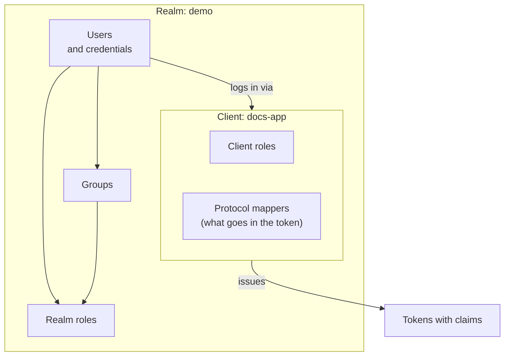

# Keycloak: realms, clients, roles, groups and tokens

*Part of [Access control for the technical PM](./README.md)*

*Last reviewed: 2026-10 · Volatility: fast*

## TL;DR

**Keycloak** is an open-source identity and access management server. It handles login, single sign-on, and the issuing of tokens. Your applications trust it to say who a user is and what roles they hold. It speaks the standard protocols: OpenID Connect, OAuth 2.0 and SAML.

You use it to avoid building login yourself. You still decide the model: which realms, which clients, which roles and groups, and what goes into each token. Keycloak does not decide for you. It gives you the parts.

This lesson covers those parts and the traps. It was checked by running Keycloak 26.7.5 locally. The next lesson covers its built-in authorization rules.

> 🎯 **For the technical PM**
>
> **Why it matters** — Login and tokens touch every product and every integration. Choosing an identity server is a long-term commitment. The setup you pick on day one shapes SSO, partner access and audits for years.
>
> **What it changes in your decisions** — You decide the realm layout, who administers it, how roles map to your product, and who runs and upgrades the server. Running it is a team's ongoing job.
>
> **Ask yourself** — *"If we adopt Keycloak, who owns upgrades, backups, high availability and the admin console, and what do we still have to build ourselves?"*
>
> **Risk if ignored** — A single realm mixes employees and customers. Every token carries every role. The admin console is open to too many people. Nobody tested an upgrade.

## The mental model: realms contain everything



## The parts

| Part | What it is | Product meaning |
| --- | --- | --- |
| **Realm** | An isolated space. Keycloak's documentation says it manages "a set of users, credentials, roles, and groups" and "a user belongs to and logs into a realm." | One user population, such as employees or customers. |
| **User** | An account with credentials and attributes | A person or a service |
| **Client** | An application that uses Keycloak to log users in or call APIs | Your web app, your API, a partner app |
| **Realm role** | A role defined for the whole realm | A job across applications |
| **Client role** | A role in one client's own namespace. The docs say "each client gets its own namespace." | A permission specific to one application |
| **Composite role** | A role that contains other roles | A role hierarchy |
| **Group** | A collection of users to which you apply roles and attributes | A team or department |
| **Protocol mapper** | A rule that puts a value in a token | The path from a user attribute to a claim |
| **Identity brokering and federation** | Login through another provider, or sync users from LDAP or Active Directory | Existing logins and directories |

Keycloak's feature list also includes single sign-on and sign-out, social login, passkeys and one-time-password second factors, and an admin console for central management.

## What Keycloak does and does not do

**It does:** log users in, run single sign-on, issue and sign tokens, keep users, roles and groups, connect to other identity providers and directories, and record events.

**It does not:** decide every access question in your application. Roles in a token are a coarse answer. Rules about specific objects need either Keycloak's authorization services or your own code or policy engine. See [Keycloak Authorization Services](./keycloak-authorization-services.md) and [ReBAC and policy engines](./rebac-and-policy-engines.md).

## Roles, groups and tokens in a real test

*This section reports a local test against Keycloak 26.7.5 (downloaded from Maven Central), run on 2026-10-01. The realm, client and users were created for the test.*

The test created a realm `demo`, realm roles `viewer`, `editor` and `admin`, a group `finance`, and a client `docs-app`. It made `editor` a composite role that includes `viewer`. Two users were created: Priya, given `editor` and placed in `finance`, and Sam, given `viewer`.

**1. Composite roles expand in the token.** Priya was given only `editor`. Her access token contained both:

```json
"realm_access": { "roles": ["viewer", "editor", "offline_access",
                            "default-roles-demo", "uma_authorization"] }
```

Sam's contained `viewer` and the same defaults, but not `editor`. The extra roles `offline_access`, `default-roles-demo` and `uma_authorization` came from the realm's defaults. Keycloak's documentation says default roles are assigned "when any user is newly created or imported through Identity Brokering."

**2. Groups are not in the token by default.** A client with no group mapper issued Priya a token with no `groups` claim, although she was in `finance`. After a group-membership mapper was added to `docs-app`, her token showed `"groups": ["finance"]`. Sam, in no group, had no `groups` claim.

**3. Custom attributes do not appear by default either.** A `department` attribute set through the admin API was silently dropped, and no claim appeared. Keycloak's documentation explains: it "will only recognize the attributes defined in your user profile configuration" and "the server ignores any other attribute not explicitly defined there." After the attribute was declared in the realm's user profile and a mapper was added, the claim `"department": "finance"` appeared.

**4. Tokens are short.** The access token lived 300 seconds. The refresh token's lifetime was 1,800 seconds, as returned by the server in this test.

**5. Full scope allowed is on by default.** The access token included every role the user held. The documentation says this means "every access token contains all roles the authenticated user holds," which "unnecessarily widens the blast radius if a token is compromised." Turn it off and map only the roles a client needs.

What to take from this: roles, groups and attributes live in Keycloak. Getting them into a token is a separate, deliberate step.

## Worked example: laying out a realm for a B2B product

*This example is invented, to show the method.*

A company sells a document product to businesses and also has staff who support it.

| Decision | Choice | Why |
| --- | --- | --- |
| Realms | `staff` (employees) and `customers` (all customer users) | Different user populations, different admins, different login rules. Never mix them. |
| Customer organizations | One realm, with each customer as a group or an organization, not one realm per customer | One realm per customer does not scale to thousands of customers. |
| Realm roles | `viewer`, `editor`, `admin` | Short list. Job names. |
| Client roles | `docs-app: export`, `billing-app: refund` | Permissions that mean something only in one app |
| Groups | One per customer team, holding role mappings | New hires join a group and get the right access |
| Tokens | Full scope off. Only needed roles per client. Short access token. | Smaller blast radius |
| Admin console | Separate admin accounts, few people, strong login | The console controls every login |
| Master realm | Used only to administer the server, never for applications | Keep operators apart from users |

The table is the decision record. Each row is something to review.

## Running Keycloak: what you take on

- **A service that must be up.** If login is down, nothing works. Plan for high availability and a database you back up.
- **Upgrades.** Keycloak ships frequent releases. At the time of this test, the documentation tree listed release notes for 26.0 through 26.8. Read the notes for each upgrade, test it, and plan for it.
- **Customisation.** Themes, mappers and extensions are possible. Each one adds something to maintain across upgrades.
- **Security of the admin plane.** Treat the admin console and API as a high-value target.
- **Cost.** Open source means no licence fee. It does not mean no cost. Compare with a managed identity service on total effort, not price.

## Tradeoffs

- **Self-host vs. managed.** Control and no per-user fee, against the work of running it.
- **One realm vs. many.** One realm is simpler and shares settings. Many realms isolate but multiply the admin work.
- **Roles in tokens vs. live checks.** See [lesson 2](./oauth-openid-connect-and-tokens.md).
- **Realm roles vs. client roles.** Realm roles are shared jobs. Client roles keep one app's permissions in its own namespace.
- **Groups for people vs. roles for permissions.** Keep the split clean, as in [lesson 3](./rbac-roles-groups-and-where-it-breaks.md).

## Failure modes

- **Full scope allowed left on.** Every token carries every role.
- **Applications in the master realm.** Operators and users share a space.
- **Everyone is an admin.** The console is broadly open.
- **Attribute surprise.** An attribute is set and never reaches a token, or reaches it for the wrong users.
- **Unreviewed upgrades.** A release changes a default, and login breaks on a Friday.
- **Realm per customer at scale.** Management cost grows with each customer.
- **Hard-coded role names in many services.** Renaming a role becomes a release train.

## Under the hood

Here is how a test like the one above is set up through Keycloak's admin REST API. Calls shown are the ones used in the test. Paths and payloads can change between versions, so check the documentation for your release. The snippet is not a production configuration.

```text
POST /admin/realms                                   {"realm":"demo","enabled":true}
POST /admin/realms/demo/roles                        {"name":"editor"}
POST /admin/realms/demo/roles/editor/composites      [ <the viewer role object> ]
POST /admin/realms/demo/groups                       {"name":"finance"}
POST /admin/realms/demo/clients                      {"clientId":"docs-app", ... }
POST /admin/realms/demo/clients/{id}/protocol-mappers/models
     {"name":"groups","protocol":"openid-connect",
      "protocolMapper":"oidc-group-membership-mapper",
      "config":{"claim.name":"groups","access.token.claim":"true"}}
PUT  /admin/realms/demo/users/profile                add attribute "department" to the user profile
```

Habits worth adopting:

- **Keep realm configuration in code.** Export it, review it, and apply it through a pipeline. Do not rely on clicks in the console.
- **Test the token.** Decode a token for each type of user in a test, and assert the roles and claims you expect.
- **Pin and rehearse upgrades.** Run the new version against a copy of your realm first.
- **Limit what goes into tokens.** Turn off full scope and map only what each client needs.

## Practitioner checklist

- [ ] Do we have separate realms for staff and customers, and none of our apps in the master realm?
- [ ] Is full scope allowed off, with explicit role scope mappings per client?
- [ ] Do we have a short, owned list of realm roles, and client roles only where they are app-specific?
- [ ] Are custom attributes declared in the user profile, and mapped to claims on purpose?
- [ ] Is realm configuration in version control and applied by a pipeline?
- [ ] Who owns upgrades, backups and high availability, and have we rehearsed an upgrade?
- [ ] Is the admin console limited to a few strongly authenticated people?
- [ ] Do tests decode tokens and assert roles and claims?

## Related lessons

- [OAuth 2.0, OpenID Connect and tokens](./oauth-openid-connect-and-tokens.md) — the tokens Keycloak issues.
- [RBAC: roles, groups and where it breaks](./rbac-roles-groups-and-where-it-breaks.md) — designing the roles.
- [Keycloak Authorization Services](./keycloak-authorization-services.md) — resources, policies and permissions.
- [Identity management in Flowable](../flowable/phases/03-user-tasks-identity-and-forms/03-identity-management/docs/en.md) — how a process engine connects to an identity source.

## Sources

- Keycloak documentation source (`keycloak/keycloak`, `docs/documentation/server_admin/topics`, main branch): `realms.adoc` (the realm definition), `overview/features.adoc` (the feature list), `user-federation.adoc`, `roles-groups/con-client-roles.adoc`, `con-comparing-groups-roles.adoc`, `con-default-roles.adoc` and `con-role-scope-mappings.adoc`, `users/user-profile.adoc`. Checked 2026-10. The keycloak.org site itself could not be opened.
- Keycloak 26.7.5, downloaded from Maven Central (`org.keycloak:keycloak-quarkus-dist`) and run locally in development mode on 2026-10-01. Every observation in the test section comes from that run. The latest Keycloak documentation tree at the time listed 26.8 release notes.
- The B2B realm layout and the explanation of running costs are this lesson's own guidance, not from the Keycloak documentation. They are illustrative.
