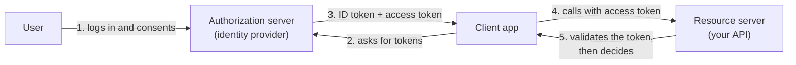

# OAuth 2.0, OpenID Connect and tokens

*Part of [Access control for the technical PM](./README.md)*

*Last reviewed: 2026-10 · Volatility: medium*

## TL;DR

**OAuth 2.0** lets one application act on a user's behalf at another application, without sharing the user's password. It is about delegation. **OpenID Connect (OIDC)** sits on top of OAuth. It adds login: it tells an app who the user is.

The system issues **tokens**. An **ID token** says who logged in. An **access token** says what an app may call. A **refresh token** gets a new access token without asking the user again. Each token has a different audience, and mixing them up is a common mistake.

Roles and attributes travel inside tokens as **claims**. That is how a decision made at login reaches the API. It is also why a stale or oversized token can cause real harm.

> 🎯 **For the technical PM**
>
> **Why it matters** — Tokens carry the user's identity and permissions across your products and to partners. Their design sets security, speed and how fast a change in access takes effect.
>
> **What it changes in your decisions** — You decide the lifetime of tokens, what goes in them, and which login flow each kind of app uses. Those are product and risk choices as well as technical ones.
>
> **Ask yourself** — *"If we remove someone's access right now, how long can their existing token still be used?"*
>
> **Risk if ignored** — A fired employee keeps working for an hour. A token with every permission in it leaks from a log. A single-page app stores a long-lived token where any script can read it.

## The mental model: who issues what, to whom



Four roles appear in every OAuth flow.

- **Resource owner:** the user, who owns the data.
- **Client:** the app that wants to act for the user.
- **Authorization server:** issues tokens after the user logs in. Keycloak is one. The authorization server is also called the identity provider (IdP).
- **Resource server:** the API that holds the data and checks the token.

## The three tokens

| Token | Meaning | Who reads it | Typical lifetime |
| --- | --- | --- | --- |
| **ID token** | "This user logged in, here are their details." | The client app | Short. Used once at login. |
| **Access token** | "The holder may call this API with these permissions." | The resource server | Short, minutes. |
| **Refresh token** | "The holder may get a new access token." | The authorization server only | Longer, hours or days. |

Never send an ID token to an API as proof of access. The ID token is for the client. The API wants an access token meant for it.

## The login flow to use: authorization code with PKCE

Most apps should use the **authorization code flow with PKCE** (Proof Key for Code Exchange, pronounced "pixie").

1. The app creates a random secret, the *code verifier*, and sends a hash of it, the *code challenge*, to the authorization server.
2. The user logs in at the authorization server, not in your app.
3. The server returns a short-lived *code* to the app.
4. The app swaps the code and the original verifier for tokens. The server checks that they match.

PKCE stops an attacker who steals the code from using it. The OAuth 2.0 Security Best Current Practice, RFC 9700 (January 2025), says public clients must use PKCE. It says confidential clients should too. It also steers away from the older implicit flow, which put tokens in the browser address bar.

## Scope, role and claim

These three words are often mixed up.

| Term | What it is | Example |
| --- | --- | --- |
| **Scope** | What the *client* asks to do on the user's behalf | `read:invoices` |
| **Role** | A bundle of permissions assigned to a *user* | `editor` |
| **Claim** | A fact inside a token | `"department": "finance"` |

A scope limits the client. A role describes the user. A claim is how either is carried. A request is allowed only if the user may do it **and** the client was granted it.

## What a real token looks like

*This is a trimmed token from a local test against Keycloak 26.7.5, run on 2026-10-01. Values are shortened. The real token also carried `aud: "account"` and a `resource_access` section. By default, Keycloak does not put your API's client id in `aud` unless the token carries one of that client's roles, so an API that checks audience needs an audience mapper on the client. Without it, step 3 below fails.*

Decoded access token for a user named Priya who has the roles `editor` and `viewer`:

```json
{
  "iss": "http://localhost:8180/realms/demo",
  "sub": "7cfb5ab5-19ce-4c78-9f11-7a678fe9d64c",
  "azp": "docs-app",
  "scope": "openid email profile",
  "realm_access": { "roles": ["viewer", "editor", "offline_access",
                              "default-roles-demo", "uma_authorization"] },
  "preferred_username": "priya",
  "exp": 1790822164,
  "iat": 1790821864
}
```

Read it field by field.

- `iss` names who issued it. Your API must check this is the issuer you trust.
- `sub` is the stable user id. Use it as the key, not the email.
- `azp` is the client the token was issued to.
- `scope` is what the client may do.
- `realm_access.roles` carries the user's roles. This claim name is Keycloak's. Other providers use other names.
- `exp` minus `iat` is 300 seconds. In this test the access token lived five minutes. The refresh token lived 1,800 seconds.

## Validating a token: what the API must check

A token is only a claim until the API checks it. A JSON Web Token (JWT) is signed. The API must verify:

1. **The signature**, using the issuer's published public keys.
2. **The issuer** (`iss`) is the one you expect.
3. **The audience** (`aud`) includes your API.
4. **The expiry** (`exp`) has not passed.
5. **The scope or role** allows this action.

Skip any of these and a forged or misdirected token can pass.

## Worked example: how long does a revoked user keep access?

*This example is invented, to show the method. The lifetimes are illustrative.*

A company fires an employee at 10:00. Their account is disabled at 10:01. They had logged in at 09:58.

| Design | Access token lifetime | Access continues until | Why |
| --- | --- | --- | --- |
| A: long-lived tokens | 8 hours | About 17:58 | The API trusts the signed token and never asks the server. |
| B: short tokens, refresh checked | 5 minutes | About 10:03 | The next refresh fails because the account is disabled. |
| C: B plus introspection on risky actions | 5 minutes | Immediately, for those actions | The API asks the server "is this token still good?" before a payment. |

Short tokens narrow the window but add refresh traffic. Introspection closes the window for the actions that matter. A PM picks the window for each class of action.

## Tradeoffs

- **Token lifetime.** Short is safer and chattier. Long is faster and riskier.
- **Roles in the token or looked up live.** In the token is fast and can be stale. Live is fresh and adds a call.
- **Token size.** Putting every role and group in a token makes it large. Large tokens slow requests and can hit header limits.
- **Opaque or JWT.** A JWT can be checked offline. An opaque token must be checked with the server, which allows instant revocation.

## Failure modes

- **ID token used as an API credential.** The API accepts a token meant for the client.
- **No audience check.** A token issued for service A is accepted by service B.
- **Tokens in browser storage.** A script injected into the page steals them.
- **Everything in the token.** All roles go in every token, so one leak exposes everything.
- **Long-lived access tokens.** Revocation takes hours.
- **Trusting the payload without verifying the signature.** Decoding is not validating.

## Under the hood

Here is the core of an API-side check. It is illustrative. Use a maintained library for the real work.

```python
def authenticate(request, jwks, issuer, audience):
    token = bearer_token(request)                      # from the Authorization header
    claims = jwt_verify(token, jwks,                    # 1. signature, from issuer's keys
                        issuer=issuer,                  # 2. expected issuer
                        audience=audience,              # 3. meant for THIS API
                        leeway=30)                      # 4. expiry, small clock skew
    return Subject(id=claims["sub"],
                   roles=claims.get("realm_access", {}).get("roles", []),
                   scopes=claims.get("scope", "").split())
```

Two facts from the Keycloak test are worth knowing.

- The server's discovery document listed `S256` and `plain` as supported PKCE methods. RFC 9700 steers clients to `S256`, so configure clients to require it.
- **Full scope allowed** is on by default for a new client. Keycloak's documentation says every access token then contains all the user's roles, which "unnecessarily widens the blast radius if a token is compromised." Limit it. The same documentation says the switch is deprecated, so plan for its removal. See [Keycloak: realms, clients, roles, groups and tokens](./keycloak-realms-clients-roles-groups-and-tokens.md).

## Practitioner checklist

- [ ] Does every web, mobile and single-page app use authorization code with PKCE?
- [ ] Do we require the `S256` challenge method?
- [ ] Does every API check signature, issuer, audience, expiry and scope?
- [ ] Is the access-token lifetime short, and do we know how long a revoked user can still act?
- [ ] Do risky actions check the token live, not only offline?
- [ ] Are tokens kept out of places scripts can read?
- [ ] Do tokens carry only the roles and claims a client needs?

## Related lessons

- [Authentication, authorization and the access-control model](./authentication-authorization-and-the-access-control-model.md) — where tokens fit in a decision.
- [Keycloak: realms, clients, roles, groups and tokens](./keycloak-realms-clients-roles-groups-and-tokens.md) — how one identity provider issues them.
- [Access control for AI agents](./access-control-for-ai-agents.md) — passing user identity to an agent safely.
- [The request-response contract](../api-integrations/the-request-response-contract.md) — the HTTP basics under tokens.

## Sources

- IETF, RFC 6749, *The OAuth 2.0 Authorization Framework* (Oct 2012); RFC 7636, *Proof Key for Code Exchange* (Sep 2015); OpenID Foundation, *OpenID Connect Core 1.0* (Nov 2014). The primary pages could not be opened when this lesson was written. The roles, tokens and flow are described from general knowledge and search-result excerpts.
- IETF, RFC 9700, *Best Current Practice for OAuth 2.0 Security* (Jan 2025, BCP 240): PKCE for public clients, S256, and moving away from the implicit grant. Described from search-result excerpts. The page could not be opened.
- Keycloak documentation source, *Role scope mappings and token content* (`server_admin/topics/roles-groups/con-role-scope-mappings.adoc`, main branch): the full scope allowed quotation. Checked 2026-10.
- The token and lifetimes come from a local test against Keycloak 26.7.5 on 2026-10-01 (downloaded from Maven Central). The revocation scenario and the code sketch are invented and illustrative.
