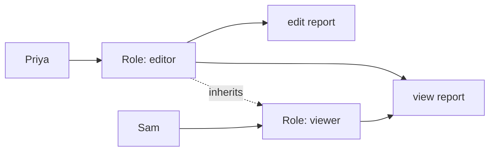

# RBAC: roles, groups and where it breaks

*Part of [Access control for the technical PM](./README.md)*

*Last reviewed: 2026-10 · Volatility: stable*

## TL;DR

**Role-based access control (RBAC)** gives permissions to roles, not to people. People get roles. A "billing admin" role holds the permissions to see and change invoices. Anyone with the role can do those things.

This works because jobs are stable. It is easy to explain, easy to audit and easy to review. It is the default choice, and for many products it is enough.

RBAC breaks in two ways. It cannot say "only your own records" without help, because a role knows nothing about a specific object. And it grows without limit. Teams add roles for each new case until nobody knows what a role means. This is called **role explosion**.

> 🎯 **For the technical PM**
>
> **Why it matters** — Roles are the language of your permission screen, your sales deck and your audit report. A clear role set makes the product easy to sell and to secure.
>
> **What it changes in your decisions** — You design roles as a product surface: a short list, with plain names, owned by someone. You also decide when a rule needs more than a role.
>
> **Ask yourself** — *"Can a new admin tell what each role allows without reading code? How many roles do we have, and how many people hold each?"*
>
> **Risk if ignored** — Forty roles that overlap, a permission screen no customer understands, and a quarterly access review that nobody can finish.

## The mental model: people, roles, permissions



Three links make the model. **User to role** says who holds which job. **Role to permission** says what the job may do. Permission to object is often implicit: "edit report" means any report.

The standard model behind this is the NIST RBAC model, adopted as ANSI INCITS 359-2004 and since revised as INCITS 359-2012. It has four levels. **Core** is users, roles, permissions and sessions. **Hierarchical** adds role inheritance. **Static separation of duty** forbids one person holding two conflicting roles. **Dynamic separation of duty** forbids using two conflicting roles in the same session.

## Roles, groups and hierarchies

| Idea | What it is | Use it for |
| --- | --- | --- |
| **Role** | A named set of permissions | What a person may do |
| **Group** | A set of people | Who belongs together (a team, a department) |
| **Role hierarchy** | One role inherits another's permissions | "Editor includes viewer" |
| **Separation of duty** | Two roles that must not be held together | "Who requests a payment cannot approve it" |

Keycloak's documentation puts the difference this way. Groups are "a collection of users to which you apply roles and attributes." Roles "define types of users, and applications assign permissions and access control to roles." Give roles to groups, and put people in groups. Then a new hire joins a team and gets the right access with one step.

## Where RBAC breaks

**It does not know about objects.** "Editor" means editor of everything. If Priya may edit only reports for her own department, a role cannot say so. Teams then create `editor-finance`, `editor-support` and so on. That is the start of role explosion.

**It does not know about context.** A role cannot say "only during business hours" or "only from a managed device."

**Roles grow.** Each exception becomes a new role. Roles are cheap to create and costly to remove. Nobody wants to delete one in case it breaks someone.

**Permissions pile up.** People change jobs and keep old roles. This is called privilege creep.

## Worked example: role explosion

*This example is invented, to show the method. The numbers are illustrative.*

A document product launches with four roles.

| Year | Roles | What was added | Why |
| --- | --- | --- | --- |
| 1 | `viewer`, `editor`, `admin`, `billing` | Launch set | Clear and short |
| 2 | + `editor-finance`, `editor-support`, `editor-legal` | One editor role per department | Editors should only touch their department |
| 3 | + `viewer-finance`, `viewer-legal`, `contractor-editor`, `auditor`, `auditor-eu` | A viewer role per department, contractors, regional auditors | Customers ask for these |
| 4 | 31 roles | Combinations for regions and departments | Each new customer wants one more |

By year four the question "what can a `viewer-legal` see?" has no short answer. Two roles overlap in ways nobody wrote down.

The cause is not too many roles. It is that department and region are **attributes of the person and the document**, not jobs. The fix is to keep four job roles and add one rule: "an editor may edit documents in their own department." That rule belongs in the next model, ABAC, covered in [ABAC: deciding with attributes and context](./abac-deciding-with-attributes-and-context.md).

## Designing roles well

- **Start from jobs, not from permissions.** Ask "what does a support agent do?" and write that.
- **Keep the list short.** A useful target is a handful of roles per product, not dozens. This is a rule of thumb, not a standard.
- **Name roles in plain words.** A customer admin should understand them.
- **Give each role an owner.** Someone approves changes and retires roles.
- **Review access on a schedule.** Compare who holds what with what they still need.
- **Use separation of duty for risky pairs.** Requesting and approving a payment should not share one person.
- **Move object and context rules out of roles.** Use attributes or relationships.

## Tradeoffs

- **Simple vs. precise.** Few roles are easy to understand and coarse. Many roles are precise and unmanageable.
- **Roles in tokens vs. live lookup.** Tokens are fast. A change takes effect when the token expires. See [lesson 2](./oauth-openid-connect-and-tokens.md).
- **Roles vs. groups.** Roles describe jobs. Groups describe membership. Mixing the two makes both unclear.
- **Customer-defined roles.** Letting customers create roles is a feature and a support cost. It also invites role explosion inside each customer.

## Failure modes

- **Role explosion.** New roles for each exception, until none is understood.
- **God roles.** One `admin` role that can do everything, held by too many people.
- **Privilege creep.** Old roles stay after a job change.
- **Role names that lie.** `viewer` can export all data.
- **No owner.** Nobody is allowed to delete a role.
- **Roles standing in for object checks.** The app trusts the role and never checks whose record it is.

## Under the hood

The check itself is simple. This sketch shows role inheritance and a separation-of-duty rule. It is illustrative.

```python
ROLE_PERMISSIONS = {
    "viewer": {"report:view"},
    "editor": {"report:edit"},
    "admin":  {"report:delete", "user:manage"},
}
INHERITS = {"editor": ["viewer"], "admin": ["editor"]}     # hierarchy
CONFLICTS = [{"payment-requester", "payment-approver"}]    # static separation of duty

def permissions_for(roles):
    seen, stack = set(), list(roles)
    while stack:
        r = stack.pop()
        if r in seen: continue
        seen.add(r); stack.extend(INHERITS.get(r, []))
    return set().union(*(ROLE_PERMISSIONS.get(r, set()) for r in seen))

def assign(user, role):
    held = user.roles | {role}
    if any(pair <= held for pair in CONFLICTS):
        raise ValueError("separation of duty violated")    # block at assignment time
    user.roles = held

def allowed(user, permission):
    return permission in permissions_for(user.roles)
```

In the Keycloak test used for this track, a role named `editor` was made a **composite role** that includes `viewer`. A user given only `editor` received both `editor` and `viewer` in the token. That is a role hierarchy in practice. See [Keycloak lesson](./keycloak-realms-clients-roles-groups-and-tokens.md).

## Practitioner checklist

- [ ] Can we list our roles on one page, with an owner and a plain-language purpose for each?
- [ ] Is each role a job, not a combination of department, region and permission?
- [ ] Do we have a rule for object and context limits that does not create a new role?
- [ ] Are risky pairs blocked by separation of duty?
- [ ] Is there a scheduled access review, with a way to remove unused access?
- [ ] Does the app check the object as well as the role?
- [ ] Do we know how many roles we have and how that number has changed?

## Related lessons

- [ABAC: deciding with attributes and context](./abac-deciding-with-attributes-and-context.md) — rules for objects and context.
- [Keycloak: realms, clients, roles, groups and tokens](./keycloak-realms-clients-roles-groups-and-tokens.md) — realm roles, client roles, composites and groups.
- [Authentication, authorization and the access-control model](./authentication-authorization-and-the-access-control-model.md) — the decision these roles feed.
- [Tool permissions, blast radius & the trust boundary](../tool-calling/permissions-blast-radius-and-the-trust-boundary.md) — least privilege for AI tools.

## Sources

- ANSI/INCITS 359-2004, *Role Based Access Control* (revised as INCITS 359-2012 (R2017)), based on the NIST RBAC model (Sandhu, Ferraiolo, Kuhn). The four levels (core, hierarchical, static and dynamic separation of duty) are described from search-result excerpts and general knowledge. The standard's page could not be opened when this lesson was written.
- Keycloak documentation source, *Comparing groups and roles* (`server_admin/topics/roles-groups/con-comparing-groups-roles.adoc`, main branch): the quoted definitions. Checked 2026-10.
- The composite-role behaviour comes from a local test against Keycloak 26.7.5 on 2026-10-01. The role-explosion story, its numbers and the code sketch are invented and illustrative.
