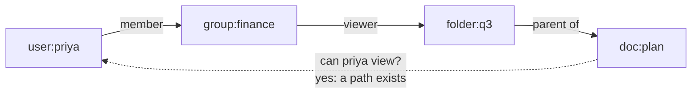

# ReBAC and policy engines

*Part of [Access control for the technical PM](./README.md)*

*Last reviewed: 2026-10 · Volatility: medium*

## TL;DR

Some access rules are about **relationships**, not roles or attributes. "Priya can view this document because she is in the Finance group, and Finance can view the folder it sits in." This is **relationship-based access control (ReBAC)**. It is how sharing works in tools like shared drives and project boards.

ReBAC stores facts as small links, called **relationship tuples**, and answers a question by walking the links. Google described this approach in its Zanzibar paper in 2019. Several open-source systems copy the idea.

A second question runs alongside: where does the rule live? A **policy engine** takes rules out of application code and runs them as a separate service or library. Open Policy Agent and Cedar are two examples. This lesson explains both ideas and how to choose.

> 🎯 **For the technical PM**
>
> **Why it matters** — Sharing, nesting and inheritance are the features users love and the ones that leak data. Their access rules are graphs, and roles cannot express them.
>
> **What it changes in your decisions** — You decide whether access follows relationships, and whether rules live in one engine or in each service. Both choices are hard to reverse.
>
> **Ask yourself** — *"If someone shares a folder, who gains access to what is inside it, and how fast does removing them take effect?"*
>
> **Risk if ignored** — Access rules end up copied into five services. They disagree. A document stays visible to someone long after they were removed from the folder.

## The mental model: access as a path



Each arrow is a stored fact. A check asks: "Is there a path from this user to this object that grants this permission?" If a rule says "viewers of a folder can view its documents," then the path above gives Priya access to the document. Change one fact and every access that depended on it changes.

## ReBAC in one page

A ReBAC system has two parts.

- **An authorization model.** It says which kinds of objects exist and how relations combine. For example: a document's `viewer` is anyone who is a `viewer` of its parent folder, or an `editor` of the document.
- **Relationship tuples.** The stored facts. Each says "this object has this relation to this subject." For example: `folder:q3 viewer group:finance#member`.

Google's Zanzibar paper (USENIX ATC 2019) describes this design as running access control for services such as Calendar, Drive and YouTube, at very large scale. OpenFGA describes itself as "a high-performance, flexible authorization/permission engine inspired by Google Zanzibar," built around authorization models, relationship tuples and a check API. Other open-source systems follow the same model.

## Where RBAC, ABAC and ReBAC fit

| Model | Natural fit | Awkward fit |
| --- | --- | --- |
| RBAC | Job-based access in an org | Per-object sharing |
| ABAC | Rules on attributes and context | Deep sharing and inheritance |
| ReBAC | Sharing, teams, folders, ownership chains | Rules on time, device or risk |

They combine. A common design uses roles for coarse access, relationships for who can see which object, and attributes for conditions such as time or device.

## Policy engines: moving rules out of code

A **policy engine** evaluates rules held outside your application code. Your service asks, "may this subject do this action on this resource?" The engine answers allow or deny.

Two open-source examples:

- **Open Policy Agent (OPA).** Its README calls it "an open source, general-purpose policy engine." Policies are written in a language called Rego. Services query OPA with JSON input and receive a decision. OPA is a graduated project in the Cloud Native Computing Foundation.
- **Cedar.** Its README calls it "a language for writing and enforcing authorization policies in your applications." It is designed to express RBAC and ABAC, and to be analysable by tools. AWS built Cedar and published it as open source.

Why use one?

- **One place to review and test rules.** Not five copies in five services.
- **Policy changes without a code release.** Where that is wanted.
- **A common decision log.**
- **Analysis.** Some languages let tools check what a policy allows.

What it costs: a new dependency, a new language, and the work of getting attributes and relationships to the engine.

## Worked example: one rule, two policy languages, and a relationship check

*This example is invented, to show the method. Each snippet below was run, against Cedar 4.12 (`cedarpy`) and a Rego interpreter (`regopy` 1.5), on 2026-10-01.*

Rule: "An editor may edit a report in their own department. A suspended user may do nothing."

**In Cedar:**

```cedar
permit (principal, action == Action::"edit", resource is Report)
when { principal.roles.contains("editor") && principal.department == resource.department };

forbid (principal, action, resource) when { principal.suspended };
```

Test results with a finance report:

| User | Roles | Department | Suspended | Result |
| --- | --- | --- | --- | --- |
| Priya | editor | finance | no | **Allow** |
| Sam | viewer | support | no | Deny. No permit matched. |
| Dana | editor | finance | yes | Deny. A permit matches, and a `forbid` overrides it. |
| Lee | editor | support | no | Deny. No permit matched, because the report is in finance. |
| Priya, action `delete` | editor | finance | no | Deny. No permit matched. |

Two properties of Cedar showed up. A request is denied unless some `permit` matches. A matching `forbid` beats any `permit`. That makes "suspend this user" a single rule that cannot be overridden by accident.

**In Rego (OPA):**

```rego
package app.authz
import rego.v1

default allow := false

allow if {
  input.action == "edit"
  "editor" in input.user.roles
  input.user.department == input.resource.department
  not input.user.suspended
}
```

With Priya's input the result was `true`. With Sam's, and with Dana's (a suspended finance editor), the package returned `allow: false`, thanks to the `default` line and the `not input.user.suspended` condition. Rego has no separate `forbid`, so the suspended check is written into the rule. Without it the answer would be "undefined," which a careless caller might treat as allow.

**As relationships.** Four tuples, checked with a small resolver written for this lesson:

```text
group:finance  member  user:priya
folder:q3      viewer  group:finance#member      # members of finance can view folder q3
folder:q3      editor  user:lee
doc:plan       parent  folder:q3                 # the document lives in folder q3
```

Rule: a folder's editor is also a folder viewer. A document's viewers are the viewers of its parent folder.

| Question | Answer | Why |
| --- | --- | --- |
| Can Priya view `doc:plan`? | Yes | She is in finance, finance views the folder, the folder holds the doc. |
| Can Lee view `doc:plan`? | Yes | Editors also view. |
| Can Sam view `doc:plan`? | No | No path. |
| Can Priya edit `doc:plan`? | No | She is only a viewer. |

Remove the one tuple `group:finance member user:priya`, and Priya loses access to the folder and every document in it. That is the strength of the model.

## Choosing

| Your situation | Lean toward |
| --- | --- |
| A few stable job roles, one application | Roles in the identity provider |
| Rules about attributes, in a few services | A policy engine with ABAC rules |
| Many services must apply the same rules | A shared policy engine |
| Users share objects, with folders and groups | A ReBAC system |
| You need rules and sharing | A ReBAC store for relationships, plus a policy engine for conditions |

Start with the simplest model that fits. Move up when a real requirement forces it. Each step adds an operational system to run.

## Tradeoffs

- **Central decision service vs. library.** A service gives one source of truth and a network hop. A library is fast and can drift.
- **Fresh relationships vs. cached.** A cache speeds checks. After a removal, a cache can still say yes. Zanzibar spends much of its design on this consistency problem.
- **Expressive language vs. reviewable policy.** A powerful language can hide mistakes. A restricted one is easier to analyse.
- **Build vs. adopt.** A hand-built relationship check is simple at first. Inheritance, groups and caching grow it into a system.
- **Listing problem.** "Who can see this?" is easy. "Which documents can this user see?" needs an index or a reverse query. Plan for it.

## Failure modes

- **Rules copied into several services.** They drift apart.
- **Engine down means everything denied.** Or worse, everything allowed. Decide the failure mode on purpose.
- **Stale relationships.** A removed person still passes a cached check.
- **Missing default deny.** An undefined result is treated as allow.
- **Overly clever policy.** Nobody can say what it allows.
- **Unknown listing cost.** A page that shows "all my documents" runs a check per row.
- **Policy edited without review.** The administration point is the weakest point.

## Under the hood

A decision call from a service to an engine is small. This sketch shows the shape, with an explicit failure mode. It is illustrative.

```python
def authorize(subject, action, resource, context):
    try:
        resp = pdp_client.check(
            subject=subject.id, action=action,
            resource=resource.ref, context=context,
            timeout_ms=50,                            # decisions are on the hot path
        )
        audit.write(subject.id, action, resource.ref, resp.allowed, resp.reason)
        return resp.allowed
    except (Timeout, ConnectionError):
        audit.write(subject.id, action, resource.ref, False, "pdp unavailable")
        return False                                  # fail closed, and say so
```

Three engineering habits matter.

- **Fail closed, and log it.** Decide how outages behave before they happen.
- **Test policy like code.** Keep a table of expected allows and denies and run it on every change.
- **Send the engine what it needs.** Attributes, relationships and context, loaded from a trusted source and not from the request body.

The product names above change over time. Treat them as examples, and check each project's current documentation before choosing.

## Practitioner checklist

- [ ] Do we know whether our access rules are roles, attributes, relationships, or a mix?
- [ ] If users share objects, do we model inheritance and groups explicitly?
- [ ] Is policy kept in one reviewed place, not copied across services?
- [ ] Is the default a deny, and is "undefined" treated as a deny?
- [ ] Does the system fail closed when the decision service is unreachable?
- [ ] After a removal, how long can a stale result still say yes?
- [ ] Do we have a plan for "which objects can this user see?"
- [ ] Is there a test table of expected allows and denies, run on every policy change?

## Related lessons

- [ABAC: deciding with attributes and context](./abac-deciding-with-attributes-and-context.md) — the attribute rules these engines evaluate.
- [Keycloak Authorization Services](./keycloak-authorization-services.md) — a built-in policy model, and when to use an external engine.
- [Authentication, authorization and the access-control model](./authentication-authorization-and-the-access-control-model.md) — the enforcement and decision points.
- [Knowledge graphs: governance, quality and trust](../knowledge-graphs/governance-quality-and-trust.md) — graphs of facts, and keeping them trustworthy.

## Sources

- Pang et al., *Zanzibar: Google's Consistent, Global Authorization System*, USENIX ATC 2019. The page and paper could not be opened when this lesson was written. The description is from search-result excerpts.
- Open Policy Agent, project README (`open-policy-agent/opa`, main branch): the description, the mention of Rego, the allow-or-deny decision example and the CNCF graduated status. Checked 2026-10.
- Cedar, project README (`cedar-policy/cedar`, main branch): the description and design goals. Checked 2026-10. That AWS created Cedar is stated from general knowledge and is not in the README.
- OpenFGA, project README (`openfga/openfga`, main branch): the quoted description, authorization models, relationship tuples and the check API. Checked 2026-10.
- The Cedar results come from running `cedarpy` 4.12.1. The Rego result comes from running `regopy` 1.5.2. The relationship check comes from a small resolver written for this lesson and run on 2026-10-01. The scenario, the names and the code sketch are invented and illustrative.
