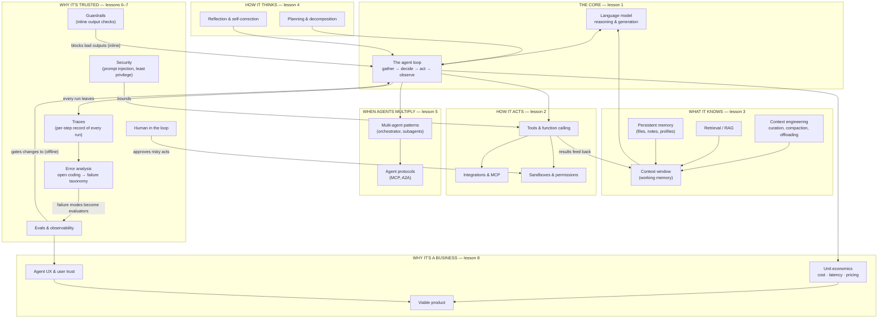

# Agentic AI for the AI PM

A chatbot answers; an **agent acts**. Give a language model tools, a goal, and permission
to loop — observe, decide, act, check the result, repeat — and you get software that can
*do things*: research a market, fix a bug, book the logistics, run the workflow. That's
the promise. The practice is a young discipline with real engineering behind it and a
thick layer of hype on top — invented protocol acronyms, "8-layer stacks," and demos that
collapse on contact with production.

This module is the honest map. It teaches what an agent actually is, the machinery that
makes one work (tools, context, memory, planning), what changes when agents multiply
(multi-agent systems and the real protocol landscape), and the three disciplines that
separate shipped agents from viral demos: **reliability, security, and unit economics**.
Every lesson ships a diagram; the module opens with a **knowledge graph** so you can see
how the pieces connect before studying them one at a time.

## The knowledge graph

Agentic AI isn't a layer cake — it's a loop with disciplines attached. Everything in this
module hangs off this picture:

Read it in three passes. **The spine:** knowledge flows into the model, the model drives
the loop, the loop acts through tools, and tool results flow back as new knowledge — that
cycle *is* the agent. **The amplifiers:** planning and reflection make each cycle
smarter; multi-agent patterns run many cycles at once. **The disciplines:** every cycle
leaves a trace, error analysis turns traces into evaluators, guardrails police the loop
inline while evals gate it offline, security bounds every tool, a human approves the
irreversible, and economics decides whether any of it is a business.

## The lessons

- [**What is an agent?**](./what-is-an-agent.md) — the loop, the autonomy spectrum from
  workflow to agent, and when *not* to build one.
- [**Tools & function calling**](./tools-and-function-calling.md) — how a model acts on
  the world: schemas, MCP, sandboxes, and the craft of tool design.
- [**Context & memory**](./context-and-memory.md) — the context window as working memory,
  retrieval, persistent memory, and context engineering.
- [**Planning & reasoning**](./planning-and-reasoning.md) — ReAct, plan-and-execute,
  reflection, and what actually makes agents smarter (and slower).
- [**Multi-agent systems & protocols**](./multi-agent-and-protocols.md) — orchestrators,
  subagents, and an honest map of the protocol landscape.
- [**Reliability & evals**](./reliability-and-evals.md) — compounding error, trajectory
  evals, observability, and why "95% per step" isn't good enough.
- [**Safety, security & governance**](./safety-security-and-governance.md) — prompt
  injection, least privilege, human-in-the-loop, and audit trails.
- [**Agentic AI as a product**](./agentic-ai-as-a-product.md) — the capstone: unit
  economics, pricing, agent UX, and deciding where agents actually pay.

Each lesson pairs the concept with a **🎯 For the AI PM** briefing — the decision it
should change and the question it should make you ask — and a diagram to make it
concrete. Builders who want to go deeper than concepts can construct this machinery hands-on
in the [Harness engineering track](../harness/index.html).

**📌 Close out the module:** [Recap & real-world examples](./recap.md).
