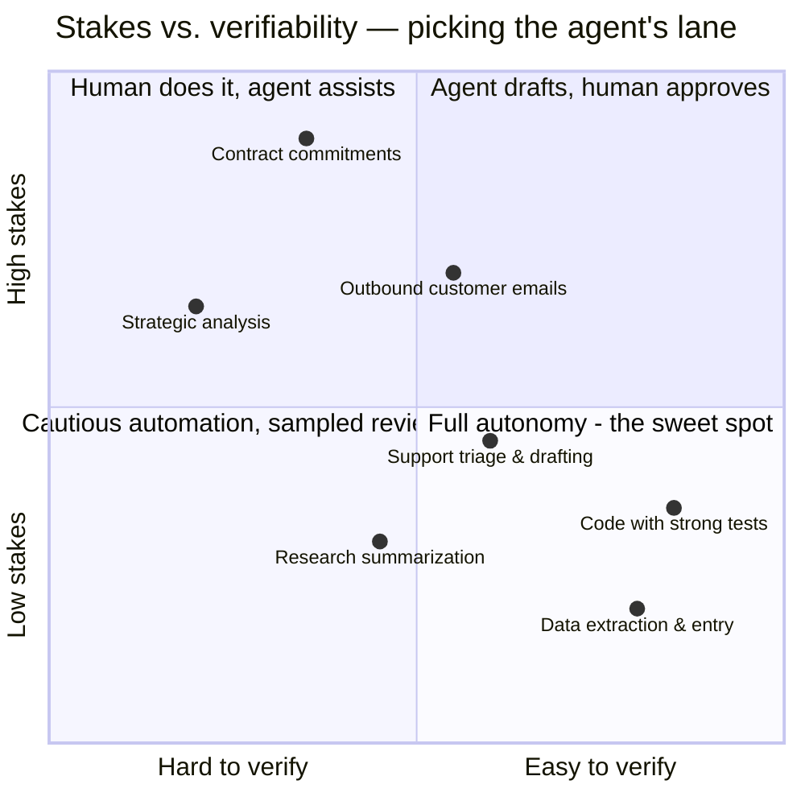

# Agentic AI as a product

*Part of [Agentic AI for the AI PM](./README.md)*

## TL;DR

The capstone question isn't "can we build an agent?" — after seven lessons, mostly yes —
it's "**where does an agent pay?**" The economics are unusual: marginal cost per task is
real and variable (tokens × steps × thinking), reliability sets how much human
supervision each task still needs, and the *supervised* cost — agent plus the human
checking it — is the number to beat against the old way of doing the work. The sweet
spot is high-volume, medium-stakes, verifiable work; the trap is low-volume,
high-stakes, unverifiable work, where checking costs more than doing. Around the
economics sits **agent UX** — trust is built by legible plans, visible progress,
reviewable diffs, and graceful escalation — and a pricing model shifting from seats
toward usage and outcomes, because an agent that does the work replaces *work*, not
software licenses.

> 🎯 **For the AI PM**
>
> **Why it matters** — This is where the module cashes out. Every concept so far —
> autonomy, tools, context, reliability, security — converges into three product
> numbers: cost per task, completion rate, and intervention rate. Those three decide
> whether your agent is a business or a subsidized demo.
>
> **What it changes in your decisions** — You pick the agent's *lane* using stakes ×
> volume × verifiability, not demo appeal; you design the supervision experience as
> carefully as the automation; and you model unit economics before the roadmap, not
> after the invoice.
>
> **Ask yourself** — *"For this task: what does the agent cost, what does the human
> checking it cost, and what did the old way cost — all-in?"*
>
> **Risk if ignored** — An impressive agent with negative unit economics at scale, or
> one parked on tasks where a single failure erases a year of savings.

## Where agents pay

Three forces pick the lane. **Verifiability** — work whose correctness can be *checked
cheaply* (tests pass, record matches source, format validates) is where autonomy
compounds; unverifiable work caps out at "assistant." **Stakes** — reversible and
low-blast-radius invites autonomy; irreversible or reputation-bearing demands a human
gate regardless of quality ([lesson 7](./safety-security-and-governance.md)). **Volume** —
the fixed costs of doing agents properly (evals, tooling, security review, supervision
design) amortize over repetition; a task done twice a month rarely repays them.

The classic entry strategy follows: start in "agent drafts, human approves," accumulate
[eval evidence](./reliability-and-evals.md) and trust, then *earn* autonomy tier by
tier — the reverse order (launch autonomous, add oversight after the incident) is
paid for in trust you don't get back.

## Unit economics

The napkin model every agent feature deserves before it enters the
[roadmap](../technical-product-management/prioritization-and-roadmaps.md):

**Cost per task** = steps × (context size × token price) + thinking budget + tool/infra
costs. Note the compounding interaction from [lesson 3](./context-and-memory.md):
context grows as tasks lengthen, so cost per task grows *faster than linearly* with task
length — long-horizon autonomy is expensive by construction.

**Supervised cost per task** = cost per task + (intervention rate × human minutes ×
loaded rate) + (failure rate × cost of a miss). This is the honest number. An agent
that's cheap per run but wrong often enough to require full review can cost *more* than
the human baseline — automation that moved the work from "doing" to "checking" without
reducing it.

**The trend lines matter more than the snapshot.** Model prices per token have fallen
steeply and repeatedly; capability per dollar keeps improving. An agent marginally
uneconomic today may clear easily in a year — build the eval and supervision
infrastructure now, and re-run the napkin when the denominators move. (The reverse
also holds: don't hard-code today's model constraints into the product's bones.)

**Pricing follows the value shape.** Per-seat pricing fits assistants (value scales
with users); usage-based fits variable work (value scales with tasks); outcome-based —
per resolved ticket, per completed job — is the direction agent pricing is drifting,
because it prices what the customer actually buys. It also transfers reliability risk
to *you*: price outcomes only when your completion rate is boringly stable.

## Agent UX: designing for trust

Users don't experience your architecture; they experience a colleague they can't see
thinking. The patterns that make delegation feel safe:

- **Legible intent** — show the plan before long or consequential work
  ([the checkpoint from lesson 4](./planning-and-reasoning.md)); let the user redirect
  before the spend, not after.
- **Visible progress** — long tasks narrate their milestones ("found 3 candidate
  causes, testing the second"). Silence reads as failure; a progress trail is also
  your intervention surface.
- **Reviewable work** — deliver *diffs, drafts, and previews*, not faits accomplis.
  The unit of agent output should be something a human can approve in one glance.
- **Honest uncertainty** — "I couldn't verify this" and "I'm stuck, here's where"
  outperform confident wrongness on every trust metric that matters
  ([escalation as a feature](./reliability-and-evals.md)).
- **Calibrated defaults** — autonomy is a *setting users grow into*, not a launch
  decision made for them. Start conservative; let power users loosen.

And the meta-pattern: **set expectations by naming the lane.** "Drafts your replies for
approval" delights at 90% quality; "handles your inbox" disappoints at 98%. Most "agent
failed" stories are really "agent was oversold" stories — the marketing wrote a check
the compounding law couldn't cash.

## Failure modes

- **Subsidized-demo economics** — unit costs never modeled; scale arrives and every
  new customer deepens the loss.
- **The checking treadmill** — automation that converts doers into full-time
  reviewers of agent output, capturing none of the promised savings.
- **Wrong-lane deployment** — full autonomy on high-stakes unverifiable work because
  the demo was smooth; one miss erases the program.
- **Autonomy as a launch stunt** — shipping maximum independence for the announcement,
  then bolting on oversight after the first incident, in the press.
- **Static pricing on falling costs** — competitors reprice on every model-price drop;
  your margin story assumed 2024 token prices forever.

## Practitioner checklist

- [ ] Have I placed each agent task on stakes × verifiability × volume — and does its
      autonomy tier match?
- [ ] What's the supervised cost per task, and what's the human baseline it must beat?
- [ ] Do users see plans before spend, progress during, and reviewable output after?
- [ ] Is autonomy earned through eval evidence, tier by tier — or granted by marketing?
- [ ] When token prices next drop 5×, which currently-uneconomic tasks flip — and are
      we positioned to catch them?

## Related lessons

- [Reliability & evals](./reliability-and-evals.md)
- [Safety, security & governance](./safety-security-and-governance.md)
- [Technical product management for AI](../technical-product-management/tpm-for-ai-products.md)
