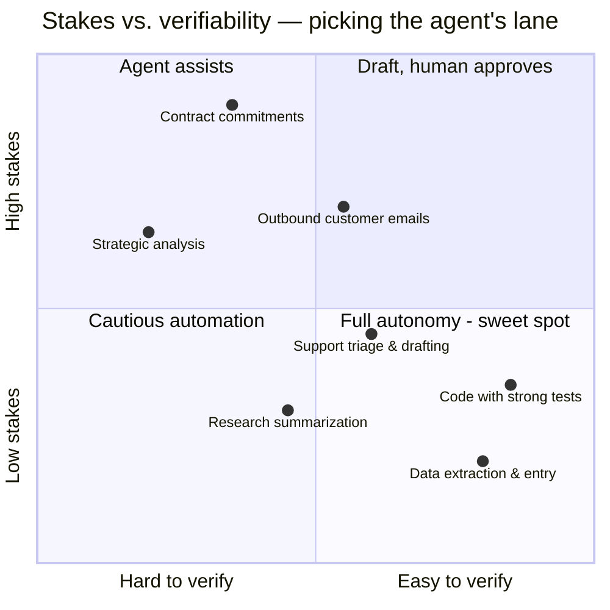

# Agentic AI as a product

*Part of [Agentic AI for the AI PM](./README.md)*

## TL;DR

After seven lessons, you can mostly build an agent. The real question is
"**where does an agent pay?**" The economics are unusual. Marginal cost per task is
real and it varies — it depends on tokens, steps, and thinking time. Reliability sets
how much human supervision each task still needs. The number to beat is the
*supervised* cost: the agent's cost plus the cost of the human checking it, measured
against the old way of doing the work. The sweet spot is high-volume, medium-stakes,
verifiable work. The trap is low-volume, high-stakes, unverifiable work, where checking
costs more than doing the work yourself. Around this economics sits **agent UX** —
trust comes from legible plans, visible progress, reviewable diffs, and graceful
escalation. Pricing is shifting too, from seats toward usage and outcomes, because an
agent that does the work replaces *work*, not software licenses.

> 🎯 **For the AI PM**
>
> **Why it matters** — This lesson is where the module pays off. Every concept so
> far — autonomy, tools, context, reliability, security — converges into three product
> numbers: cost per task, completion rate, and intervention rate. These three numbers
> decide whether your agent is a real business or a subsidized demo.
>
> **What it changes in your decisions** — Pick the agent's *lane* using stakes,
> volume, and verifiability, not demo appeal. Design the supervision experience as
> carefully as the automation. Model unit economics before you write the roadmap, not
> after the invoice arrives.
>
> **Ask yourself** — *"For this task: what does the agent cost, what does the human
> checking it cost, and what did the old way cost — all-in?"*
>
> **Risk if ignored** — An impressive agent with negative unit economics at scale. Or
> one parked on a task where a single failure erases a year of savings.

## Where agents pay

```mermaid
quadrantChart
    title Stakes vs. verifiability — picking the agent's lane
    x-axis Hard to verify --> Easy to verify
    y-axis Low stakes --> High stakes
    quadrant-1 Draft, human approves
    quadrant-2 Agent assists
    quadrant-3 Cautious automation
    quadrant-4 Full autonomy - sweet spot
    "Code with strong tests": [0.85, 0.35]
    "Support triage & drafting": [0.6, 0.45]
    "Data extraction & entry": [0.8, 0.2]
    "Outbound customer emails": [0.55, 0.7]
    "Contract commitments": [0.35, 0.9]
    "Strategic analysis": [0.2, 0.65]
    "Research summarization": [0.45, 0.3]
```

Three forces pick the lane.

**Verifiability** decides how far autonomy can go. Work whose correctness you can
check cheaply — tests pass, a record matches its source, a format validates — is
where autonomy compounds. Work you can't verify cheaply caps out at "assistant."

**Stakes** decide whether autonomy is safe. Reversible, low-blast-radius work invites
autonomy. Irreversible or reputation-bearing work demands a human gate, no matter how
good the quality looks ([lesson 7](./safety-security-and-governance.md)).

**Volume** decides whether autonomy pays for itself. Doing agents properly costs money
up front — evals, tooling, security review, supervision design. Those fixed costs
amortize over repetition. A task done twice a month rarely repays them.

The classic entry strategy follows from this. Start in "agent drafts, human approves."
Build up [eval evidence](./reliability-and-evals.md) and trust. Then *earn* autonomy
tier by tier. Do it in the reverse order — launch autonomous, add oversight after the
incident — and you pay for it in trust you don't get back.

## Unit economics

The napkin model every agent feature deserves before it enters the
[roadmap](../technical-product-management/prioritization-and-roadmaps.md):

**Cost per task** = steps × (context size × token price) + thinking budget + tool/infra
costs. There's a compounding interaction here, covered in
[lesson 3](./context-and-memory.md): context grows as tasks lengthen, so cost per task
grows *faster than linearly* with task length. Long-horizon autonomy is expensive by
construction.

**Supervised cost per task** = cost per task + (intervention rate × human minutes ×
loaded rate) + (failure rate × cost of a miss). This is the honest number. An agent
that's cheap per run but wrong often enough to need full review can still cost *more*
than the human baseline did. It just moved the work from "doing" to "checking"
without reducing it.

**The trend lines matter more than the snapshot.** Model prices per token have fallen
steeply and repeatedly, and capability per dollar keeps improving. An agent that's
marginally uneconomic today may clear easily in a year. Build the eval and supervision
infrastructure now, and re-run the napkin math when the denominators move. The reverse
also holds: don't hard-code today's model constraints into the product's bones.

**Pricing should follow the value shape.** Per-seat pricing fits assistants, because
value scales with users. Usage-based pricing fits variable work, because value scales
with tasks. Outcome-based pricing — per resolved ticket, per completed job — is the
direction agent pricing is drifting, because it prices what the customer actually
buys. It also shifts reliability risk onto *you*: price outcomes only when your
completion rate is boringly stable.

## Service-as-a-Software: selling the work itself

The strategy frame around these economics comes from platform thinking — Sangeet Paul
Choudary's Enterprise AI playbook. Work is a bundle of tasks. Software long ago ate
the rote ones. But two kinds of human glue still held every workflow together:
**knowledge work** (the decisions) and **managerial work** (the goal-seeking). LLMs
absorb the first kind, agents the second — which is why this wave doesn't stop at
features. The cycle runs like this: a service-dominant workflow gets **unbundled**
into tasks, the tasks get **componentized** into software (an API call away), and
then they get **rebundled** — into the old workflow, or into entirely new ones. The
agent is the natural place for that rebundling. It plays the role managers used to
play.

Three product consequences:

- **You're selling the work, not the software.** "Service-as-a-Software" means you
  deliver the outcome — the resolved ticket, the qualified lead, the completed
  booking. This erases the classic enterprise adoption tax: onboarding, retraining,
  change management. There's no software for the customer to learn. The go-to-market
  follows services, not SaaS: sell the story to the top, land a tightly-scoped proof
  of *outcome*, capture the first workflow, then expand to adjacent ones.
- **Point-solution outcome pricing races to the bottom.** The more quantifiable a unit
  outcome is, the more crowded its market gets. Durable positions come from capturing
  *more of the workflow* and bundling it. A player who controls a larger workflow can
  cross-subsidize the commoditized piece and still win the account. When you eye an
  adjacent workflow, ask the question that decides the endgame: *if someone else
  captured it, would they integrate into us — or would we integrate into them?*
- **The honest metric is human-reviews-per-task, and it should trend down.** Choudary
  names the trap: becoming an "overfunded BPO," where hype and funding hide humans
  quietly doing the work behind the AI. ScaleFactor shipped books done by
  accountants. Amazon's Just Walk Out ran about 700 human reviews per 1,000 sales,
  against a target of 20–50. If the service isn't *progressively* absorbed into
  software, there is no software business. Track absorption, not annualized run rate.

## Agent UX: designing for trust

Users don't experience your architecture. They experience a colleague whose thinking
they can't see. These patterns make delegation feel safe:

- **Legible intent** — Show the plan before long or consequential work runs
  ([the checkpoint from lesson 4](./planning-and-reasoning.md)). Let the user redirect
  before the spend, not after.
- **Visible progress** — Long tasks should narrate their milestones — "found 3
  candidate causes, testing the second." Silence reads as failure. A progress trail
  also gives you a place to intervene.
- **Reviewable work** — Deliver *diffs, drafts, and previews*, not finished decisions.
  The unit of agent output should be something a human can approve in one glance.
- **Honest uncertainty** — "I couldn't verify this" and "I'm stuck, here's where" beat
  confident wrongness on every trust metric that matters
  ([escalation as a feature](./reliability-and-evals.md)).
- **Calibrated defaults** — Autonomy is a *setting users grow into*, not a launch
  decision you make for them. Start conservative, and let power users loosen it.

One meta-pattern ties these together: **set expectations by naming the lane.** "Drafts
your replies for approval" delights at 90% quality. "Handles your inbox" disappoints at
98%. Most "agent failed" stories are really "agent was oversold" stories — the
marketing wrote a check the compounding law couldn't cash.

## Failure modes

- **Subsidized-demo economics** — Unit costs were never modeled. Scale arrives, and
  every new customer deepens the loss.
- **The checking treadmill** — Automation turns doers into full-time reviewers of
  agent output. None of the promised savings show up.
- **Wrong-lane deployment** — Full autonomy on high-stakes, unverifiable work, because
  the demo went smoothly. One miss erases the program.
- **Autonomy as a launch stunt** — Maximum independence ships for the announcement.
  Oversight gets bolted on after the first incident — in the press.
- **Static pricing on falling costs** — Competitors reprice on every model-price drop.
  Your margin story assumed 2024 token prices would last forever.

## Practitioner checklist

- [ ] Have I placed each agent task on stakes × verifiability × volume — and does its
      autonomy tier match?
- [ ] What's the supervised cost per task, and what's the human baseline it must beat?
- [ ] Do users see plans before spend, progress during, and reviewable output after?
- [ ] Is autonomy earned through eval evidence, tier by tier — or granted by marketing?
- [ ] When token prices next drop 5×, which tasks that are uneconomic today flip — and
      are we positioned to catch them?

## Related lessons

- [Reliability & evals](./reliability-and-evals.md)
- [Safety, security & governance](./safety-security-and-governance.md)
- [Technical product management for AI](../technical-product-management/tpm-for-ai-products.md)
- [Product sense for AI products](../product-sense/product-sense-for-ai.md) — the taste and trust judgment that agent UX under non-determinism demands.
