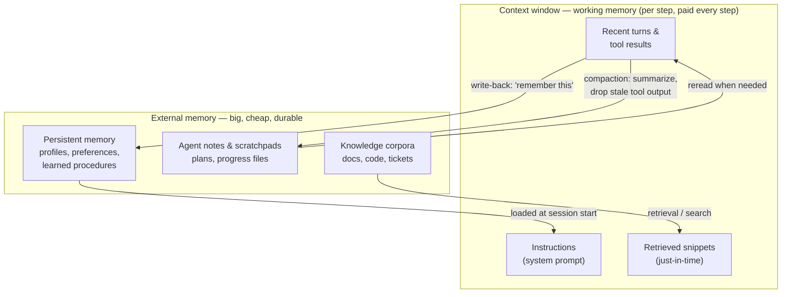

# Context & memory

*Part of [Agentic AI for the AI PM](./README.md)*

## TL;DR

A model has no memory between calls; an agent's "mind" on any given step is exactly what's
in its **context window** — instructions, conversation, tool results, retrieved knowledge.
That window is finite, and everything in agentic AI fights over it. So agents are built
around a memory hierarchy: the context window as **working memory** (fast, tiny,
attention degrades as it fills), **retrieval** pulling just-in-time knowledge from large
corpora, and **persistent memory** (files, notes, profiles, learned procedures) surviving
across sessions. The craft — **context engineering** — is curating the smallest
high-signal set of tokens per step: compacting old turns, summarizing tool floods,
offloading to notes, and resisting the temptation to stuff the window just because it's
big.

> 🎯 **For the AI PM**
>
> **Why it matters** — Context is the agent's real scarce resource, and it's also your
> cost line: every token in the window is paid for on every step, and quality *degrades*
> as the window fills — long-running agents get dumber and pricier at the same time.
> Most "the agent forgot / ignored my instruction / lost the plot" complaints are
> context-management failures, not model failures.
>
> **What it changes in your decisions** — "What does the agent remember, for how long,
> across what boundary?" becomes a spec question with privacy teeth: memory that delights
> one user ("it knows my preferences") is a liability across users, and a
> user-visible, editable memory is a different product from a silent one.
>
> **Ask yourself** — *"At step 30 of a long task, what is actually in this agent's
> window — and what fell out?"*
>
> **Risk if ignored** — An agent that aces 5-step demos and quietly falls apart on
> 50-step real work; or a memory feature that resurfaces something a user assumed was
> forgotten — in front of the wrong audience.

## The memory hierarchy

- **Working memory (the window)** — everything the model can "see" right now. Two hard
  truths: it's paid for on *every* step (a bloated context multiplies cost across the
  whole loop), and attention isn't uniform — as windows fill, models increasingly miss
  or misweight things buried in the middle. A big window is headroom, not a strategy.
- **Retrieval** — instead of pre-loading everything, fetch what *this step* needs:
  classic RAG over embeddings, but increasingly also **agentic search** — the agent
  using search/grep/file tools to find things the way a person would, which composes
  better with the loop than one-shot retrieval. (Agent platforms call the ingested,
  vector-indexed corpora **data stores** — documents provided in their original form,
  embedded, and queryable at runtime; it's the standard implementation of RAG in
  agent stacks.)
- **Notes & scratchpads** — agents doing long tasks write plans and progress to files
  and reread them, exactly like a human with a notebook. This is the simplest, most
  robust long-task memory: it survives compaction, it's inspectable, and it's debuggable.
- **Persistent memory** — what survives across sessions: user preferences, entity
  profiles, "how we did this last time" procedures. The magic feature and the liability,
  in one: it needs a retention policy, a user-visible surface, and a hard tenant
  boundary ([governance](./safety-security-and-governance.md)).

## Context engineering

The discipline has a name because the naive strategy — append everything, forever —
reliably fails. The working techniques:

- **Compaction** — when the window nears its budget, summarize the oldest exchanges and
  replace them with the summary. Cheap, lossy, essential. What to preserve (decisions,
  constraints, open questions) vs. drop (raw tool dumps, dead ends) is *product*
  judgment — a compaction that loses the user's stated constraint is a bug users will
  meet as "it forgot what I said."
- **Tool-result hygiene** — the biggest context polluter is tool output. Summarize or
  truncate at the source ([tool design](./tools-and-function-calling.md)); keep
  references ("full results in file X") instead of payloads.
- **Offloading** — move state out of the window into the environment: write the plan to
  a file, keep the checklist in a task tool, store intermediate data as artifacts. The
  window holds *pointers and the working set*, not the world.
- **Sub-agent isolation** — give a messy subtask (a deep search, a giant log analysis)
  to a [subagent](./multi-agent-and-protocols.md) with its own window, and take back
  only its conclusion. Context isolation is one of the strongest reasons multi-agent
  architectures exist.
- **Instruction anchoring** — durable rules (tone, constraints, safety) live in the
  system prompt, which survives compaction; don't rely on the user's turn-3 remark
  staying visible at turn 60.

At enterprise scale this discipline is the difference between a toy and a product. A
cleverly prompted assistant answers one question well; a product operates across a
canvas of entitlements, policies, compliance frameworks, and strategy — and that
context has to arrive through a *pipeline*, per request, not through whatever survived
the conversation. The tell that the pipeline is missing: inconsistency across sessions,
like the roadmap assistant that recommends entering the SMB market on Monday and
enterprise-only on Tuesday because nothing carried the strategic context forward. When
users report an agent as "unreliable," check what its window actually contained on each
occasion before blaming the model.

## What "the agent remembers me" really means

Product memory is three separate features wearing one name — scope them separately:

- **Session memory** ("it remembers what we said an hour ago") — context + compaction.
- **User memory** ("it knows my preferences and history") — persistent profile store,
  with consent, visibility, and edit/delete. Decide *what's worth remembering* — models
  writing their own memories save trivia and miss the important unless guided.
- **Organizational memory** ("it knows how *we* do things") — shared procedures and
  knowledge, with the tenant boundary as the load-bearing wall: leakage across users or
  orgs is the memory feature's catastrophic failure mode.

## Failure modes

- **Context stuffing** — "the window is 1M tokens, just put everything in." Cost
  multiplies per step; quality quietly degrades; nobody can say what the agent actually
  used.
- **Lossy compaction of the load-bearing fact** — the summary drops the user's
  constraint; the agent cheerfully violates it twenty steps later.
- **Goldfish agents** — no notes, no offloading; every session and every long task
  starts from zero, and users retype context forever.
- **Hoarder memory** — persistent memory that accretes stale, wrong, or sensitive facts
  with no expiry, no visibility, and no way for users to correct it.
- **The leaky tenant** — memory or retrieval crossing user/org boundaries; one incident
  of "why does it know *that*?" costs more trust than the feature ever earned.

## Practitioner checklist

- [ ] For a 50-step task: what's in the window at step 40, what got compacted, and who
      decided what compaction preserves?
- [ ] Are tool results summarized at the source, or flooding the window raw?
- [ ] Does the agent externalize plans/progress (notes, files, tasks) on long work?
- [ ] For persistent memory: what's stored, where can users see/edit/delete it, when
      does it expire, and what enforces the tenant boundary?
- [ ] Do I know the context cost per task — and its growth curve as tasks get longer?

## Related lessons

- [Tools & function calling](./tools-and-function-calling.md)
- [Multi-agent systems & protocols](./multi-agent-and-protocols.md)
- [Reliability & evals](./reliability-and-evals.md)
- [Foundations: context engineering](../content/00-foundations/context-engineering.md) — the same discipline at the prompt level
