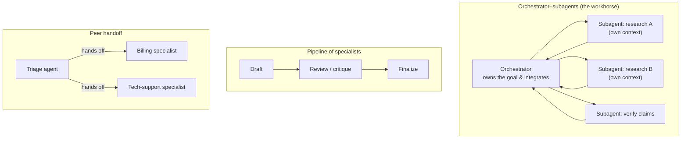

# Multi-agent systems & protocols

*Part of [Agentic AI for the AI PM](./README.md)*

## TL;DR

Sometimes one loop isn't enough — the task is too big for one context window, too
parallel for one worker, or needs specialists. Multi-agent systems answer with a few
recurring **topologies**: an **orchestrator** delegating to **subagents** (the workhorse
pattern), **pipelines** of specialists, and **peer handoffs**. The honest rule: multi-agent
buys *context isolation* and *parallelism*, and pays in *coordination overhead* — poorly
split, a crowd of agents underperforms one good loop at many times the cost. On
protocols: two matter today — **MCP** connects agents to tools; **A2A** aims to connect
agents to each other (real, early). The rest of the acronym soup on stack infographics
is speculative, niche, or invented; treat "the agent internet" as a research direction,
not an install step.

> 🎯 **For the AI PM**
>
> **Why it matters** — Multi-agent architectures are where agent budgets go to
> multiply: token spend scales with agent count, and coordination failures are
> emergent — each agent behaves, the *system* misbehaves. They're also the industry's
> favourite thing to oversell.
>
> **What it changes in your decisions** — You demand the same justification for "add an
> agent" as for "add a service": a named bottleneck (context, parallelism, or
> specialization) that a single loop demonstrably can't clear. Architecture diagrams
> with six agents get the question "what did each one earn?"
>
> **Ask yourself** — *"Would one agent with better tools and cleaner context do this —
> and have we actually tried?"*
>
> **Risk if ignored** — A five-agent system that's slower, costlier, and less debuggable
> than the single agent it replaced — adopted because the diagram looked like an org
> chart and org charts feel like progress.

## The topologies

- **Orchestrator–subagents** — a lead agent decomposes the task, spawns focused workers
  (each with its own context window and a scoped toolbox), and integrates results. The
  two genuine wins: **context isolation** (a subagent can burn 100k tokens grepping
  logs and return one paragraph — the lead's context stays clean, which is often the
  real reason this beats one agent) and **parallelism** (three research threads at
  once). The recurring cost: the orchestrator's brief *is* the spec; vague briefs yield
  duplicated or contradictory work.
- **Pipeline** — sequential specialists, each stage checkable. This is the multi-agent
  version of a [workflow](./what-is-an-agent.md): predictable, testable stage by stage,
  and usually the right shape when stages are known in advance.
- **Peer handoff** — an agent recognizes "not my job" and transfers the conversation,
  state and all (the customer-support shape). The design work is in the handoff: what
  context transfers, and does the user feel a seam?

Two disciplines keep any topology sane. **Structured handoffs** — subagent briefs and
returns are defined artifacts (task, constraints, expected output format), not vibes;
most multi-agent failures are really specification failures at the seams. **Someone owns
the whole** — one place (orchestrator or human) is accountable for the integrated
result, or you ship beautifully-done fragments that don't compose.

## The protocol landscape, honestly

You've seen the infographics: eight layers, a "protocol layer" listing A2A, MCP, ACP,
ANP, AGORA, TAP, OAP, FCP, AGP as if they were TCP/IP. Reality check, worth internalizing
because it inoculates you against a whole genre of hype:

- **MCP (Model Context Protocol)** — real, shipped, broadly adopted across major
  vendors; the standard way to plug tools and data into agents
  ([lesson 2](./tools-and-function-calling.md)). If you learn one protocol, it's this.
- **A2A (Agent2Agent)** — real (Google-initiated, now a Linux Foundation project):
  agents advertising capabilities and delegating to each other across vendors. Early —
  watch it, pilot it where a partner ecosystem demands, don't architect your product
  around universal adoption.
- **The rest** — a mix of research proposals, single-vendor efforts, and acronyms that
  exist mainly on infographics. Some may mature; none is a dependency you should list
  today.

The strategic read: tool-to-agent standardization (MCP) succeeded because the problem
was concrete and the payoff immediate. Agent-to-agent standardization is harder — it
needs identity, trust, payments, and liability answers, not just message formats — so
the "agent internet" arrives (if it does) the way the web did: unevenly, driven by a few
killer use cases. Meanwhile, every external agent your agent talks to is an
**untrusted input source** wearing a peer costume — the
[security lesson](./safety-security-and-governance.md) applies double at
organization boundaries.

## When to go multi-agent

A decision rule that survives contact with vendors:

1. **Start with one agent.** Better tools, tighter prompts, cleaner
   [context](./context-and-memory.md) fix most "we need more agents" symptoms.
2. **Add subagents when a bottleneck is named:** context (isolate the messy subtask),
   parallelism (independent threads), or specialization (genuinely different
   tools/permissions — e.g. only the deploy agent holds deploy credentials, which is a
   *security* win as much as an architecture one).
3. **Stop when coordination cost shows up** — in the token bill, the latency, or the
   debugging sessions that now span four transcripts.

The industry name for the mature end of step 2 is **agent chaining**, or a **"mixture
of agent experts"** — specialized agents, each strong in one domain or task, composed
into one system. It's a real pattern (it's how serious coding and research agents are
built today), but note what makes it work in practice: the specialists earn their place
by owning *different tools, permissions, or context* — not by having a different
adjective in their prompt.

## Failure modes

- **Org-chart architecture** — agents mirroring your team structure instead of the
  task's structure; the coordination overhead mirrors your meetings, too.
- **Vague briefs** — subagents told "research the market" twice; one returns consumer,
  one returns enterprise, neither returns what the plan needed.
- **The telephone game** — key constraints degrading across three handoffs until the
  final agent optimizes the wrong thing.
- **Protocol-driven roadmaps** — building for an "agent internet" of standards that
  don't exist yet, while competitors ship value on MCP and plain APIs.
- **Emergent runaway** — agents in a loop re-triggering each other; budgets and
  circuit breakers exist per *system*, not just per agent.

## Practitioner checklist

- [ ] For each agent in the design: which named bottleneck (context / parallelism /
      specialization) justifies its existence?
- [ ] Are handoffs structured artifacts — brief in, defined deliverable out?
- [ ] Who (agent or human) owns the integrated result?
- [ ] What's the *system-level* budget and kill switch, not just per-agent limits?
- [ ] Which protocols do we actually depend on today — and is anything on the roadmap
      betting on one that doesn't exist yet?

## Related lessons

- [Tools & function calling](./tools-and-function-calling.md)
- [Context & memory](./context-and-memory.md)
- [Reliability & evals](./reliability-and-evals.md)
