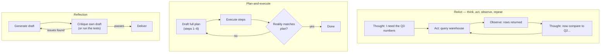

# Planning & reasoning

*Part of [Agentic AI for the AI PM](./README.md)*

## TL;DR

"Cognition" in an agent is not a module you install — it's the model, prompted and
orchestrated into **patterns**. The big four: **ReAct** (interleave thinking and acting,
one step at a time), **plan-and-execute** (draft the whole plan first, then work it,
revising as reality pushes back), **reflection** (generate, critique your own output,
retry), and **decomposition** (split the goal into subtasks, farm them out, integrate).
Modern *reasoning models* bake much of this in — they "think" before answering, and
think longer on harder problems, trading latency and tokens for accuracy (**test-time
compute**). The product craft is matching pattern and thinking budget to the task:
reasoning helps most on verifiable, multi-constraint problems; it's expensive decoration
on lookups; and no pattern rescues an agent whose environment gives it no feedback to
reason *about*.

> 🎯 **For the AI PM**
>
> **Why it matters** — Thinking is now a metered feature. The same model can answer in
> one second or deliberate for two minutes at 50× the tokens, and somebody — you — has
> to decide what each task deserves. Pattern choice drives the three numbers users feel:
> quality, latency, and cost.
>
> **What it changes in your decisions** — You stop asking "is the model smart enough?"
> and start asking "what's the thinking budget for this task tier, and what checkable
> feedback does the agent get so its thinking converges instead of spiraling?"
>
> **Ask yourself** — *"When this agent gets the plan wrong at step 2, what tells it —
> and how much have we spent by the time it finds out?"*
>
> **Risk if ignored** — An agent that burns two minutes and 100k tokens deliberating
> over a FAQ answer, or one that executes a flawed plan at full speed because nothing
> in the loop ever checked the plan.

## The patterns

- **ReAct** — the default loop from [lesson 1](./what-is-an-agent.md) with the thinking
  made explicit: reason about the situation, act, observe, reason again. Strong when
  each step's result should shape the next (debugging, research). Weakness: myopia — no
  global picture, so it can wander or loop.
- **Plan-and-execute** — think globally first. Better for multi-part deliverables and
  long tasks; also gives you a natural **human checkpoint** — showing the plan before
  execution is the cheapest, highest-leverage approval gate in agent UX. Weakness:
  plans meet reality; the pattern only works with an explicit "revise the plan" path.
- **Reflection / self-correction** — quality through iteration. Crucial nuance: models
  are mediocre critics of their own *unverifiable* claims, but excellent responders to
  **external verification** — failing tests, compiler errors, schema validators, a
  checklist. Reflection pays roughly in proportion to how checkable the work is; that's
  why coding agents (tests!) improved faster than open-ended writing agents.
- **Decomposition** — split, delegate (often to [subagents](./multi-agent-and-protocols.md)),
  integrate. Buys focus and parallelism; costs coordination — subtasks done brilliantly
  can still integrate into nonsense unless something owns the whole.

The patterns have a short research lineage worth knowing, because vendors still name
frameworks after it: **chain-of-thought** (prompt the model to reason step-by-step
before answering) came first; **self-consistency** improved it by sampling several
chains and taking the majority answer; **Tree-of-Thoughts** generalized it to exploring
multiple reasoning branches with backtracking — deliberate search instead of one linear
chain. **ReAct** grafted chain-of-thought onto action: thought → act → observe, taught
to the model with a few in-context examples. Reasoning models internalized most of this
lineage — you now buy it as "thinking" rather than prompt it by hand — but the names
survive in framework docs, and the underlying moves survive in every agent transcript
you'll read.

These compose: a serious coding agent plans, executes each step ReAct-style, reflects
against tests, and decomposes big work. Frameworks mostly package these patterns with
plumbing — evaluate them on the plumbing, because the patterns themselves are a page of
prompting.

## Test-time compute: thinking as a budget

Reasoning models (o-series, Claude's extended thinking, R1, Gemini thinking) generate
internal chains of thought before answering, and accuracy on hard problems climbs with
thinking time — a new scaling axis that happens at *inference*, on your bill, per
request. Three product consequences:

- **Thinking is tierable.** Route by stakes: no thinking for lookups, standard for
  everyday tasks, deep deliberation for the gnarly 5%. A single global setting
  overspends on the easy and underserves the hard.
- **Latency is now a quality dial, and users can see it.** "Thinking…" for 90 seconds is
  acceptable for "audit this contract," fatal for autocomplete. Set thinking budgets
  per surface, not per model.
- **More thinking isn't monotonic value.** Past a point, extra deliberation adds cost
  and sometimes second-guesses correct answers. Find the knee of the curve with
  [evals](./reliability-and-evals.md), not vibes.

And the boundary that keeps you honest: reasoning improves *derivation* — math, code,
constraint-juggling, multi-hop logic. It does not add knowledge the model lacks
(that's [retrieval](./context-and-memory.md)), and it doesn't reliably fix
hallucination — a model can reason beautifully from a false premise. Diagnose which
failure you have before buying thinking tokens.

## Feedback beats brilliance

The strongest single lever on agent intelligence isn't the pattern or the budget — it's
the **quality of the feedback the environment returns**. An agent with tests,
validators, error messages that teach, and checkable intermediate results converges; an
agent acting into a void diverges, no matter how clever. This is why "make the work
verifiable" — add a checker tool, define acceptance criteria the agent can run, return
[errors that explain](./tools-and-function-calling.md) — routinely beats "make the
model think harder" as an investment. When someone proposes upgrading the model, first
ask what the agent would *see* if it were wrong.

## Failure modes

- **Deliberation as decoration** — maximum thinking budget on every request because the
  demo looked smarter; the invoice and the latency graph disagree.
- **Plan worship** — executing a stale plan after step 1 disproved it, because nobody
  built the revise path.
- **Self-grading inflation** — trusting the model's "I checked my work" without an
  external verifier; reflection without verification is confidence laundering.
- **Endless pondering** — reasoning loops without budgets on ambiguous tasks; the agent
  thinks in circles at your expense instead of asking a human.
- **Pattern cargo-culting** — adopting a framework's five-agent planner-critic-executor
  architecture for a task a single well-prompted loop handles better and cheaper.

## Practitioner checklist

- [ ] For each task tier: which pattern, what thinking budget, and what latency does
      the user experience?
- [ ] Where does a human see the plan before expensive or risky execution begins?
- [ ] What external verification does the agent's work pass through — and could we add
      more checkable structure to the task?
- [ ] Do evals show where extra thinking stops paying on *our* tasks?
- [ ] When the agent is uncertain, does it ask — or deliberate expensively toward a
      guess?

## Related lessons

- [What is an agent?](./what-is-an-agent.md)
- [Reliability & evals](./reliability-and-evals.md)
- [Multi-agent systems & protocols](./multi-agent-and-protocols.md)
