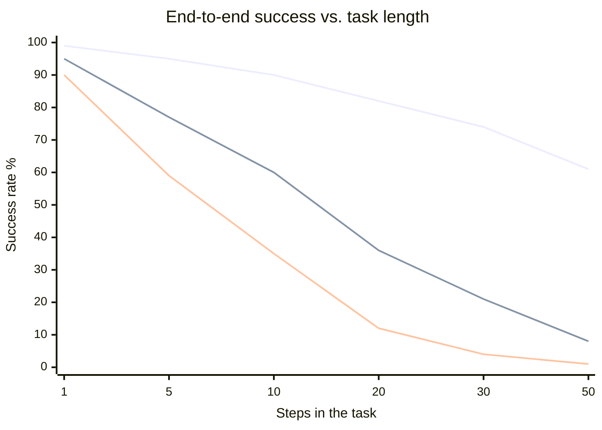

# Reliability & evals

*Part of [Agentic AI for the AI PM](./README.md)*

## TL;DR

Agent reliability is ruled by one brutal equation: errors **compound across steps**. A
step that succeeds 95% of the time sounds fine — until the task takes 20 such steps and
end-to-end success drops toward 36%. That's why agents demo brilliantly and deploy
disappointingly, and why the reliability toolkit is what it is: **shorten the chain**
(fewer, higher-level steps), **verify mid-flight** (checkpoints that catch errors before
they propagate), **recover** (retries, revisions, escalation), and **measure like you
mean it** — evals that grade both outcomes *and* trajectories, plus tracing that lets a
human replay any run. An agent without evals and traces isn't unreliable — it's
*unknowable*, which is worse.

> 🎯 **For the AI PM**
>
> **Why it matters** — The gap between "worked in the demo" and "works for customers"
> is precisely this lesson. Reliability determines the two numbers that make or break
> agent economics: task completion rate and human-intervention rate.
>
> **What it changes in your decisions** — You spec reliability the way you spec
> features: target completion rate per task tier, maximum intervention rate, and the
> recovery behaviour when — not if — a step fails. And you refuse to scale an agent
> whose failures you can't see, replay, and categorize.
>
> **Ask yourself** — *"How many sequential things must go right for this task — and
> what's our measured per-step success rate, not our hoped one?"*
>
> **Risk if ignored** — You promise autonomy on 30-step tasks with 5%-per-step error,
> ship a coin flip, and learn about it from churn instead of dashboards.

## The compounding law

Top curve: 99% per step. Middle: 95%. Bottom: 90%. Read the middle one: a *good*
per-step rate (95%) yields near-total failure on 50-step work. Three consequences worth tattooing on every agent roadmap:

- **Small per-step gains are enormous end-to-end.** 95% → 99% per step takes a 20-step
  task from 36% to 82%. This is why unglamorous work — [better tool errors](./tools-and-function-calling.md),
  [cleaner context](./context-and-memory.md), tighter prompts — routinely beats model
  upgrades.
- **Shortening the chain is a reliability strategy.** One right-altitude tool call
  replacing four low-level ones removes three failure opportunities. So does narrowing
  scope: an agent that does less, more reliably, is usually the better product
  ([lesson 8](./agentic-ai-as-a-product.md)).
- **Checkpoints reset the math.** A mid-task verification that catches and fixes errors
  effectively restarts the compounding clock. Recovery, not perfection, is the design
  goal — the best agents aren't the ones that never err; they're the ones that notice.

Design recovery in tiers: **retry** (transient failures, with backoff and a cap — the
same action repeated identically five times is a loop, not persistence), **revise**
(feed the error back and let the model change approach — this is where
[teaching errors](./tools-and-function-calling.md) pay), **restart** (a checkpoint
rollback beats forty steps of drift), and **escalate** (hand to a human with context —
a *feature*, not a failure; the agent that says "I'm stuck, here's where" keeps trust
that a confident wrong answer destroys).

## Evals: grade the journey, not just the destination

Everything from [eval-driven development](../technical-product-management/tpm-for-ai-products.md)
applies; agents add a layer, because two runs can reach the same answer — one cleanly,
one via eleven wasted tool calls and a lucky guess. Grade both:

- **Outcome evals** — did the task succeed? Prefer *verifiable* endpoints: the test
  passes, the record updated correctly, the extracted data matches ground truth. For
  fuzzy outcomes, rubric-graded by an LLM judge with human spot-audits.
- **Trajectory evals** — was the *path* sane? Right tools called, no forbidden actions,
  no flailing (retry storms, circular reasoning), efficient step count, correct
  escalation when stuck. Trajectory regressions are your early warning: paths often rot
  before outcomes do.
- **The suite** — dozens-to-hundreds of realistic tasks, run on every change (prompt,
  toolbox, model version), with production failures folded back in monthly. One eval
  dimension people forget: **cost and steps per task** — a change that keeps quality but
  doubles tokens is a regression.

Two agent-specific measurement traps. **Non-determinism:** run each eval task several
times and report pass rates with spread — a single green run proves little.
**Environment drift:** agent evals need stable sandboxed environments (seeded data,
frozen APIs); an eval that flakes because the test environment changed teaches teams to
ignore evals.

And the multi-turn debugging discipline, since agent failures rarely live where they
surface: annotate the **first upstream failing step**, not the visibly wrong final
answer — twenty downstream turns of confusion usually trace to one bad retrieval or
tool result. In multi-agent systems, log traces *per agent* but stitch them into one
session view, or every incident becomes four transcripts and no story. For sessions
with human handoffs, evaluate the agent's work *up to the handoff* (and whether it
escalated at the right moment) rather than blaming it for what happened after. Above
all: before building elaborate multi-step evaluators, try **simplifying the workflow**
— a step that's hard to evaluate is often a step that shouldn't exist.

## Observability: every run replayable

The non-negotiable: **full traces** — every model call, every tool call and result,
every decision point, linked per run. Traces are how you debug ("why did it delete
that?"), how you build eval sets (yesterday's weird trace is tomorrow's test case), and
how you audit ([governance](./safety-security-and-governance.md)). On top of traces,
the dashboard that matters: completion rate by task tier, intervention/escalation rate,
steps and cost per task, tool-error rates by tool, and — the sleeper metric — **user
overrides** (how often humans redo the agent's work; the truest quality signal you
have, and it arrives before churn does).

## Failure modes

- **Demo-grade confidence** — extrapolating from five hand-picked 3-step tasks to
  production 30-step tasks; the compounding law collects either way.
- **Outcome-only evals** — the answer's right, the path is degenerating, and nobody
  notices until the paths stop reaching answers.
- **Retry theater** — identical retries hammering a failing step, burning budget to
  fail slower.
- **The unknowable agent** — no traces; every incident is archaeology, every fix is a
  guess, every "it's better now" is a vibe.
- **Flaky eval environments** — tests that fail for environment reasons until everyone
  stops believing red means anything.

## Practitioner checklist

- [ ] What's our measured per-step success rate and typical chain length — and what
      does the compounding math predict end-to-end?
- [ ] Where are the checkpoints that catch errors mid-task, and what's the recovery
      ladder (retry → revise → restart → escalate)?
- [ ] Do evals grade trajectories and cost, or only final answers — and how many runs
      per task back each number?
- [ ] Can I pull the full trace of any production run from last week?
- [ ] What's our intervention rate trending, and who reviews the override signal?

## Related lessons

- [Planning & reasoning](./planning-and-reasoning.md)
- [Safety, security & governance](./safety-security-and-governance.md)
- [Agentic AI as a product](./agentic-ai-as-a-product.md)
