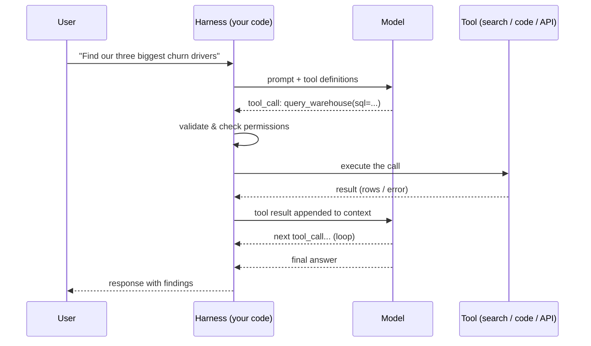

# Tools & function calling

*Part of [Agentic AI for the AI PM](./README.md)*

## TL;DR

Tools are how a model stops being a text generator and starts being an actor. The
mechanics are simple: you describe functions to the model (name, purpose, typed
parameters); the model replies "call this one, with these arguments"; **your code**
executes the call and feeds the result back; the model continues. The model never runs
anything itself — which means the harness owning execution is where safety, permissions,
and reliability actually live. The craft is mostly **tool design** (few, well-described,
right-altitude tools beat a hundred thin API wrappers), **integration** (MCP made
tools portable across apps and vendors), and **containment** (sandboxes and scoped
credentials, because a tool call is real-world action).

> 🎯 **For the AI PM**
>
> **Why it matters** — The tool list *is* the product surface of an agent: it defines
> everything the agent can do, everything that can go wrong, and most of what it costs.
> Two agents on the same model with different toolboxes are different products.
>
> **What it changes in your decisions** — You review the toolbox like you review a
> permissions screen: what can this agent read, write, spend, and delete; which of
> those actions are reversible; and which require a human's approval. And you treat
> "add a tool" with the gravity of "add a capability," not "add a config line."
>
> **Ask yourself** — *"For each tool: what's the worst realistic thing the agent could
> do with it, and would we survive that on a bad day?"*
>
> **Risk if ignored** — An over-provisioned agent meets a manipulated input
> ([prompt injection](./safety-security-and-governance.md)) or its own confusion, and
> uses a legitimate tool to do something catastrophic — politely, and at machine speed.

## The mechanics

The two arrows worth staring at: the model only ever *requests* a call, and the harness
*executes and can refuse*. Every control you'll ever want — allowlists, approval
prompts, rate limits, spend caps, logging — attaches at that harness step. A model with
tools is exactly as dangerous as the harness lets it be.

One taxonomy worth knowing, because platform docs and eng teams use it (it's from
Google's *Agents* whitepaper): tools split by **where the call executes**.
**Extensions** run agent-side — the agent's runtime calls the API directly, useful for
pre-built integrations and multi-hop chains where the next call depends on the last
result. **Function calling** runs client-side — the model only *outputs* the function
name and arguments, and your application executes (or refuses) the call, exactly as in
the diagram above. **Data stores** are the retrieval path — documents vector-indexed so
the agent can query them at runtime ([context & memory](./context-and-memory.md)). The
whitepaper's three canonical reasons to keep execution client-side are the reasons this
lesson defaults to it: security and auth restrictions that mean the agent shouldn't hold
API credentials; timing and order-of-operations constraints (batch jobs,
human-in-the-loop review before anything fires); and APIs that simply aren't reachable
from the agent's infrastructure. Choosing agent-side execution is choosing convenience
over a control point — make that trade knowingly.

Two late-2025 developments upgraded the mechanics. **Code execution as tool-glue**:
instead of emitting one tool call per turn (each result round-tripping through the
context), the model writes a short program that calls many MCP tools directly and
returns only the final result — collapsing token cost and latency on multi-tool
workflows, and making the code sandbox the orchestration surface. And **Skills**:
packaged procedural knowledge (a folder with instructions, scripts, and resources the
agent loads when relevant) as a third primitive alongside tools and prompts — tools
give the agent *capabilities*, skills give it *know-how* about when and how to use
them. Both matter to the PM the same way: the toolbox review now includes what code
the agent can run and what procedures it has been handed, not just which APIs it can
call.

What counts as a tool spans a wide range: retrieval and web search; code execution (the
universal power tool — a Python sandbox turns "things the model can describe" into
"things the model can do"); file and document operations; business APIs (CRM, calendar,
payments); and computer/browser use, where the model drives real UIs by looking at the
screen — powerful, slower, and the most fragile of the family.

## Tool design is UX design (for a model)

Models use tools well when the toolbox is designed for a *reader*, not a machine:

- **Few and distinct beats many and overlapping.** Given 40 near-duplicate tools, models
  pick wrong ones and waste turns; a handful of clearly-separated capabilities works
  dramatically better. If two tools are confusable to you, they're confusable to it.
- **Right altitude.** Don't wrap every endpoint 1:1. `book_meeting(person, topic, week)`
  beats making the model orchestrate `list_calendars` → `get_availability` →
  `create_event` → `send_invite` across four calls it can fumble. Fold your reliability
  into the tool; spend the model's intelligence on judgment, not plumbing.
- **Descriptions are prompts.** The tool description is the manual the model reads.
  State what it's for, when *not* to use it, and what it returns — including on failure.
- **Errors must teach.** A tool that returns "error 500" produces a stuck loop; one that
  returns "date must be YYYY-MM-DD, e.g. 2026-07-01" produces a self-correcting one.
  The quality of your error messages is a *feature* of your agent.
- **Return what's needed, not what exists.** A tool that dumps 40 KB of JSON into the
  context per call bloats cost and drowns signal
  ([context & memory](./context-and-memory.md)). Summarize, paginate, truncate.

## Integration and containment

**MCP (Model Context Protocol)** standardized the boring, valuable part: instead of
every app hand-wiring every integration, a tool provider ships one MCP server (exposing
tools, with schemas) and any MCP-capable agent can use it. Think "USB for tools." It's
real, widely adopted, and the piece of the much-hyped protocol landscape most worth
knowing ([the honest protocol map](./multi-agent-and-protocols.md) comes in lesson 5).
An ecosystem note that becomes a product note: an MCP server someone else wrote is
*third-party code your agent trusts* — its tool results enter your context, so vet
servers like dependencies, not like plugins.

**Containment** is the other half of integration. The working defaults:

- **Sandboxes** — code execution happens in an isolated, disposable environment with no
  production credentials and constrained network access. Non-negotiable for arbitrary
  code.
- **Least privilege** — the agent gets the narrowest scopes that let it do the job:
  read-only where read-only suffices, this-folder not all-folders, staging not prod.
- **Graduated irreversibility** — reads are free; writes are logged; destructive or
  outward-facing actions (delete, send, spend) require confirmation or a
  [human's approval](./safety-security-and-governance.md). Map every tool to a tier
  *before* launch.

## Failure modes

- **The kitchen-sink toolbox** — 60 auto-generated API wrappers; the agent spends its
  intelligence navigating your plumbing and still picks wrong.
- **Prod credentials in the loop** — the agent's "read the database" tool quietly has
  write scope too, discovered the day it matters.
- **Mute errors** — tools that fail without explaining; the agent retries the same
  broken call five times and gives up (or worse, doesn't).
- **Context-flooding tools** — every call returns the full firehose; cost balloons and
  quality drops as the signal drowns.
- **Unvetted MCP servers** — installing community tool servers like browser extensions,
  granting each one a seat inside your agent's trust boundary.

## Practitioner checklist

- [ ] Can I list my agent's tools from memory, and for each: read or write? reversible?
      max blast radius?
- [ ] Are tools at task altitude (`book_meeting`) rather than endpoint altitude
      (`create_event`)?
- [ ] Do tool errors tell the model how to correct course?
- [ ] Is code execution sandboxed, and are credentials scoped to least privilege?
- [ ] Which tool calls require human approval, and did a product decision (not a
      default) draw that line?

## Related lessons

- [What is an agent?](./what-is-an-agent.md)
- [Safety, security & governance](./safety-security-and-governance.md)
- [Multi-agent systems & protocols](./multi-agent-and-protocols.md)
