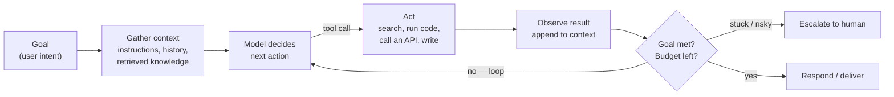

# What is an agent?

*Part of [Agentic AI for the AI PM](./README.md)*

## TL;DR

An agent is a language model given **tools**, a **goal**, and **permission to loop**: it
gathers context, decides an action, executes it, observes the result, and repeats until
the goal is met or it gives up. That loop — not any particular framework, protocol, or
"layer" — is the essence. Everything else in agentic AI is an attachment to the loop:
memory feeds it, planning steers it, evals grade it, sandboxes contain it. The key
product variable is **autonomy**: a spectrum from a fixed workflow that calls a model at
predefined steps, to an agent that decides its own steps. More autonomy buys flexibility
on open-ended problems and costs you predictability, latency, money, and debuggability —
which is why the first agent design decision is always *how little autonomy can we get
away with?*

> 🎯 **For the AI PM**
>
> **Why it matters** — "Agent" is the most abused word in the industry; it's applied to
> everything from a cron job with an LLM call to a fully autonomous coding system. If
> you can't place a proposal on the autonomy spectrum, you can't estimate its cost,
> risk, or failure modes — and you can't compare two "agents" that differ by an order
> of magnitude in both.
>
> **What it changes in your decisions** — For every "let's build an agent" proposal,
> you first ask whether a fixed workflow with LLM steps would do — it's cheaper, faster,
> more predictable, and easier to debug. Full agency is reserved for problems where you
> genuinely can't enumerate the steps in advance.
>
> **Ask yourself** — *"Could I draw this task as a flowchart? If yes, why am I paying
> for an agent to rediscover the flowchart on every request?"*
>
> **Risk if ignored** — You ship an expensive, unpredictable loop where a five-step
> pipeline would have done, or you demo a scripted workflow as an "agent" and set
> expectations autonomy can't meet.

## The loop

Strip away every framework and an agent is this:

Each pass through the loop, the model sees everything so far — the goal, its previous
actions, and their results — and picks the next move. Three properties follow directly
from this shape, and they explain most of agent behaviour:

- **Agents are stateful by accumulation.** The context grows every turn; the agent's
  "understanding" of the task is literally the transcript. This is why long tasks
  degrade ([context & memory](./context-and-memory.md)) and why a bad early observation
  can poison everything after it.
- **Agents are only as good as their feedback.** The loop self-corrects *only* when the
  environment pushes back — a failing test, an error message, a search with no results.
  Give an agent actions whose results it can't observe and verify, and it will confidently
  compound its own mistakes ([reliability](./reliability-and-evals.md)).
- **Agents need budgets and exits.** Left alone, a loop can run forever, burn money, or
  wander off-task. Real agents carry step limits, cost caps, time-outs, and an explicit
  "stuck → ask a human" path. The exits are product decisions, not plumbing.

## The canonical anatomy: model, tools, orchestration

Google's 2024 *Agents* whitepaper — the closest thing the industry has to a shared
reference — names the three components inside every serious implementation of the loop,
and the vocabulary is worth adopting because your engineering team already uses it:

- **The model** — the language model (one or several, general-purpose or fine-tuned)
  acting as the centralized decision-maker: the "decide" box of the loop, running a
  reasoning framework like ReAct or chain-of-thought
  ([planning & reasoning](./planning-and-reasoning.md)).
- **The tools** — the bridge between the model's internal capabilities and the outside
  world ([tools & function calling](./tools-and-function-calling.md)); without them the
  model can only describe actions, never take them.
- **The orchestration layer** — the cyclical process governing how the agent takes in
  information, reasons, and uses that reasoning to pick its next action until it reaches
  the goal or a stopping point. That's the loop above — plus your budgets and exits.

The same paper's model-vs-agent contrast is a useful smell test, compressed: a model's
knowledge ends at its training data, an agent extends it live through tools; a model does
one inference per query with no session state, an agent manages multi-turn history in the
orchestration layer; a model has no native tool use or logic layer, an agent has both
built in. If a proposal calls something an "agent" but has no tools, no session
management, and no loop — it's a model call wearing a costume.

## The autonomy spectrum

"Agent or not" is the wrong question; *how much agency* is the right one:

| Level | What decides the steps | Example | Failure style |
| --- | --- | --- | --- |
| LLM call | Nothing — one shot | Summarize this ticket | Wrong output |
| Workflow | Your code; LLM fills slots | Extract → classify → route pipeline | Predictable, per-step |
| Router | LLM picks a branch, code runs it | Support triage choosing a playbook | Wrong branch |
| Tool-using agent | LLM picks actions from a toolbox, loops | Research assistant with search + docs | Wanders, over-calls tools |
| Autonomous agent | LLM plans, acts, self-corrects over long horizons | Coding agent fixing a bug end-to-end | Expensive, novel failures |

Two heuristics carry most of the decision. **Enumerable steps → workflow.** If an expert
can write down the procedure, encode the procedure; use the model inside the steps where
judgment or language handling is needed. Workflows are cheaper, faster, testable, and
their failures are local. **Open-ended path → agent.** When the steps genuinely depend on
what's discovered along the way — debugging, research, negotiation — a fixed pipeline
either explodes into unmanageable branches or fails on the first surprise; that's what
the loop is for.

And a third, from hard experience: **match autonomy to stakes and reversibility**. An
agent drafting replies a human sends can be boldly autonomous; an agent with delete
access to production data had better not be ([safety & security](./safety-security-and-governance.md)).

## A loop, not a layer cake

You'll meet diagrams presenting agentic AI as a tidy tower — infrastructure at the
bottom, then protocols, tools, cognition, memory, applications, governance stacked on
top. They're useful as *inventories* (most of the named pieces exist) and misleading as
*architecture*: the pieces aren't layers with dependencies, the model itself is usually
missing, "cognition" is mostly the model plus prompting patterns rather than an
installable component, and governance and observability are cross-cutting disciplines,
not a penthouse floor. When you see such a stack, mentally rearrange it into the
knowledge graph from the [module overview](./README.md): a loop at the center,
capabilities feeding it, disciplines bounding it. That picture predicts behaviour; the
tower doesn't.

## Failure modes

- **Agent-washing** — calling a scripted workflow an agent (or vice versa). Misprices
  the work, mis-sets expectations, and hides where failures will come from.
- **Maximum autonomy by default** — reaching for a free-roaming agent because it demos
  impressively, when the task is a five-step flowchart.
- **No exits** — loops without step budgets, cost caps, or an escalation path; the
  failure is discovered on the invoice or in the incident channel.
- **Unobservable actions** — giving the agent tools whose outcomes it can't check, then
  wondering why it never self-corrects.
- **Demo-horizon thinking** — judging an agent on a three-step task when production
  tasks take thirty ([compounding error](./reliability-and-evals.md) does the rest).

## Practitioner checklist

- [ ] For my current "agent" proposal: where exactly does it sit on the autonomy
      spectrum, and could one level less do the job?
- [ ] Can I draw the loop for it — including what the agent *observes* after each
      action to know whether the action worked?
- [ ] What are the budgets (steps, cost, time) and what happens when they're hit?
- [ ] Which actions are irreversible, and does autonomy drop where stakes rise?
- [ ] If I removed the word "agent" from the pitch, would the design still make sense?

## Related lessons

- [Tools & function calling](./tools-and-function-calling.md)
- [Context & memory](./context-and-memory.md)
- [Agentic AI as a product](./agentic-ai-as-a-product.md)
