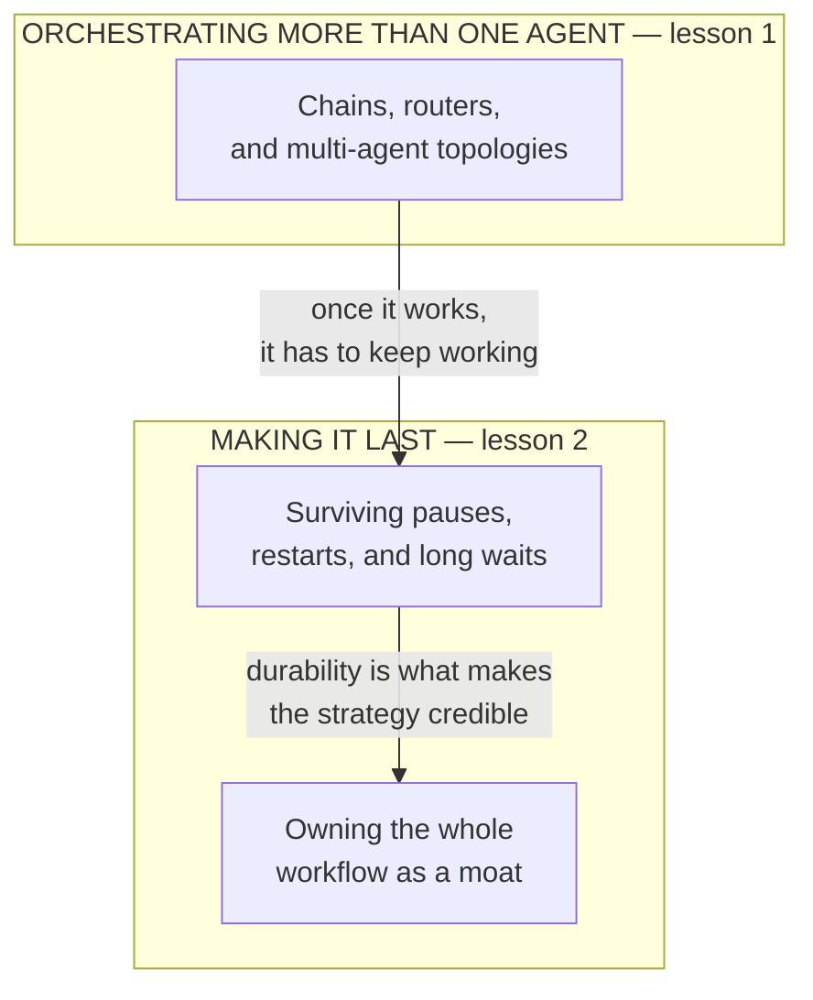

# Agentic workflows for the product leader

*Part of the [Generative AI family](../GENERATIVE_AI_ROADMAP.md).*

A single agent's loop only gets you so far. Some jobs are too big for one context window,
too parallel for one worker, or too long-running to fit inside one continuous run — they
need to pause for days waiting on a human, survive a restart, and pick up exactly where
they left off. "Agentic workflow" is the name for what happens once a task needs more than
one loop, or needs the loop to keep its place across real time. Getting this right is
mostly a small number of orchestration and durability decisions, made deliberately instead
of by whichever framework happened to be closest to hand.

**A note on scope.** This is the most heavily covered topic in this family so far.
[Multi-agent systems & protocols](../agentic-ai/multi-agent-and-protocols.md) already
develops orchestration topologies and the MCP/A2A protocol landscape in full depth. The
workflow-versus-agent distinction itself is already the subject of
[AI agents](../ai-agents/README.md)'s first lesson in this same family. Human-in-the-loop
design is already developed as part of
[Agentic AI as a product](../agentic-ai/agentic-ai-as-a-product.md)'s agent-UX section, and
belongs more fully to this family's upcoming AI security & guardrails module. Durable,
long-running execution is the entire subject of a dedicated twelve-phase track,
[Flowable](../flowable/README.md), which builds a real process engine from scratch.
Workflow capture as a business strategy is already a full section — and an existing
glossary term — inside *Agentic AI as a product*. Re-deriving any of it here would only
restate it a fourth or fifth time. This module compresses to the two lessons that are
genuinely new once all of that is accounted for: how to decide on an orchestration shape
once one agent isn't enough, and what it takes to make a workflow durable enough, and
valuable enough, to be worth owning end to end.

## The knowledge graph

Read it as two questions asked in sequence. **Orchestrating**: once a single agent's loop
isn't enough, what shape should the work take — a fixed pipeline, a router, several
agents coordinating? **Making it last**: once that shape exists, does it survive being
paused for three days waiting on a human, and is owning the whole thing — not just a step
inside it — actually the better business bet?

## The lessons

- [**Orchestrating more than one agent**](./orchestrating-more-than-one-agent.md) — the
  recurring shapes multi-agent work takes, and the discipline that keeps a
  multi-agent system from costing more than the single agent it replaced.
- [**Making a workflow durable, and worth owning**](./making-a-workflow-durable-and-worth-owning.md)
  — why a workflow has to survive real time to be worth anything, and why owning it
  end to end is the strategic move underneath the mechanics.

Each lesson pairs the product framing with a **🎯 For the product leader** briefing —
why it matters, the decision it changes, the question to ask your team, and the risk if
ignored — plus a diagram. For the engineering depth behind every mechanic mentioned here,
follow the spokes into
[Multi-agent systems & protocols](../agentic-ai/multi-agent-and-protocols.md),
[Flowable](../flowable/README.md), and
[Agentic AI as a product](../agentic-ai/agentic-ai-as-a-product.md).

**📌 Close out the module:** [Recap & real-world examples](./recap.md).
