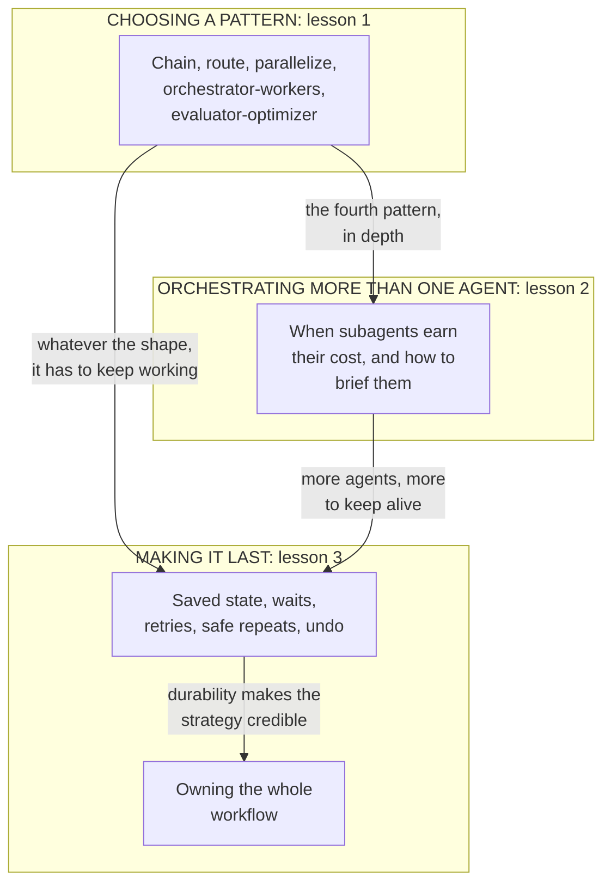

# Agentic workflows for the product leader

*Part of the [Generative AI family](../GENERATIVE_AI_ROADMAP.md).*

A single agent's loop only gets you so far. Some jobs are too big for one context window,
too parallel for one worker, or too long-running to fit inside one continuous run — they
need to pause for days waiting on a human, survive a restart, and pick up exactly where
they left off. "Agentic workflow" is the name for what happens once a task needs more than
one loop, or needs the loop to keep its place across real time. Getting this right is
mostly a small number of orchestration and durability decisions, made deliberately instead
of by whichever framework happened to be closest to hand.

**A note on scope.** Several neighbouring lessons already cover parts of this topic.
[Multi-agent systems & protocols](../agentic-ai/multi-agent-and-protocols.md) develops the
orchestration topologies and the MCP and A2A landscape. [AI agents](../ai-agents/README.md)
covers the workflow-versus-agent line, and the run-level controls: budgets, approval gates
and the kill switch. [Flowable](../flowable/README.md) builds a real process engine from
scratch. [Agentic AI as a product](../agentic-ai/agentic-ai-as-a-product.md) covers
workflow capture as a business strategy. This module does not repeat them. It adds the
decisions that sit between them: which workflow pattern to use, when more than one agent
earns its cost, and what makes a workflow survive real time.

## Where the depth lives

Each lesson summarises an idea and points to the lesson that covers it in full.

| If you want the full depth on | Read |
| --- | --- |
| Orchestration topologies and the MCP and A2A landscape | [Multi-agent systems & protocols](../agentic-ai/multi-agent-and-protocols.md) |
| The autonomy dial, and workflow versus agent | [What an agent is](../ai-agents/what-an-agent-is-and-how-much-autonomy-it-needs.md) |
| Run limits, approval gates and the kill switch | [Running an agent in production](../ai-agents/running-an-agent-in-production.md) |
| Writing the prompts inside a chain | [Prompt chaining and multi-step workflows](../prompt-engineering/prompt-chaining-and-workflows.md) |
| Wait states, retries, compensation and process engines | [Flowable](../flowable/README.md) |
| Workflow capture and agent economics | [Agentic AI as a product](../agentic-ai/agentic-ai-as-a-product.md) |

## The knowledge graph

```mermaid
flowchart TB
  subgraph PATTERN["CHOOSING A PATTERN: lesson 1"]
    FIVE["Chain, route, parallelize,<br/>orchestrator-workers,<br/>evaluator-optimizer"]
  end
  subgraph ORCH["ORCHESTRATING MORE THAN ONE AGENT: lesson 2"]
    TOPO["When subagents earn<br/>their cost, and how to<br/>brief them"]
  end
  subgraph DURABLE["MAKING IT LAST: lesson 3"]
    SURVIVE["Saved state, waits,<br/>retries, safe repeats, undo"]
    OWN["Owning the whole<br/>workflow"]
  end
  FIVE -->|"the fourth pattern,<br/>in depth"| TOPO
  FIVE -->|"whatever the shape,<br/>it has to keep working"| SURVIVE
  TOPO -->|"more agents, more<br/>to keep alive"| SURVIVE
  SURVIVE -->|"durability makes the<br/>strategy credible"| OWN
```

Read it as three questions in order. **Which shape?** Pick the simplest of five patterns
that does the job. **How many agents?** Add one only when it clears a named bottleneck.
**Will it last?** Once the shape exists, it must survive a three-day wait and a restart.
Only then is owning the whole workflow worth asking.

## The lessons

- [**Choosing a workflow pattern**](./choosing-a-workflow-pattern.md) — the five patterns,
  what each costs, and how to choose the simplest that works.
- [**Orchestrating more than one agent**](./orchestrating-more-than-one-agent.md) — when
  subagents are worth their cost, what the evidence says, and how to write a brief.
- [**Making a workflow durable, and worth owning**](./making-a-workflow-durable-and-worth-owning.md)
  — saved state, waits, retries, safe repeats and undo, then the case for owning the whole
  workflow.

Each lesson has a **🎯 For the product leader** briefing, a labelled worked example, an
"Under the hood" section for engineers, and a Sources list.

**📌 Close out the module:** [Recap & real-world examples](./recap.md), which ends with a
self-test.
