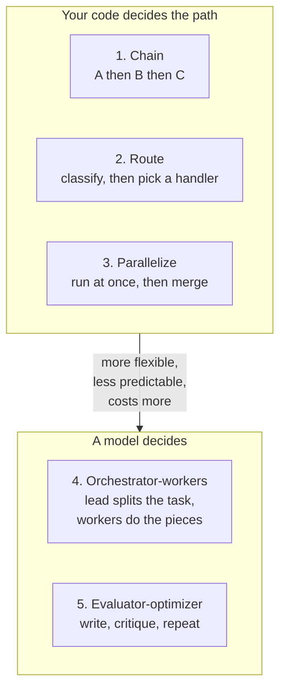

# Choosing a workflow pattern

*Part of [Agentic workflows for the product leader](./README.md)*

*Last reviewed: 2026-09 · Volatility: fast*

## TL;DR

Many AI features that do real work are not one model call. They are a workflow: several
model calls, and some plain code, joined in a shape. Five shapes are common.

1. **Prompt chaining.** Step one feeds step two, and so on.
2. **Routing.** Classify the input, then send it to the right handler.
3. **Parallelization.** Run independent calls at once and combine the results.
4. **Orchestrator-workers.** A lead model splits the task and hands pieces to workers.
5. **Evaluator-optimizer.** One call writes, another critiques, and they loop.

The first three keep the path in your code. The fourth lets a model decide the path. The
fifth adds a quality loop. As a rule of thumb, moving down the list gains flexibility and
usually costs predictability, speed and cost control. That ordering is this lesson's
judgement, not a measured ranking. Pick the first shape that does the job.

> 🎯 **For the product leader**
>
> **Why it matters** — The pattern sets your cost per task, your latency, and how hard
> failures are to find. Teams that skip this choice often end up with the most
> flexible shape by default, and pay for it on every request.
>
> **What it changes in your decisions** — You ask which pattern a proposal uses, and why
> a simpler one would not do. You treat a move to a more flexible pattern as a spend
> decision.
>
> **Ask yourself** — *"Which of the five is this? Could the previous one on the list do
> the job?"*
>
> **Risk if ignored** — A feature that could have been a three-step chain ships as an
> orchestrator with workers. It costs more, runs slower, and fails in ways
> nobody can trace.

## The mental model: who decides the path

The key question is who decides what happens next. In the first three patterns, your code
decides. In the fourth, a model decides. In the fifth, the critic decides when to stop, so
set a round limit.



Anthropic separates workflows, where code directs the model, from agents, where the model
directs itself. It lists all five patterns here as workflows. The split by who decides the
path is this lesson's own framing. Anthropic also advises
starting with the simplest approach, and adding multi-step agentic systems "only when
simpler solutions fall short."
For the autonomy question itself, see
[What an agent is, and how much autonomy it needs](../ai-agents/what-an-agent-is-and-how-much-autonomy-it-needs.md).

## The five patterns

Each pattern below shows what it is, when it fits, and what it costs. The wording of the
definitions follows Anthropic's.

| Pattern | What it does | Use when | Main cost | Typical failure |
| --- | --- | --- | --- | --- |
| **Prompt chaining** | Breaks a task into a sequence. Each call works on the last call's output. | The task splits cleanly into fixed steps. | Latency adds up, one call per step. | An early mistake flows through every later step. |
| **Routing** | Classifies the input and sends it to a specialised follow-up. | There are distinct categories that need different handling. | One extra classification call. | Misrouted input gets the wrong handler, confidently. |
| **Parallelization** | Runs calls at the same time and combines the results in code. | Subtasks are independent, or you want several views. | More tokens at once. Usually not slower than a chain. | Results disagree, with no rule to settle it. |
| **Orchestrator-workers** | A lead model breaks the task down, delegates, and combines. | You cannot predict the subtasks in advance. | Usually the highest and least predictable spend. This is a rule of thumb. Anthropic does not rank the patterns. | The lead gives vague briefs, and workers duplicate effort. |
| **Evaluator-optimizer** | One call generates. Another gives feedback. They loop. | You have clear criteria, and revision measurably helps. | Several calls per answer. | The loop runs on, or the critic is no better than the writer. |

## How to choose

Work down the list and stop at the first pattern that fits.

| If the task... | Start with |
| --- | --- |
| Has fixed steps, each easy to check | Prompt chaining |
| Has distinct input types needing different treatment | Routing, then a chain per route |
| Has independent parts, or needs a second opinion | Parallelization |
| Has steps you cannot list in advance | Orchestrator-workers |
| Has a clear quality bar, and a draft is often not good enough | Evaluator-optimizer on top of one of the above |

Patterns combine. A common product shape is route, then chain, with an evaluator on the
last step. Keep each added layer justified by a measured gap.

## Worked example: one support email, five ways

*This example is invented, to show the method. The numbers are illustrative.*

A team wants to answer customer emails about orders. They compare patterns. Counts are
model calls only. Lookups are plain code.

| Pattern | How it would work here | Model calls per email | Verdict |
| --- | --- | --- | --- |
| Chain | Extract order id, look it up (plain code), draft a reply. | 2 | Good first build. Predictable. |
| Route + chain | Classify as refund, shipping or other. Use a chain per type. | 3 | Best fit. Types differ, and each path is short. |
| Parallelize | Draft three tones at once, pick one by a rule in code. | 3 | Not needed. The tone does not vary enough to pay for. |
| Orchestrator-workers | A lead plans, workers fetch data and draft. | 5 or more | Overkill. The steps are known. |
| Add evaluator | A second call checks the reply against policy. | +1 per round with a model critic | Worth it for refunds only, where a wrong reply costs money. |

The team ships "route, then chain", with an evaluator on the refund path only. They do not
build the orchestrator. If a fourth email type appears with no fixed steps, they revisit
that choice.

## Tradeoffs

- **Control vs. flexibility.** Fixed paths are easy to test and trace. Model-chosen paths
  handle surprises and create their own.
- **Cost vs. quality.** Parallel calls and evaluator loops buy quality with tokens.
- **Latency.** A chain adds a call per step. Parallel calls add tokens and little time.
  Loops add time per round.
- **Debuggability.** A failure in a chain points to one step. A failure in a model-led
  pattern can sit anywhere. Log every call.

## Failure modes

- **Flexibility by default.** The most open pattern is chosen because the demo looked good.
  The task had fixed steps.
- **A chain with no checks between steps.** One bad output is passed on and amplified.
- **Routing with no fallback.** An input that fits no category gets forced into one.
- **A critic that is the same model with the same blind spots.** The loop agrees with
  itself. Use a test, a validator or a rubric as the check.
- **An unbounded loop.** An evaluator that never says "good enough" runs until the budget
  does. Set a round limit.

## Under the hood

The point of the first three patterns is that your code holds the control flow. Here is
each in outline. `llm()` stands for one model call.

```python
# 1. Chain: each step's output feeds the next, with a check in between.
facts = llm("Extract order id and issue as JSON.", email)
validate(facts)                                   # fail early, not three steps later
reply = llm("Draft a reply.", [facts, lookup(facts["order_id"])])

# 2. Route: a small classifier picks the handler. Always have a fallback.
kind = llm("Classify: refund | shipping | other.", email)
handler = HANDLERS.get(kind, escalate_to_human)
reply = handler(email)

# 3. Parallelize: independent calls, merged by a rule in code.
drafts = run_concurrently([lambda: llm(p, email) for p in PROMPTS])
reply = pick_by_rule(drafts)                      # not "ask the model to pick"

# 5. Evaluator-optimizer: bounded loop, with a real check where possible.
draft = llm("Draft a reply.", email)
for _ in range(MAX_ROUNDS):                       # a budget, not a hope
    verdict = check(draft)                        # a test or rubric beats a second opinion
    if verdict.ok:
        break
    draft = llm("Revise using this feedback.", [draft, verdict.feedback])
```

Pattern 4, orchestrator-workers, hands control to a model. That is why it needs the limits
and briefs described in
[Orchestrating more than one agent](./orchestrating-more-than-one-agent.md).

For prompt-level detail on chains, see
[Prompt chaining and multi-step workflows](../prompt-engineering/prompt-chaining-and-workflows.md).

## Practitioner checklist

- [ ] Can we name which of the five patterns this feature uses?
- [ ] Did we try the earlier patterns first, and write down why they were not enough?
- [ ] Does each step in a chain validate its input before passing output on?
- [ ] Does every router have a fallback for input that fits no category?
- [ ] Are parallel results combined by a rule in code, not by guesswork?
- [ ] Does every loop have a round limit and a real check?
- [ ] Do we log every call, so we can see which step failed?

## Related lessons

- [Orchestrating more than one agent](./orchestrating-more-than-one-agent.md) — the
  fourth pattern in depth: cost, briefs and when it earns its place.
- [Making a workflow durable, and worth owning](./making-a-workflow-durable-and-worth-owning.md)
  — what has to hold once the workflow runs over real time.
- [What an agent is, and how much autonomy it needs](../ai-agents/what-an-agent-is-and-how-much-autonomy-it-needs.md)
  — the autonomy dial these patterns sit on.
- [Prompt chaining and multi-step workflows](../prompt-engineering/prompt-chaining-and-workflows.md)
  — writing the prompts inside a chain.
- [Multi-agent systems & protocols](../agentic-ai/multi-agent-and-protocols.md) — the
  topologies in engineering depth.

## Sources

- Anthropic, [Building effective agents](https://www.anthropic.com/engineering/building-effective-agents)
  (Dec 2024): the five workflow patterns and their definitions, the workflow-versus-agent
  distinction, and the advice to start simple. Checked 2026-09.
- The cost and flexibility ordering of the patterns is this lesson's judgement. Anthropic
  does not rank them.
- The support-email comparison, its call counts and the code sketches are invented and
  illustrative.
