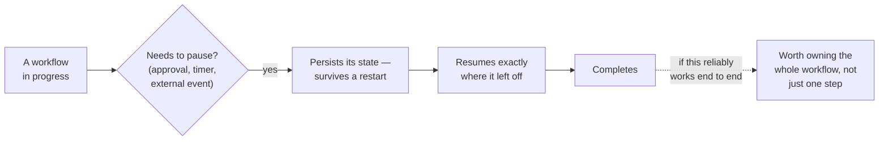

# Making a workflow durable, and worth owning

*Part of [Agentic workflows for the product leader](./README.md)*

## TL;DR

A workflow earns its name the moment it needs to outlive a single continuous run: it has
to pause for three days waiting on a signature, survive a server restart without losing
its place, and resume exactly where it left off when the wait ends. That's a different
engineering problem than making one agent call reliable, and it's the one that turns a
promising demo into infrastructure a business can actually depend on. Once a workflow can
survive real time, a second, strategic question follows: is it worth owning the whole
thing end to end, rather than just automating one step inside it? Owning the whole
workflow removes the seams a user would otherwise have to stitch together by hand, and
that's what turns an AI feature into something genuinely hard to displace.

> 🎯 **For the product leader**
>
> **Why it matters** — Durability decides whether a workflow feature can be trusted with
> anything that takes longer than one conversation. Ownership scope decides whether the
> feature becomes a moat or stays a replaceable point solution.
>
> **What it changes in your decisions** — Whether a "long-running" workflow feature is
> scoped as a resumable process from day one, or bolted on as an afterthought once the
> first restart loses someone's in-progress work — and whether the roadmap aims at owning
> a whole workflow or just automating a step inside someone else's.
>
> **Ask yourself** — *"If our server restarted right now, would every in-progress workflow
> resume exactly where it left off — and if we own this whole workflow instead of one
> step, what happens to the seams the user currently stitches together by hand?"*
>
> **Risk if ignored** — A workflow that works perfectly in every demo loses a customer's
> in-progress work on the first real restart, or a well-executed single step gets
> commoditized because a competitor captured the whole workflow around it.

## The mental model: durability first, then the business case

The sequence matters. A workflow that can't reliably persist through a pause and resume
correctly isn't ready to be the thing a business stakes a "we own this end to end" claim
on — durability is the precondition, not a detail to fix later. Only once it's genuinely
trustworthy does the strategic question about ownership scope become worth asking.

## What actually makes a workflow durable

The core idea is a **wait state**: a point where the process safely pauses and saves
itself, so it can sit idle for days waiting on a human approval, a timer, or an external
event, and then resume from exactly that point rather than from the beginning. Underneath
that sits a **job executor** — a background worker that picks up scheduled or retried
work (a timer that fires, a step that failed and needs another attempt) without anyone
watching it happen live. Together these are what separate "an agent that ran once and
answered" from "a process a business can depend on being still there in three days." The
full mechanics — building this exact machinery from scratch, then running it on a real
process engine — are developed across an entire dedicated track,
[Flowable](../flowable/README.md).

## The strategic case for owning the whole workflow

A tool that automates one step still leaves a human to do — and stitch together — the
rest of the job by hand. Capturing the entire workflow end to end removes that stitching
work entirely: there's nothing left for the user to assemble, because the system already
owns the whole outcome. That position compounds. Once a workflow is owned end to end,
expansion into adjacent workflows starts from a position of trust and integration the
point-solution competitor doesn't have. The trap on the other side is real too: a
quantifiable single-step outcome is easy for a competitor to price and copy, so a durable
advantage usually comes from owning more of the workflow, not from doing one step of it
exceptionally well. This economic case, including how it interacts with pricing and the
honest metric of how much of the workflow is still secretly done by humans behind the
interface, is developed in full in
[Agentic AI as a product](../agentic-ai/agentic-ai-as-a-product.md).

## Failure modes

- **Durability bolted on after the first incident** — a workflow shipped as if it always
  runs start to finish in one sitting, until the first server restart loses someone's
  three-day-old in-progress work.
- **No compensating path for partial failure** — a multi-step workflow with no defined
  "undo" for the steps that already happened when a later step fails, leaving the system
  in a half-completed state nobody planned for.
- **Owning a step instead of the workflow** — automating one stage well while the
  surrounding workflow stays fragmented, leaving room for a competitor to capture the
  whole thing and make the single-step tool replaceable.
- **Point-solution pricing on a commoditizing outcome** — a well-quantified single-step
  outcome priced attractively today, in a market that races to the bottom the moment it's
  easy to copy.

## Practitioner checklist

- [ ] If the system restarted mid-workflow right now, would every in-progress instance
      resume exactly where it left off?
- [ ] Is there a defined compensating action for every step whose failure would otherwise
      leave the workflow in a half-completed state?
- [ ] Is the roadmap aimed at owning an entire workflow end to end, or just automating one
      step inside a workflow someone else still has to assemble?
- [ ] What fraction of this "automated" workflow is still secretly done by a human behind
      the interface, and is that fraction shrinking over time?

## Related lessons

- [Orchestrating more than one agent](./orchestrating-more-than-one-agent.md) — the
  shape this lesson's durability and ownership questions apply to once it's running.
- [Flowable](../flowable/README.md) — the full mechanics of wait states, persistence,
  job execution, and durable process design, built from scratch.
- [Agentic AI as a product](../agentic-ai/agentic-ai-as-a-product.md) — the full
  economics of workflow capture, agent UX, and service-as-a-software strategy.
