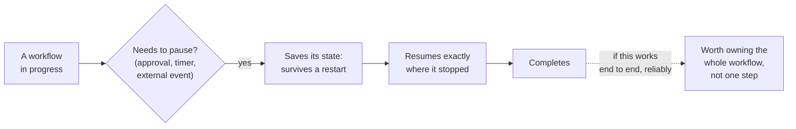

# Making a workflow durable, and worth owning

*Part of [Agentic workflows for the product leader](./README.md)*

*Last reviewed: 2026-09 · Volatility: fast*

## TL;DR

A workflow earns the name when it must outlive one continuous run. It may wait three days
for a signature. A server may restart in the middle. It must pick up where it stopped.

That is a different problem from making one agent call reliable. It is the problem that
turns a demo into something a business can depend on. Five things make a workflow durable:

- **Saved state** after every step.
- **Wait states** for people and timers.
- **Retries** with limits.
- **Safe repeats**, so a retry cannot do harm twice.
- **Undo steps**, for when a late step fails.

Once a workflow survives real time, a business question follows. Is it worth owning the
whole workflow, or only one step of it?

> 🎯 **For the product leader**
>
> **Why it matters** — Durability decides whether a feature can be trusted with anything
> that takes longer than one conversation. Ownership scope decides whether it becomes
> hard to replace or stays a point solution.
>
> **What it changes in your decisions** — You scope any long-running feature as a
> resumable process from day one. You do not bolt it on after the first restart loses
> someone's work.
>
> **Ask yourself** — *"If our servers restarted right now, would every workflow in
> progress resume where it stopped, with nothing done twice?"*
>
> **Risk if ignored** — A workflow that works in every demo loses a customer's three-day
> approval on its first real restart, or charges them twice when a retry fires.

## The mental model: durability first, then the business case


```mermaid
flowchart LR
  RUN["A workflow<br/>in progress"] --> WAIT{"Needs to pause?<br/>(approval, timer,<br/>external event)"}
  WAIT -->|"yes"| PERSIST["Saves its state:<br/>survives a restart"]
  PERSIST --> RESUME["Resumes exactly<br/>where it stopped"]
  RESUME --> DONE["Completes"]
  DONE -.->|"if this works<br/>end to end, reliably"| CAPTURE["Worth owning the<br/>whole workflow,<br/>not one step"]
```

Order matters. A workflow that cannot survive a pause is not ready for a claim like "we
own this end to end." Durability comes first. Only then is the ownership question worth
asking.

## What makes a workflow durable

**State saved after every step.** Write down enough to resume: which step is done, what
each step returned, and what is next. A crash at step 14 then restarts at step 14. The
Claude research system Anthropic described works this way. It saves progress so agents
"can resume from where the agent was when the errors occurred" instead of starting over.

**Wait states.** A wait state is a point where the workflow safely pauses and saves
itself. It can sit for days, waiting for a human approval, a timer, or an outside event.
Then it wakes and continues.

**Retries with limits.** A step that fails for a passing reason, such as a timeout, should
try again. A limit and a growing delay keep a bad step from looping all night. After the
limit, the workflow should stop and raise the problem to a person.

**Safe repeats.** A retry or a restart can run a step twice. An action such as "charge the
card" must not charge twice. Give each action an idempotency key, which makes a repeat
harmless.

**Undo steps.** If step 5 fails after steps 1 to 4 succeeded, the workflow must not be
left half done. Define a compensating action for each step that changed the world: cancel
the booking, reverse the refund, release the stock.

**A job runner.** Something must pick up scheduled and retried work without a person
watching. Together with saved state, this is the difference between "an agent that ran
once" and "a process still there in three days."

## How engines resume after a crash

You can build this yourself, or run it on a workflow engine. Engines such as Temporal
keep a durable log of everything that happened in each workflow. After a crash, another
worker reads the log, rebuilds the workflow's state, and continues. Other engines,
such as Flowable, store the process state in a database. The full mechanics are built from
scratch in the [Flowable](../flowable/README.md) track.

For the product decision, ask three questions of any engine or framework:

- Where is state saved, and does it survive a restart of every component?
- What happens to a workflow already in flight when we deploy new code?
- Can we see, retry, or cancel one stuck workflow without a developer?

The second question is real. Anthropic noted that its research agents run for long periods
across many tool calls, so a code update can land mid-run. It used "rainbow deployments,"
which shift traffic gradually so running agents are not cut off. Plan for updates to a
system that is never idle.

## Worked example: a refund that waits three days

*This example is invented, to show the method.*

A refund above a set limit needs a manager's approval. The workflow runs like this.

| Day | Step | What is saved | What could go wrong |
| --- | --- | --- | --- |
| Mon 10:00 | 1. Read the request and order | Order id, amount | Order lookup times out |
| Mon 10:01 | 2. Check policy, amount over limit | Decision: needs approval | None |
| Mon 10:02 | 3. Reserve the refund amount | Reservation id, idempotency key | A retry reserves twice |
| Mon 10:03 | 4. **Wait** for approval, 3-day timer | Waiting since Mon 10:03 | Server restarts on Tue |
| Tue 02:00 | *Server restarts* | State is read back from storage | State was only in memory |
| Wed 14:00 | 5. Manager approves | Approver, time | Manager never replies |
| Wed 14:01 | 6. Issue the refund | Refund id | Payment API fails |
| Wed 14:02 | 7. Email the customer | Sent flag | Email fails after refund |

Now trace the failure cases.

- **Restart on Tuesday.** State was saved at step 4, so the workflow wakes on Wednesday
  and continues. If state had lived in memory, the request would be gone and the customer
  would never hear back.
- **Retry at step 3.** The idempotency key makes a second attempt return the same
  reservation. One reservation, not two.
- **Manager never replies.** The three-day timer fires. The workflow escalates to a second
  approver, then to the support lead. It never waits forever.
- **Payment fails at step 6.** The compensating action releases the reservation from step
  3, and the customer gets an apology and a reference. Nothing is left half done.
- **Email fails at step 7.** The refund is real, so the workflow does not undo it. It
  retries the email and, after the limit, flags it for a person.

The table is the spec. If a row has no answer in "what is saved" and "what could go
wrong," the workflow is not ready to ship.

## Tradeoffs

- **Durability vs. speed to ship.** Saved state, timers and compensation add build time.
  Skipping them adds an incident later.
- **Build vs. engine.** A hand-built runner is simple at first and grows into an engine.
  An engine adds a dependency and a learning curve.
- **Retry vs. escalate.** More retries absorb glitches. Fewer retries surface real faults
  sooner.
- **Undo vs. forward-fix.** Some steps cannot be undone, such as an email sent. Those need
  a gate before them, not a compensation after.

## Worth owning? The business question, briefly

A tool that automates one step still leaves a person to do the rest and stitch it
together. A system that owns the whole workflow removes that stitching. It also starts any
move into nearby workflows from a position of trust and integration.

A single step with a clear, measurable outcome is easy for a rival to price and copy. A
lasting position usually comes from owning more of the workflow, not from doing one step
exceptionally well.

Only claim this if it is true. Track the share of steps a human still does behind the
interface, and check that it falls over time. The economics, pricing and the strategic
case are developed in
[Agentic AI as a product](../agentic-ai/agentic-ai-as-a-product.md).

## Failure modes

- **Durability bolted on after the first incident.** The workflow is built to run in one
  sitting, and the first restart loses three-day-old work.
- **State in memory only.** A restart wipes every workflow in flight.
- **Retry without idempotency.** The retry that fixes one fault creates a duplicate charge.
- **No undo for a partial failure.** The system ends up half done, in a state nobody
  planned.
- **Waiting forever.** No timer and no escalation, so a missed reply stalls the case.
- **Owning a step, not the workflow.** A rival captures the whole flow, and the single-step
  tool becomes replaceable.
- **Hidden human work.** The workflow is marketed as automatic, and people quietly finish
  it.

## Under the hood

The saved state is a small record. Every step reads it first and writes it last.

```python
state = {
    "workflow_id": "refund-8841",
    "step": 4,                          # the last completed step
    "status": "waiting",               # running | waiting | failed | done
    "wait_until": "2026-10-05T10:03Z", # timer for the wait state
    "outputs": {"reservation_id": "rsv_912"},
    "attempts": {"3": 1},              # retries so far, per step
}

def run_step(wf, step):
    key = f"{wf['workflow_id']}:{step.number}"          # idempotency key per step
    for attempt in range(1, step.max_attempts + 1):
        try:
            out = step.run(wf["outputs"], idempotency_key=key)
            save(wf, step=step.number, outputs=out)     # write BEFORE moving on
            return out
        except Transient:
            sleep(backoff(attempt))                     # growing delay
        except Permanent:
            break
    compensate(wf, upto=step.number)                    # undo earlier steps, newest first
    escalate_to_human(wf, reason=f"step {step.number} failed")
```

Two habits keep this honest.

- **Write state before moving on.** If the write comes after the next step starts, a crash
  in between repeats work.
- **Test the restart.** Kill the worker in the middle of a workflow in a test. It should
  finish with no duplicates. If you have never done this, you do not know.

Also log the numbers that show whether the workflow is healthy: steps completed per
workflow, retries per step, time spent waiting, share finished without a human, and cost
per completed workflow.

## Practitioner checklist

- [ ] If the system restarted mid-workflow right now, would every workflow resume where it
      stopped?
- [ ] Is state saved to durable storage after every step, before the next begins?
- [ ] Does every wait have a timer and an escalation path?
- [ ] Does every retried action carry an idempotency key?
- [ ] Is there a compensating action for every step that changes the world, and a gate
      before every step that cannot be undone?
- [ ] Do we know what happens to in-flight workflows when we deploy new code?
- [ ] Have we tested a restart in the middle of a run?
- [ ] What share of this "automated" workflow do people still do, and is it shrinking?

## Related lessons

- [Choosing a workflow pattern](./choosing-a-workflow-pattern.md) — the shapes a workflow
  can take.
- [Orchestrating more than one agent](./orchestrating-more-than-one-agent.md) — the
  multi-agent case this lesson's durability applies to.
- [Running an agent in production](../ai-agents/running-an-agent-in-production.md) — run
  limits, approval gates and the kill switch.
- [Flowable](../flowable/README.md) — wait states, persistence, retries and compensation,
  built from scratch.
- [Agentic AI as a product](../agentic-ai/agentic-ai-as-a-product.md) — the economics of
  owning the whole workflow.

## Sources

- Anthropic, [How we built our multi-agent research system](https://www.anthropic.com/engineering/multi-agent-research-system)
  (Jun 13, 2025): resuming from where errors occurred, long-running stateful agents, and
  rainbow deployments. Checked 2026-09.
- Temporal, [Event History](https://docs.temporal.io/encyclopedia/event-history): a
  durable log of a workflow's events, replayed by a new worker to rebuild state. The page
  could not be opened when this lesson was written. It is described from search-result
  excerpts.
- The refund workflow, its table, and the code sketch are invented and illustrative. The
  idempotency key, retry and compensation ideas are standard engineering practice, covered
  in the [Flowable](../flowable/README.md) track.
