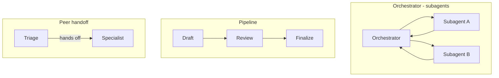

# Orchestrating more than one agent

*Part of [Agentic workflows for the product leader](./README.md)*

## TL;DR

Most tasks are better off as one well-built agent. But sometimes one loop genuinely isn't
enough — the work is too big for one context window, has independent threads that could
run in parallel, or needs specialists with different tools and permissions. When that's
true, the same small number of shapes recur: an **orchestrator** delegating to
**subagents**, a **pipeline** of specialists handling one stage each, and **peer
handoffs** where an agent recognizes "not my job" and transfers the conversation. Every
shape buys the same two things — isolating messy context and running work in parallel —
and pays for them in the same currency: coordination overhead. Adding an agent should
require the same justification as adding a service: a named bottleneck that a single loop
demonstrably can't clear, not a diagram that looks more impressive with more boxes on it.

> 🎯 **For the product leader**
>
> **Why it matters** — Multi-agent architectures are where budgets multiply fastest.
> Token spend scales with how many agents are running, and coordination failures are
> emergent — every individual agent can behave correctly while the system as a whole
> misbehaves.
>
> **What it changes in your decisions** — Every additional agent in a design needs to
> name the specific bottleneck — context, parallelism, or specialization — that a single,
> better-built agent couldn't clear.
>
> **Ask yourself** — *"Would one agent with better tools and cleaner context do this —
> and have we actually tried that first?"*
>
> **Risk if ignored** — A five-agent system that is slower, more expensive, and harder to
> debug than the single agent it replaced, built because the architecture diagram looked
> like progress.

## The mental model: three shapes, one shared cost

Each shape fits a different reason for splitting the work. An orchestrator delegating to
subagents suits a task with independent, parallelizable threads, or one messy subtask
whose noisy detail shouldn't pollute the main agent's context. A pipeline suits work whose
stages are known in advance and each one is independently checkable — it's the
multi-agent version of a fixed workflow, and just as predictable. A peer handoff suits the
case where an agent needs to recognize a request isn't its job and pass it, with its full
context, to one that specializes in it. All three are developed in full — including the
protocol landscape (MCP for tools, A2A for agent-to-agent handoffs, and which of the rest
of the acronym soup is real versus speculative) — in
[Multi-agent systems & protocols](../agentic-ai/multi-agent-and-protocols.md).

## The discipline that keeps any shape from collapsing

Two things separate a multi-agent system that works from one that quietly produces
fragments that don't compose. **Handoffs need to be structured artifacts, not vibes** — a
brief in, a defined deliverable out, with an explicit format and constraints — because
most multi-agent failures turn out to be specification failures at exactly these seams.
**Someone has to own the whole** — an orchestrator or a human accountable for the
integrated result — or a system can produce work where every individual piece was done
well and the combination is nonsense.

## A decision rule that survives contact with a vendor pitch

Start with one agent, and fix most "we need more agents" symptoms with better tools, a
tighter prompt, and cleaner context first — that alone resolves more of these situations
than adding a second agent would. Add a subagent only once a bottleneck has an actual
name: a messy subtask worth isolating, independent work worth parallelizing, or a genuine
need for different tools or permissions (a deploy-capable agent that only the deploy step
ever touches is a security decision as much as an architecture one). Stop adding agents
the moment coordination cost starts showing up — in the token bill, in added latency, or
in debugging sessions that now span several transcripts instead of one.

## Failure modes

- **Org-chart architecture** — a multi-agent design that mirrors the team's own structure
  rather than the task's actual structure, importing the coordination overhead of a
  meeting into the system.
- **Vague briefs** — two subagents given the same ambiguous instruction, returning
  contradictory or duplicated work that a clearer handoff would have prevented.
- **No one owns the whole** — every subagent's piece individually correct, and the
  integrated result incoherent, because no orchestrator or human was accountable for it.
- **Protocol-driven roadmaps** — betting a plan on a still-speculative "agent internet"
  standard instead of shipping on what's actually adopted today.

## Practitioner checklist

- [ ] For every agent in this design, which named bottleneck — context, parallelism, or
      specialization — justifies its existence?
- [ ] Are handoffs defined artifacts with an explicit brief and expected output, or are
      they informal instructions?
- [ ] Is there one clear owner — agent or human — accountable for the integrated result?
- [ ] Has a single, better-built agent actually been tried before reaching for a second
      one?

## Related lessons

- [Making a workflow durable, and worth owning](./making-a-workflow-durable-and-worth-owning.md)
  — what has to be true once this orchestration shape needs to run reliably over real
  time.
- [What an agent is, and how much autonomy it needs](../ai-agents/what-an-agent-is-and-how-much-autonomy-it-needs.md)
  — the single-agent decision this lesson's multi-agent case builds on.
- [Multi-agent systems & protocols](../agentic-ai/multi-agent-and-protocols.md) — the
  full depth on topologies, the protocol landscape, and the decision rule for going
  multi-agent.
