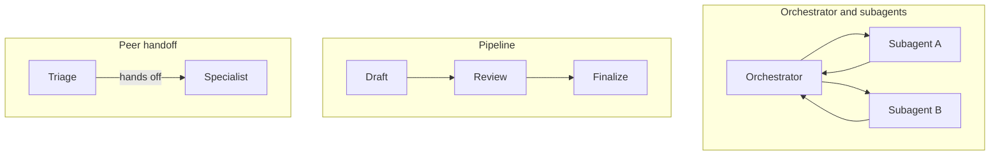

# Orchestrating more than one agent

*Part of [Agentic workflows for the product leader](./README.md)*

*Last reviewed: 2026-09 · Volatility: fast*

## TL;DR

Most tasks do better with one well-built agent. Sometimes one loop is not enough. The
work may be too big for one context window. It may have independent threads that can run
at once. It may need specialists with different tools and permissions.

Then a lead agent can hand pieces to subagents and combine what they return. This is the
orchestrator-workers pattern from the
[previous lesson](./choosing-a-workflow-pattern.md). It buys two things: clean context
and parallel work. It costs one thing: coordination.

That cost is large. Adding an agent needs the same case as adding a service. Name the
bottleneck that one loop cannot clear. A diagram with more boxes is not a case.

> 🎯 **For the product leader**
>
> **Why it matters** — Multi-agent designs are where token budgets grow fastest. Spend
> scales with the number of agents. Failures are emergent: each agent can behave and the
> system can still misbehave.
>
> **What it changes in your decisions** — Every extra agent must name its bottleneck:
> context, parallelism or specialisation. You also ask for a cost estimate against the
> single-agent version.
>
> **Ask yourself** — *"Would one agent with better tools and cleaner context do this? Have
> we tried that first?"*
>
> **Risk if ignored** — A five-agent system that is slower, costs more and is harder to
> debug than the single agent it replaced, built because the diagram looked like progress.

## The mental model: three shapes, one shared cost


```mermaid
flowchart TB
  subgraph ORCH["Orchestrator and subagents"]
    O["Orchestrator"] --> S1["Subagent A"]
    O --> S2["Subagent B"]
    S1 --> O
    S2 --> O
  end
  subgraph PIPE["Pipeline"]
    P1["Draft"] --> P2["Review"] --> P3["Finalize"]
  end
  subgraph PEER["Peer handoff"]
    H1["Triage"] -->|"hands off"| H2["Specialist"]
  end
```

- **Orchestrator and subagents.** A lead splits the task. Each subagent works in its own
  context window and returns a short result. This helps when threads are independent, or
  when one messy subtask would flood the lead's context.
- **Pipeline.** Specialists handle one stage each. It is a fixed workflow with several
  agents in it, and it is as predictable as one.
- **Peer handoff.** An agent sees a request is not its job and passes it on, with context.

The topologies and the protocols around them (MCP for tools, A2A for agent-to-agent) are
covered in [Multi-agent systems & protocols](../agentic-ai/multi-agent-and-protocols.md).
This lesson stays on the decision: when is it worth it?

## The evidence: it helps in some work and costs a lot

Anthropic published results from its multi-agent research system in June 2025. Three
findings matter to a product leader.

- **It can win.** The multi-agent setup beat a single-agent Claude Opus 4 by 90.2% on
  Anthropic's internal research evaluation. The tasks were breadth-first, such as
  gathering facts across many sources.
- **It costs a lot.** Agents used about 4 times the tokens of a chat. Multi-agent systems
  used about 15 times the tokens of a chat.
- **It does not suit everything.** Anthropic says multi-agent systems fit "valuable tasks
  that involve heavy parallelization, information that exceeds single context windows,
  and interfacing with numerous complex tools." It also says most coding tasks "involve
  fewer truly parallelizable tasks than research," and that agents are "not yet great at
  coordinating and delegating to other agents in real time."

There is a sharper counter-view. Cognition, the maker of a coding agent, argued in 2025
that running agents in parallel creates more problems than it solves. Its reasoning is
that every action carries hidden decisions, and agents that do not share full context make
conflicting ones. Treat it as a real objection, not a rebuttal of the Anthropic result.
Both agree on one point: the answer depends on the task. Research that splits into
independent searches suits parallel workers. Tightly coupled work does not.

## The discipline that keeps any shape from collapsing

Two habits separate a multi-agent system that works from one that produces fragments.

- **Handoffs are written artifacts, not vibes.** The lead gives each worker a brief. The
  worker returns a defined result. Most multi-agent failures are specification failures at
  these seams. Anthropic reports that vague delegation led subagents to misread the task
  or repeat the same searches as other agents.
- **Someone owns the whole.** An orchestrator, or a human, answers for the combined
  result. Otherwise every piece can be good and the sum can be nonsense.

## Worked example: a vague brief and a good one

*This example is invented, to show the method.*

A lead agent is researching "which payment providers support instant payouts in India."
It spawns three subagents.

**Vague brief, sent to all three:** "Research payment providers and instant payouts."

- Subagent A lists the ten most famous providers.
- Subagent B lists nine of the same providers.
- Subagent C wanders into card fees, which nobody asked about.

The lead gets overlapping lists and one off-topic report. It spends tokens merging them.

**Good briefs, one per subagent:**

| Part of the brief | Subagent A | Subagent B | Subagent C |
| --- | --- | --- | --- |
| Goal | Find providers with instant payouts to bank accounts | Same goal | Same goal |
| Scope | Providers headquartered in India | Global providers with Indian operations | Banks offering their own payout APIs |
| Output | A table: name, payout speed, source link | Same | Same |
| Boundaries | Skip anything without a source. No fee comparison. | Same | Same |
| Stop when | 8 providers, or 10 tool calls | Same | Same |

Now the threads do not overlap. The results share a format, so the lead can merge them
with a simple step. Each subagent has a stop rule, so cost is capped.

## A decision rule that survives a vendor pitch

1. **Start with one agent.** Better tools, a tighter prompt and cleaner context fix most
   "we need more agents" symptoms.
2. **Add a subagent only for a named bottleneck.** The bottleneck may be context (isolate
   a messy subtask), parallelism (independent threads), or specialisation (different tools
   or permissions). A deploy-only agent that alone holds deploy credentials is a security
   choice as much as an architecture one.
3. **Stop when coordination cost shows.** It will show in the token bill, in latency, and
   in debugging sessions that span several transcripts.

## Tradeoffs

- **Quality vs. cost.** Parallel workers can raise quality on broad tasks. They multiply
  tokens.
- **Speed vs. complexity.** Threads run at once, but briefs, merging and retries add work.
- **Isolation vs. shared context.** A worker with its own window stays focused. It also
  cannot see what the others know.
- **Specialisation vs. oversight.** More specialists means more places to look when
  something breaks.

## Failure modes

- **Org-chart architecture.** The design copies the team's structure, not the task's.
- **Vague briefs.** Workers duplicate effort or return different formats.
- **No owner for the whole.** Every part is right and the result is incoherent.
- **Hidden conflicts.** Workers make incompatible choices because they cannot see each
  other's context.
- **Protocol-driven roadmaps.** The plan depends on a speculative "agent internet" instead
  of what is adopted today.

## Under the hood

A brief is a small, fixed structure. Write it once as a template, and have the lead fill
it in. This makes briefs reviewable and testable.

```python
BRIEF = """
GOAL: {goal}
SCOPE: {scope}
OUTPUT FORMAT: {output_format}
SOURCES TO USE: {sources}
BOUNDARIES: {boundaries}
STOP WHEN: {stop_rule}
"""

def spawn_worker(lead_ctx, task):
    brief = BRIEF.format(**task.brief_fields)      # the brief IS the spec
    result = run_agent(brief, tools=task.tools,    # scoped tools, scoped permissions
                       max_steps=task.max_steps,   # each worker has its own budget
                       max_cost=task.max_cost)
    validate(result, task.output_schema)           # reject results that break the format
    return result                                  # the lead gets a short summary only
```

Three habits matter to an engineer.

- **Give each worker its own budget.** Cap steps and cost per worker and per run. See
  [Running an agent in production](../ai-agents/running-an-agent-in-production.md).
- **Validate worker output against a schema.** A lead that merges free-form text will
  merge mistakes.
- **Trace across agents.** Log the brief, the tool calls and the result for every worker
  under one run id. Otherwise debugging spans several unconnected transcripts.

## Practitioner checklist

- [ ] For each agent in the design, which named bottleneck justifies it?
- [ ] Did we try one better-built agent first, and record the result?
- [ ] Do we have a cost estimate against the single-agent version, using measured runs?
- [ ] Are handoffs written briefs with a goal, scope, format, boundaries and stop rule?
- [ ] Is worker output checked against a schema before the lead uses it?
- [ ] Is one agent or one person accountable for the combined result?
- [ ] Is each worker budgeted, and are all workers traced under one run id?

## Related lessons

- [Choosing a workflow pattern](./choosing-a-workflow-pattern.md) — where
  orchestrator-workers sits among the five patterns.
- [Making a workflow durable, and worth owning](./making-a-workflow-durable-and-worth-owning.md)
  — what has to hold once this runs over real time.
- [What an agent is, and how much autonomy it needs](../ai-agents/what-an-agent-is-and-how-much-autonomy-it-needs.md)
  — the single-agent decision this builds on.
- [Running an agent in production](../ai-agents/running-an-agent-in-production.md) —
  budgets, gates and the kill switch.
- [Multi-agent systems & protocols](../agentic-ai/multi-agent-and-protocols.md) — the
  topologies and the protocol landscape in depth.

## Sources

- Anthropic, [How we built our multi-agent research system](https://www.anthropic.com/engineering/multi-agent-research-system)
  (Jun 13, 2025): the 90.2% internal result, the 4x and 15x token figures, the conditions
  where multi-agent fits and does not, and the vague-delegation failures. Checked 2026-09.
- Cognition, "Don't Build Multi-Agents" (2025): the view that parallel agents without
  shared context make conflicting decisions. The page could not be opened when this lesson
  was written. It is summarised from search-result excerpts.
- The payments research scenario and the brief template are invented and illustrative.
