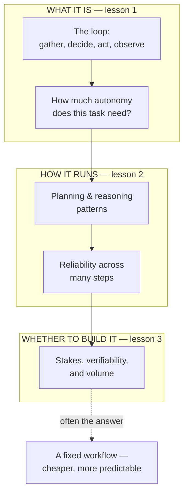

# AI agents for the product leader

*Part of the [Generative AI family](../GENERATIVE_AI_ROADMAP.md).*

An agent is what you get when you give a model a goal, a set of tools, and permission to
loop: gather context, decide an action, take it, look at what happened, and repeat until
the goal is met or the budget runs out. That loop is the single idea behind every "AI that
does things" pitch, and it is also where an AI feature's economics and its failure modes
both actually live — not in the model's raw intelligence, but in how the loop is scoped,
watched, and stopped.

**A note on scope.** This topic has the deepest existing coverage of anything in this
family. [Agentic AI for the AI PM](../agentic-ai/README.md) already develops the loop, the
autonomy spectrum, planning and reasoning patterns, reliability and the compounding-error
math, and the economics of when an agent actually pays for itself, in full depth and in
the same product-leader voice this family uses. Two of the planned lessons for this module
— tools, and memory across a run — are also already the dedicated subject of two sibling
modules in this family, [Tool calling](../tool-calling/README.md) and
[Memory & context](../memory-and-context/README.md). Re-deriving any of that here would
only restate it three times over. This module exists to be the compact front door under
the name people actually search for — **AI agents** — and to send every reader past it
into the depth that already exists. That is why it is three lessons, not seven: the
honest amount of genuinely new ground, once the sibling modules and the deeper agentic-ai
track are accounted for, is three lessons' worth.

## The knowledge graph

Read it as a decision funnel, not a feature list. **What it is**: the loop is simple, and
the first real design choice is how much autonomy the task actually needs. **How it
runs**: once it's looping, the two things that determine whether it works are how it
reasons and how well it survives many steps in a row without its errors compounding.
**Whether to build it**: the loop above is often the wrong answer, and knowing that before
you build it is the highest-leverage call in this module.

## The lessons

- [**What an agent is, and how much autonomy it needs**](./what-an-agent-is-and-how-much-autonomy-it-needs.md)
  — the loop stripped to its essence, and the spectrum from a fixed workflow to a fully
  autonomous agent that the first design decision actually turns on.
- [**Planning, reasoning & reliability across a run**](./planning-reasoning-and-reliability-across-a-run.md)
  — how an agent thinks step to step, and why small per-step error rates quietly become
  large end-to-end failures.
- [**When not to build an agent**](./when-not-to-build-an-agent.md) — the stakes,
  verifiability, and volume questions that decide whether an agent pays for itself, or
  whether a workflow would have done the job for less.

Each lesson pairs the product framing with a **🎯 For the product leader** briefing —
why it matters, the decision it changes, the question to ask your team, and the risk if
ignored — plus a diagram. For the engineering depth behind every mechanic mentioned here,
follow the spokes into [Agentic AI for the AI PM](../agentic-ai/README.md), and for tools
and memory specifically, into [Tool calling](../tool-calling/README.md) and
[Memory & context](../memory-and-context/README.md).

**📌 Close out the module:** [Recap & real-world examples](./recap.md).
