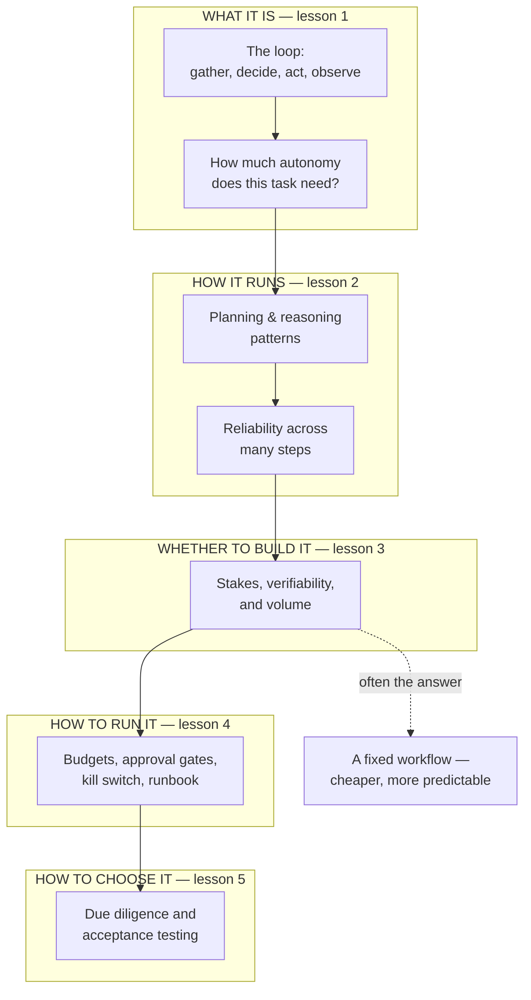

# AI agents for the product leader

*Part of the [Generative AI family](../GENERATIVE_AI_ROADMAP.md).*

An agent is what you get when you give a model a goal, a set of tools, and permission to
loop: gather context, decide an action, take it, look at what happened, and repeat until
the goal is met or the budget runs out. That loop is the single idea behind every "AI that
does things" pitch, and it is also where an AI feature's economics and its failure modes
both actually live — not in the model's raw intelligence, but in how the loop is scoped,
watched, and stopped.

**A note on scope.** This topic has deep coverage elsewhere. [Agentic AI for the AI PM](../agentic-ai/README.md)
develops the loop, planning and reasoning, reliability, protocols, safety, and unit
economics in full. [Tool calling](../tool-calling/README.md) and
[Memory & context](../memory-and-context/README.md) cover tools and memory. This module is
the compact front door under the name people search for: **AI agents**. It does not repeat
those lessons. It answers the decisions a product leader faces in order: what an agent is,
how it runs, whether to build one, how to run it safely, and how to choose one.

## Where the depth lives

Each lesson summarises an idea and points to the lesson that covers it in full.

| If you want the full depth on | Read |
| --- | --- |
| The agent loop, anatomy, and vocabulary | [What is an agent?](../agentic-ai/what-is-an-agent.md) |
| Tools and how an agent acts | [Tool calling](../tool-calling/README.md) |
| Context windows, compaction, and memory | [Context & memory](../agentic-ai/context-and-memory.md) |
| Planning and reasoning patterns | [Planning & reasoning](../agentic-ai/planning-and-reasoning.md) |
| The compounding maths, evals, and tracing | [Reliability & evals](../agentic-ai/reliability-and-evals.md) |
| MCP, A2A, and multi-agent systems | [Multi-agent & protocols](../agentic-ai/multi-agent-and-protocols.md) |
| Prompt injection, defences, and governance | [Safety, security & governance](../agentic-ai/safety-security-and-governance.md) |
| Unit economics, agent UX, and business models | [Agentic AI as a product](../agentic-ai/agentic-ai-as-a-product.md) |

## The knowledge graph

```mermaid
flowchart TB
  subgraph BUILD["WHAT IT IS — lesson 1"]
    LOOP["The loop:<br/>gather, decide, act, observe"]
    AUTONOMY["How much autonomy<br/>does this task need?"]
  end
  subgraph RUN["HOW IT RUNS — lesson 2"]
    THINK["Planning & reasoning<br/>patterns"]
    RELY["Reliability across<br/>many steps"]
  end
  subgraph DECIDE["WHETHER TO BUILD IT — lesson 3"]
    ECON["Stakes, verifiability,<br/>and volume"]
  end
  subgraph OPERATE["HOW TO RUN IT — lesson 4"]
    CTRL["Budgets, approval gates,<br/>kill switch, runbook"]
  end
  subgraph CHOOSE["HOW TO CHOOSE IT — lesson 5"]
    TEST["Due diligence and<br/>acceptance testing"]
  end
  LOOP --> AUTONOMY
  AUTONOMY --> THINK
  THINK --> RELY
  RELY --> ECON
  ECON --> CTRL
  CTRL --> TEST
  ECON -.->|"often the answer"| WORKFLOW["A fixed workflow —<br/>cheaper, more predictable"]
```

Read it as a decision funnel, not a feature list. **What it is**: the loop is simple, and
the first design choice is how much autonomy the task needs. **How it runs**: how it reasons,
and whether errors compound over many steps. **Whether to build it**: the loop is often the
wrong answer, and knowing that first is the highest-leverage call. **How to run it**: the
controls you set before launch. **How to choose it**: how to test a claim before you buy.

## The lessons

- [**What an agent is, and how much autonomy it needs**](./what-an-agent-is-and-how-much-autonomy-it-needs.md)
  — the loop, and the dial from fixed workflow to full autonomy.
- [**Planning, reasoning & reliability across a run**](./planning-reasoning-and-reliability-across-a-run.md)
  — how an agent thinks, and why small per-step errors become large end-to-end failures.
- [**When not to build an agent**](./when-not-to-build-an-agent.md) — the stakes,
  verifiability, and volume questions, and the supervised cost.
- [**Running an agent in production**](./running-an-agent-in-production.md) — budgets,
  risk-tiered approval gates, audit trail, rollback, kill switch, and an incident runbook.
- [**Choosing and acceptance-testing an agent**](./choosing-and-acceptance-testing-an-agent.md)
  — due diligence, agent-washing, and an acceptance test you agree before you sign.

Each lesson pairs the product framing with a **🎯 For the product leader** briefing, a
worked example, a diagram, and an **Under the hood** section for engineers. Sources and a
review date close each lesson.

**📌 Close out the module:** [Recap & real-world examples](./recap.md).
