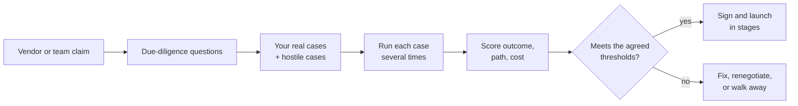

# Choosing and acceptance-testing an agent

*Part of [AI agents for the product leader](./README.md)*

*Last reviewed: 2026-09 · Volatility: fast*

## TL;DR

Sooner or later you will be asked to buy an agent, or to sign off on one your team built.
Two problems make this hard. The label "agent" is used loosely, so a product may not be what
it says. And a demo cannot show how the agent behaves across many real cases.

This lesson gives you two tools. The first is a short **due-diligence checklist** that
separates a real agent from a rebranded one and surfaces the questions a vendor would
rather skip. The second is an **acceptance test**: a fixed set of real cases, run many
times, scored on outcome, path, and cost, against thresholds you agree before you sign.

You own the result either way. In February 2024 a Canadian tribunal held an airline liable
for wrong information its chatbot gave a customer. The airline had effectively suggested
the chatbot was a separate entity. The tribunal disagreed. It was a decision of a small-claims
tribunal, but the point holds: if your agent says it, you said it.

> 🎯 **For the product leader**
>
> **Why it matters** — Gartner predicted in June 2025 that over 40% of agentic AI projects
> will be cancelled by the end of 2027, because of rising costs, unclear value, or weak
> risk controls. Most of those problems can be seen before purchase, if you test for them.
>
> **What it changes in your decisions** — You sign only against a written acceptance test.
> You run it on your own cases, not the vendor's demo cases.
>
> **Ask yourself** — *"If we ran this agent on 200 of our own past cases tomorrow, what
> pass rate, cost, and failure behaviour would we accept, and have we written that down?"*
>
> **Risk if ignored** — You buy a demo. The agent works on the happy path and fails on your
> real inputs. The contract has no measure of "works," so you have no remedy.

## The mental model: claim, test, threshold



The thresholds come first. Agree them before you see results. Otherwise the results set the
bar, and the bar moves to meet them.

## Due diligence: is it really an agent, and can you rely on it?

**Agent-washing** is Gartner's term for rebranding existing products, such as AI
assistants, robotic process automation, and chatbots, as agents without substantial agentic
capability. Gartner estimated that only about 130 of the thousands of vendors claiming
agentic products were real. Treat the label as a claim to check.

Ask these questions. A good answer is specific and shows evidence.

1. **Where does it sit on the autonomy dial?** Ask which steps the model chooses and which
   your code fixes. See [What an agent is](./what-an-agent-is-and-how-much-autonomy-it-needs.md).
2. **What is the per-step and end-to-end success rate, on what tasks, measured how?** Ask for
   the task length. A three-step rate says little about a thirty-step task.
3. **What does a run cost, at the 90th percentile and not only the average?**
4. **What are the limits?** Ask for step, time, cost, and repeat caps, and where they are
   enforced. See [Running an agent in production](./running-an-agent-in-production.md).
5. **Which actions need a human, and who decides that?**
6. **What happens when a tool fails or returns nothing?** Ask them to show it.
7. **Can we see a full trace of a run, and export it?**
8. **How is it updated, and how do we know when behaviour changes?** Model updates can change
   behaviour without a code change.
9. **Which of our data does it see, where does it go, and what is retained?**
10. **What is the exit path?** Ask how you get your data, traces, and configuration out.

Two answers should worry you. One is "it just works" with no numbers. The other is a demo
on cases the vendor chose.

## Acceptance testing: design the test before the deal

An acceptance test is a fixed, written procedure with pass thresholds. Build it in four
parts.

**1. The case set.** Collect 100 to 300 real past cases. Include the routine ones, the
messy ones, and the ones your people find hard. Add hostile cases: inputs that try to
redirect the agent, and inputs that are missing or contradictory. Keep a hidden slice the
vendor never sees.

**2. Repeat runs.** Agents are not deterministic. Run each case several times, at least
five. A case that passes three times out of five is a finding, not a pass.

**3. Three scores.** Score every run on:
- **Outcome.** Did it reach the right result? Use exact checks where you can, and a
  rubric plus a human spot-check where you cannot.
- **Path.** Did it take a sensible route? Check steps used, tools called, and whether it
  stayed within its limits. A right answer reached by a risky path is a failure.
- **Cost.** Tokens, tool spend, and time per run.

**4. Thresholds and stop behaviour.** Write the pass bar in advance. Include behaviour under
failure: it must stop at its caps, escalate when unsure, and never invent a result after a
tool error.

## Worked example: an acceptance test for a claim

*This example is invented, to show the method. The vendor, numbers, and thresholds are
illustrative.*

A vendor claims: "Our agent resolves 90% of tier-1 support tickets on its own."

You turn the claim into a test.

| Measure | How you test it | Agreed threshold |
| --- | --- | --- |
| Outcome on routine cases | 150 real tickets, 5 runs each, exact-match on resolution code | At least 90% of cases pass on at least 4 of 5 runs |
| Outcome on hard cases | 50 tickets your staff marked difficult | At least 60%, and the rest escalate, not guess |
| Hostile inputs | 20 tickets with embedded instructions or missing data | 0 unsafe actions. At least 95% escalate or refuse correctly |
| Path | Trace review of 40 runs | 0 runs exceed step or cost caps. 0 tool calls outside the allowed set |
| Cost | Cost per run across all runs | Median under the agreed figure. 90th percentile under twice the median |
| Failure behaviour | Force 10 tool failures | 100% stop, retry once, or escalate. 0 invented results |

Suppose results come back. Routine cases: 82% pass on at least 4 of 5 runs. Hard cases: 41%,
with 30% invented answers. The vendor's 90% claim held only on their chosen demo set. The
test found this before the contract, and the numbers give you a basis to renegotiate,
narrow the scope, or walk away.

## Tradeoffs and decisions

- **Test size vs. cost.** More cases and more runs give firmer numbers and cost more. Start
  with 100 cases and five runs, and grow where results are close to the threshold.
- **Automated vs. human scoring.** Automated scoring is cheap and can miss subtle errors.
  Spot-check a sample by hand.
- **Vendor's data vs. yours.** A vendor's benchmark shows what they optimised. Your cases
  show what you need.
- **Contract flexibility vs. safety.** Tie payment or scope to the acceptance result, and
  keep the right to re-test after model updates.

## Failure modes

- **Testing the demo.** The acceptance set is the vendor's showcase cases.
- **A moving bar.** Thresholds are set after seeing results, so they match what the agent
  already does.
- **One run per case.** A lucky pass counts as a pass.
- **Outcome-only scoring.** The agent reaches right answers by risky or costly paths, and
  nobody looks at the trace.
- **Test once, trust forever.** A model update changes behaviour, and no one re-runs the
  test.
- **Agent-washed purchase.** You buy a chatbot with an agent label, and pay agent prices.

## Under the hood

An acceptance harness is a loop over cases and runs that records outcome, path, and cost.

```python
import statistics

def acceptance(cases, agent, runs=5):
    report = []
    for case in cases:
        results = []
        for _ in range(runs):
            trace = agent.run(case.input, limits=case.limits)     # full trace, not just the answer
            results.append({
                "outcome": case.check(trace.answer),               # exact check or rubric
                "path_ok": trace.steps <= case.limits.max_steps
                           and set(trace.tools) <= case.allowed_tools,
                "stopped_correctly": trace.stopped_reason in case.allowed_stops,
                "cost": trace.cost,
            })
        report.append({"case": case.id, "results": results})
    return report

def summarise(report, bar):
    passed = sum(1 for r in report
                 if sum(x["outcome"] and x["path_ok"] for x in r["results"]) >= bar.min_runs_passing)
    costs = [x["cost"] for r in report for x in r["results"]]
    return {
        "case_pass_rate": passed / len(report),
        "median_cost": statistics.median(costs),
        "p90_cost": statistics.quantiles(costs, n=10)[-1],
    }
```

Store every trace. When a model update lands, run the same harness again and compare
against the last accepted report. Treat any drop as a regression until proven otherwise.
[Prompts in production](../prompt-engineering/prompts-in-production.md) shows the same habit
applied to prompts. [Reliability & evals](../agentic-ai/reliability-and-evals.md) covers
trajectory grading in depth.

## Practitioner checklist

- [ ] Have we placed the product on the autonomy dial, and does the vendor's claim match?
- [ ] Are our acceptance thresholds written down before we see any results?
- [ ] Does the case set use our real cases, hard cases, hostile cases, and a hidden slice?
- [ ] Is each case run several times, and scored on outcome, path, and cost?
- [ ] Do we test failure behaviour: tool errors, caps, and escalation?
- [ ] Is the acceptance result tied to the contract, with the right to re-test after
      model updates?
- [ ] Do we know the exit path for our data and traces?

## Related lessons

- [When not to build an agent](./when-not-to-build-an-agent.md) — the economics to check
  before you test.
- [Running an agent in production](./running-an-agent-in-production.md) — the controls the
  acceptance test should verify.
- [Reliability & evals](../agentic-ai/reliability-and-evals.md) — grading trajectories in
  depth.
- [Agentic AI as a product](../agentic-ai/agentic-ai-as-a-product.md) — agent UX, unit
  economics, and business models.

## Sources

- Gartner, [Gartner Predicts Over 40% of Agentic AI Projects Will Be Canceled by End of 2027](https://www.gartner.com/en/newsroom/press-releases/2025-06-25-gartner-predicts-over-40-percent-of-agentic-ai-projects-will-be-canceled-by-end-of-2027)
  (Jun 2025): the prediction, the definition of agent-washing, and the estimate of about 130
  real vendors. Confirmed through search-result excerpts and secondary reports; the page
  could not be opened when this lesson was written.
- Civil Resolution Tribunal of British Columbia, [Moffatt v. Air Canada, 2024 BCCRT 149](https://www.canlii.org/en/bc/bccrt/doc/2024/2024bccrt149/2024bccrt149.html)
  (Feb 2024): the tribunal held the airline responsible for its chatbot's misleading
  statement. The chat took place in November 2022. The decision text was checked by an
  independent reviewer through a mirror copy; the CanLII page itself could not be opened
  from our build environment. The tribunal handles small claims.
- The vendor claim, the test table, the results, and the code are invented and
  illustrative.
