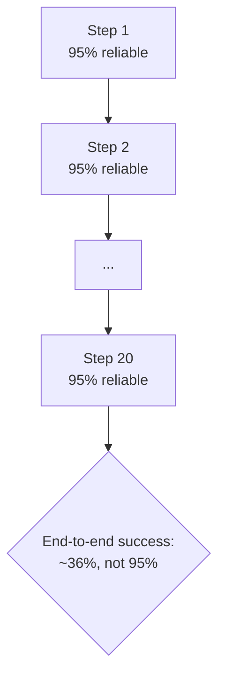

# Planning, reasoning & reliability across a run

*Part of [AI agents for the product leader](./README.md)*

## TL;DR

Once an agent is looping, two things decide whether it actually finishes the job: how it
reasons about what to do next, and whether small mistakes survive long enough to compound
into a failed task. Reasoning isn't a separate module bolted onto the model — it's the
model, prompted into patterns like thinking one step at a time, drafting a full plan
before acting, or checking and revising its own work. None of those patterns save a task
from the harder problem underneath them: a step that succeeds 95% of the time sounds
reliable, until a twenty-step task drags that down toward a coin flip end to end. This is
why agents that look brilliant on a three-step demo routinely disappoint on the thirty-step
version of the same task, and why recovering from an error well matters more than never
making one.

> 🎯 **For the product leader**
>
> **Why it matters** — This is the gap between "worked in the demo" and "works for
> customers." It determines the two numbers that make or break an agent's economics: how
> often it finishes the task, and how often a human has to step in.
>
> **What it changes in your decisions** — Spec reliability the way you'd spec a feature —
> a target completion rate per task type, and an explicit answer for what happens when a
> step fails, not a hope that it won't.
>
> **Ask yourself** — *"How many things have to go right in a row for this task to
> succeed, and what's our actual measured success rate per step — not the one we're
> hoping for?"*
>
> **Risk if ignored** — A team promises an agent will handle a thirty-step task
> autonomously, ships something that behaves like a coin flip, and finds out from
> customer complaints instead of from a dashboard.

## The mental model: errors compound faster than intuition expects

A step that's right nineteen times out of twenty feels safe. Chain twenty of them together
and the task succeeds roughly a third of the time, because the per-step rates multiply,
not average. This single fact explains most of the gap between an agent's demo and its
production behavior, and it's why the reliability toolkit is built around shortening the
chain, catching errors mid-flight, and recovering well — not around chasing a slightly
smarter model. The full math, the recovery ladder (retry, revise, restart, escalate), and
the eval and tracing discipline that makes an agent's failures knowable instead of
mysterious are developed in depth in
[Reliability & evals](../agentic-ai/reliability-and-evals.md).

## How an agent reasons, at a glance

An agent's "thinking" is the model working through one of a small number of patterns, not
a separate cognitive layer. Interleaving a thought with each action lets the agent adjust
one step at a time, which suits tasks where each result should shape the next, like
debugging. Drafting the whole plan before acting suits longer or multi-part work, and it
creates a natural place for a human to see and approve the plan before anything expensive
or risky runs. Generating a draft and then checking it against something external — a
test, a validator, a checklist — before delivering it is the pattern behind most
meaningful quality gains, precisely because models are far better at responding to a real
check than at grading their own unverifiable claims. Which pattern fits, and how much of
the model's newer "extended thinking" budget a given task deserves, is a cost and latency
decision as much as a quality one — developed in full in
[Planning & reasoning](../agentic-ai/planning-and-reasoning.md).

## Why the environment matters more than the model

The single strongest lever on how well an agent performs isn't which pattern it follows or
how long it's allowed to think — it's the quality of the feedback it gets back from
whatever it's acting on. An agent that can see a failing test, a clear error message, or a
validator's verdict corrects itself. An agent acting into a void — where nothing tells it
whether the last step actually worked — drifts confidently in the wrong direction no
matter how capable the underlying model is. Before reaching for a smarter model or a more
elaborate reasoning pattern, the higher-leverage question is almost always what the agent
would actually see if it got something wrong.

## Failure modes

- **Demo-horizon thinking** — judging an agent's reliability on a hand-picked three-step
  task, then deploying it on the thirty-step version of the same job the compounding math
  was always going to punish.
- **Self-grading inflation** — trusting a model's own "I checked my work" claim with
  nothing external verifying it, which is confidence, not verification.
- **No recovery ladder** — every failure treated the same way (usually: silently retried
  or silently ignored), instead of a deliberate escalation from retry to revise to restart
  to a human handoff.
- **Deliberation as decoration** — maximum reasoning effort spent on every request because
  it made a demo look smarter, regardless of whether the task needed it.

## Practitioner checklist

- [ ] For this task's typical length: what does the compounding math predict end to end,
      given our actual measured per-step success rate?
- [ ] Where does a human see the plan before expensive or risky execution begins?
- [ ] What does the agent actually observe when a step goes wrong — and would it notice?
- [ ] Is there a real recovery ladder (retry, revise, restart, escalate), or does every
      failure get handled the same way?

## Related lessons

- [What an agent is, and how much autonomy it needs](./what-an-agent-is-and-how-much-autonomy-it-needs.md)
  — the loop this lesson's reasoning and reliability concerns run inside.
- [When not to build an agent](./when-not-to-build-an-agent.md) — what compounding error
  and unreliable feedback do to an agent's economics.
- [Planning & reasoning](../agentic-ai/planning-and-reasoning.md) — the full depth on
  reasoning patterns and test-time compute.
- [Reliability & evals](../agentic-ai/reliability-and-evals.md) — the full depth on the
  compounding math, recovery, and the eval and tracing discipline behind it.
