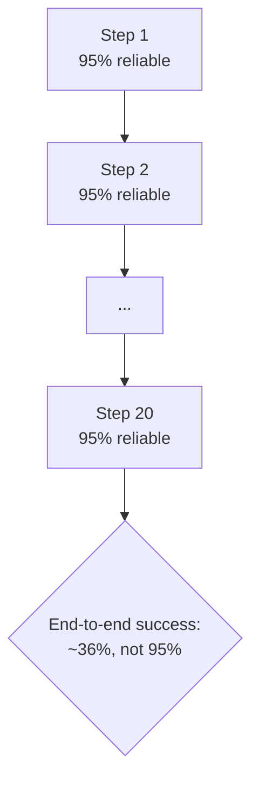

# Planning, reasoning & reliability across a run

*Part of [AI agents for the product leader](./README.md)*

*Last reviewed: 2026-09 · Volatility: fast*

## TL;DR

Once an agent is looping, two things decide whether it finishes the job. The first is how
it reasons about the next step. The second is whether small mistakes survive long enough to
add up to a failed task.

Reasoning is not a separate module. It is the model, prompted or configured to think one
step at a time, to draft a plan before acting, or to check and revise its own work. None of
these patterns removes the harder problem underneath. A step that succeeds 95% of the time
sounds reliable. Chain twenty of them and the task succeeds about a third of the time.

This is why agents that shine on a three-step demo often disappoint on the thirty-step
version of the same job. It is also why recovering well from an error matters more than
never making one.

> 🎯 **For the product leader**
>
> **Why it matters** — This is the gap between "worked in the demo" and "works for
> customers." It sets the two numbers that make or break an agent's economics: how often
> it finishes, and how often a human must step in.
>
> **What it changes in your decisions** — Spec reliability like any feature. Set a target
> completion rate per task type. Write down what happens when a step fails.
>
> **Ask yourself** — *"How many things must go right in a row for this task to succeed?
> What is our measured success rate per step, not the one we hope for?"*
>
> **Risk if ignored** — A team promises an agent will handle a thirty-step task alone,
> ships something that behaves like a coin flip, and learns it from customer complaints
> instead of a dashboard.

## The mental model: errors compound faster than intuition expects


```mermaid
flowchart TB
  S1["Step 1<br/>95% reliable"] --> S2["Step 2<br/>95% reliable"]
  S2 --> S3["..."]
  S3 --> S20["Step 20<br/>95% reliable"]
  S20 --> RESULT{"End-to-end success:<br/>~36%, not 95%"}
```

A step that is right nineteen times in twenty feels safe. Chain twenty of them and the task
succeeds about 36% of the time. The per-step rates multiply. They do not average.

This one fact explains most of the gap between demo and production. It also shapes the
toolkit: shorten the chain, catch errors mid-flight, and recover well. The toolkit does not
depend on a slightly smarter model. The full maths, the recovery ladder (retry, revise,
restart, escalate), and the eval and tracing habits are in
[Reliability & evals](../agentic-ai/reliability-and-evals.md).

## Worked example: how length and reliability interact

This is arithmetic, not a measurement. It multiplies the same per-step success rate across
the steps of a task.

| Steps in the task | 95% per step | 99% per step |
| --- | --- | --- |
| 3 | 86% | 97% |
| 10 | 60% | 90% |
| 20 | 36% | 82% |
| 30 | 21% | 74% |

Read across the rows. A three-step demo looks fine at either rate. At thirty steps, a 95%
agent finishes about one task in five. Now read down the columns. Moving from 95% to 99%
per step turns a 36% task into an 82% task at twenty steps. Small gains in per-step
reliability matter more than they look.

Two design moves follow.

- **Shorten the chain.** Fewer steps means fewer chances to fail. Merge steps, or move
  routine steps into plain code.
- **Add checkpoints.** After a risky step, verify the result. If the check fails, retry
  that step, not the whole task. This turns one long chain into several short ones.

## Evidence that length is the problem

The pattern shows up in research on real agents. The research group METR (Model Evaluation & Threat Research) measures agents by
the length of task they can finish, where length is the time a skilled human needs. It
reports that the task length an agent completes with 50% success has been doubling about
every seven months. This is progress, and it is also a warning. A task that a person does
in an hour is still a coin flip for many agents. The work was measured on software tasks.
Do not assume the same numbers hold for your domain. Measure your own.

## How an agent reasons, at a glance

An agent's thinking is the model working through a small set of patterns.

- **Think, act, observe.** Add a thought before each action. The agent adjusts one step at
  a time. This suits tasks where each result should shape the next, such as debugging.
- **Plan first.** Draft the whole plan before acting. This suits long or multi-part work.
  It also gives a human a place to approve the plan before anything costly or risky runs.
- **Draft, then check against something outside the model.** Test the draft with a test, a
  validator, or a checklist before delivering it. This pattern drives most real quality
  gains. Models respond well to a real check. They grade their own unverifiable claims
  poorly.

How much the model should think is now a setting, not a prompt trick. On current Claude
models, adaptive thinking lets the model decide when and how much to think. An `effort`
setting controls the depth. Lower effort is faster and cheaper. Higher effort helps on hard
steps. This is a cost and latency decision as much as a quality one. Pattern choice is
covered in [Planning & reasoning](../agentic-ai/planning-and-reasoning.md).

## Why the environment matters more than the model

The strongest lever on an agent's performance is the feedback it gets from what it acts on.

An agent that can see a failing test, a clear error message, or a validator's verdict
corrects itself. An agent that acts into a void drifts in the wrong direction, however
capable the model is. Anthropic's guidance says the same: at each step the agent should get
"ground truth from the environment," such as tool results or code execution, and there
should be stopping conditions, such as a maximum number of iterations.

Before you reach for a smarter model, ask a simpler question. What would the agent see if
it got something wrong?

## Tradeoffs and decisions

- **Short chains vs. flexibility.** Fewer steps are more reliable. They also give the agent
  less room to adapt.
- **Checkpoint cost.** Each check adds time and cost. Put checks after risky steps, not
  after every step.
- **Plan approval vs. speed.** A human plan gate catches expensive mistakes early. It also
  slows every run.
- **Thinking effort vs. cost.** High effort on every step is slow and expensive. Reserve it
  for the steps that need it.

## Failure modes

- **Demo-horizon thinking.** An agent is judged on a hand-picked three-step task, then
  deployed on the thirty-step version of the same job.
- **Self-grading inflation.** The model says "I checked my work," and nothing outside the
  model verifies it. That is confidence, not verification.
- **No recovery ladder.** Every failure is handled the same way, usually a silent retry or
  a silent ignore. There is no planned path from retry to revise to restart to a human.
- **Deliberation as decoration.** Maximum thinking effort is spent on every request because
  it made a demo look smart.

## Under the hood

Two mechanisms make a long run survivable: saved state, and a log of every step.

**Checkpointing.** Save enough state after each step to resume from it. Then a failure at
step 14 restarts at step 14, not step 1.

```python
def run_with_checkpoints(task, steps, store):
    state = store.load(task.id) or {"done": 0, "outputs": []}
    for i in range(state["done"], len(steps)):
        out = steps[i](state["outputs"])          # one step
        if not verify(out):                        # an external check, not the model's word
            out = retry_once_or_escalate(steps[i], state, task)
        state["outputs"].append(out)
        state["done"] = i + 1
        store.save(task.id, state)                 # resume point
    return state["outputs"]
```

**Trajectory logging.** Log the full sequence: each model decision, each tool call, each
result, and the cost. Judge an agent by the path, not only the final answer. An answer can
be right for the wrong reasons, and a wrong answer often traces to one bad step. See
[Reliability & evals](../agentic-ai/reliability-and-evals.md) for grading trajectories.

**Measure your own per-step rate.** Run the task many times. Count completed steps over
attempted steps. Then use the table above to predict end-to-end success at the real task
length.

## Practitioner checklist

- [ ] For this task's typical length, what does the compounding maths predict, given our
      measured per-step success rate?
- [ ] Where does a human see the plan before costly or risky execution begins?
- [ ] What does the agent observe when a step goes wrong? Would it notice?
- [ ] Is there a recovery ladder (retry, revise, restart, escalate), or is every failure
      handled the same way?
- [ ] Can a failed run resume from a checkpoint instead of starting over?
- [ ] Do we log the full trajectory, not only the final answer?

## Related lessons

- [What an agent is, and how much autonomy it needs](./what-an-agent-is-and-how-much-autonomy-it-needs.md)
  — the loop these concerns run inside.
- [When not to build an agent](./when-not-to-build-an-agent.md) — what compounding error
  does to an agent's economics.
- [Running an agent in production](./running-an-agent-in-production.md) — budgets, gates,
  and stopping a run that goes wrong.
- [Planning & reasoning](../agentic-ai/planning-and-reasoning.md) — reasoning patterns and
  thinking effort in depth.
- [Reliability & evals](../agentic-ai/reliability-and-evals.md) — the compounding maths,
  recovery, and trajectory evals in depth.

## Sources

- Anthropic, [Building effective agents](https://www.anthropic.com/engineering/building-effective-agents)
  (Dec 2024): ground truth from the environment each step, and stopping conditions.
  Checked 2026-09.
- Anthropic, [Prompting best practices](https://platform.claude.com/docs/en/build-with-claude/prompt-engineering/claude-prompting-best-practices):
  adaptive thinking and the `effort` setting on current Claude models. Checked 2026-09.
- METR, [Measuring AI Ability to Complete Long Tasks](https://metr.org/blog/2025-03-19-measuring-ai-ability-to-complete-long-tasks/)
  (Mar 2025): the 50% time horizon and the roughly seven-month doubling, measured on
  software tasks. Confirmed through search-result excerpts of the abstract; the page could
  not be opened when this lesson was written.
- The table is arithmetic: each cell is the per-step rate raised to the number of steps.
