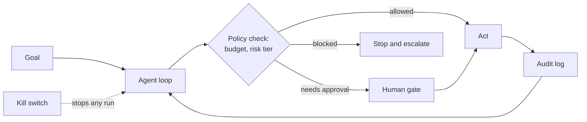

# Running an agent in production

*Part of [AI agents for the product leader](./README.md)*

*Last reviewed: 2026-09 · Volatility: fast*

## TL;DR

Building an agent is one job. Running it is another. An agent acts on its own, so a
mistake can repeat many times before a person sees it. Production needs a control layer
around the loop, and you should decide it before launch.

The control layer has five parts. **Budgets** cap steps, time, and cost. **Approval gates**
match the level of human review to the risk of the action. **An audit trail** records what
the agent did and why. **Rollback** undoes what can be undone. A **kill switch** stops a
run, or all runs, in seconds. This lesson turns these into an operating runbook.

The theory of why agents are attackable is in
[Safety, security & governance](../agentic-ai/safety-security-and-governance.md). This
lesson is the practical layer: what to set, who owns it, and what to do at 2 a.m.

> 🎯 **For the product leader**
>
> **Why it matters** — An agent that fails in a demo costs a retry. An agent that fails in
> production can send the wrong email a thousand times, or spend a budget in an hour.
>
> **What it changes in your decisions** — You approve an agent for launch only when the
> controls exist and have been tested. "It usually works" is not a control.
>
> **Ask yourself** — *"If this agent started doing the wrong thing right now, how fast could
> we stop it, and how much would it have done by then?"*
>
> **Risk if ignored** — A runaway loop or a hijacked run does damage at machine speed, and
> the first sign is an invoice or a customer complaint.

## The mental model: a control layer around the loop



The model proposes an action. Your code decides whether the action may run. That order
matters. Controls that live inside the prompt are requests. Controls that live in code are
limits.

## Budgets: put a ceiling on every run

Set four limits per run. Choose numbers from your own measured runs, not guesses.

- **Steps.** A maximum number of loop iterations.
- **Time.** A wall-clock limit, so a stuck run ends.
- **Cost.** A spend limit per run and per day, so one bad loop cannot spend a month's
  budget.
- **Repeats.** A cap on the same tool call with the same arguments. A repeat is a sign the
  agent is stuck.

When a limit hits, the run stops and hands off to a person with its state saved. It does
not fail silently. Anthropic's guidance for agents says the same: include stopping
conditions, such as a maximum number of iterations, to keep control.

## Approval gates: match review to risk

Not every action needs a human. Reviewing everything removes the saving. Reviewing nothing
removes the safety. Sort actions into tiers and set the gate for each tier.

| Tier | Example | Reversible? | Gate |
| --- | --- | --- | --- |
| 0. Read only | Search a knowledge base, read an order | n/a | None. Log it. |
| 1. Reversible write | Draft a reply, update a ticket field | Yes | Automatic. Sample and review after the fact. |
| 2. Costly to reverse | Send an email to a customer, refund under a limit | Partly | Automatic under a limit. Human approval above it. |
| 3. Irreversible or high stakes | Delete data, move money above a limit, change access, contact many people | No | Always a human approval. |

Two rules keep the table honest. First, **the tier belongs to the action, not the agent.**
The same agent may do tier 1 alone and need approval for tier 3. Second, **new tools start
at a high tier** and move down only after a track record. For the permission mechanics, see
[Tool permissions, blast radius & the trust boundary](../tool-calling/permissions-blast-radius-and-the-trust-boundary.md).

## Audit trail and rollback

**Audit trail.** For every run, record the goal, each model decision, each tool call with
its arguments, each result, the approver for any gate, and the cost. You need this to debug,
to answer a customer, and to answer a regulator. A trace you cannot replay cannot be
audited. See [Reliability & evals](../agentic-ai/reliability-and-evals.md).

**Rollback.** Decide before launch what "undo" means for each tool.

- **Reversible actions** need an undo path: a saved previous value, or a compensating
  action such as a refund reversal.
- **Irreversible actions** need a gate, because rollback is not available.
- **Repeated calls** need to be safe. A tool that runs twice must not charge twice. Use an
  idempotency key, which makes a repeat harmless.

## The kill switch

A kill switch is only real if it is fast, easy to reach, and tested.

- **Three scopes.** Stop one run. Stop one agent or one customer's runs. Stop everything.
- **Checked every step.** The loop reads the switch before each action, so a stop takes
  effect within one step.
- **Owned by a person, not a team.** Name who may pull it, and who is on call.
- **Tested on a schedule.** A switch that has never been pulled may not work.

Long-running agents add a deployment problem. Anthropic reported that its research agents
run for long periods across many tool calls, so a code update can land in the middle of a
run. It used "rainbow deployments," which shift traffic gradually so running agents are not
cut off. Plan for updates to a system that is never idle.

## Worked example: a runaway loop, hour by hour

*This example is invented, to show the runbook in use. Times and amounts are illustrative.*

An agent files support tickets from customer emails. A supplier changes an email format.

- **09:00** The agent starts misreading one field. It creates duplicate tickets.
- **09:12** The repeat cap trips. The same call with the same arguments has run three
  times. The run stops and escalates to a person. This is a budget control doing its job.
- **09:15** Monitoring shows the same pattern across forty runs. An alert pages the
  on-call owner.
- **09:20** The owner pulls the kill switch for this agent only. Other agents keep running.
- **09:40** The team finds the format change in the audit trail. They replay two failed runs
  to confirm.
- **10:30** They fix the parsing step, run the saved failing cases as tests, and re-enable
  the agent at a small share of traffic.
- **Next day** They add the failing email format to the eval set, so it cannot regress.

Without the repeat cap, the loop would have run until the step limit. Without the audit
trail, the team would have guessed. Without the kill switch, it would have needed a
deployment.

## Tradeoffs and decisions

- **Gate strictness vs. throughput.** Tighter gates are safer and slower. Loosen them by
  tier, using evidence.
- **Budget tightness vs. completion.** Too low a cap causes premature give-ups. Tune against
  real tasks.
- **Logging depth vs. privacy.** Full traces help debugging. They also store customer data.
  Set retention and access rules.
- **Central kill switch vs. local control.** A global stop is powerful. A per-agent stop
  limits collateral damage. Have both.

## Failure modes

- **Controls in the prompt.** "Never spend more than 50" is written in the system prompt. A
  hijacked or confused run ignores it. Put limits in code.
- **The untested kill switch.** It exists, and it fails the first time it is needed.
- **Approval fatigue.** People are asked to approve too many low-risk actions, and start
  approving without reading. Gate by tier so approvals are rare and meaningful.
- **No owner at 2 a.m.** The controls exist, and nobody is responsible for using them.
- **Rollback assumed.** A team believes actions can be undone, and finds that an email
  cannot be unsent.

## Under the hood

The policy check is a small piece of code that sits between the model's proposal and the
tool. A config file states the limits, so a reviewer can read them without reading code.

```yaml
# agent-policy.yaml (illustrative)
budgets:
  max_steps: 12
  max_seconds: 300
  max_cost_usd_per_run: 0.75
  max_cost_usd_per_day: 200
  max_repeat_same_call: 2
tiers:
  read_only:          {gate: none}
  reversible_write:   {gate: none, sample_review: 0.05}
  costly_to_reverse:  {gate: none, limit_usd: 100, above_limit: human}
  irreversible:       {gate: human}
kill_switch:
  scopes: [run, agent, global]
  check: every_step
  owner: oncall-agents
```

```python
def guarded_call(step, ctx, policy, kill):
    if kill.is_set(ctx.run_id, ctx.agent_id):       # checked before every action
        raise RunStopped("kill switch")
    ctx.budget.spend(step.estimated_cost)            # raises when a cap is hit
    if ctx.repeats(step.tool, step.args) > policy.max_repeat_same_call:
        raise RunStopped("repeat cap")
    tier = policy.tier_of(step.tool)
    if policy.needs_human(tier, step):
        step = wait_for_approval(step)               # blocks, logs the approver
    result = tools[step.tool](**step.args, idempotency_key=ctx.key(step))
    audit.write(ctx, step, result)                   # replayable trace
    return result
```

**Agent-specific risks to test.** The Open Worldwide Application Security Project (OWASP)
published a Top 10 for Agentic Applications in December 2025. It lists risks that map to this lesson: goal hijack, tool misuse, identity and
privilege abuse, cascading failures, and rogue agents. Include a hostile-input case for
each in your test set. The
[prompts in production](../prompt-engineering/prompts-in-production.md) lesson shows how
to keep such a test set.

## Practitioner checklist

- [ ] Does every run have limits on steps, time, cost, and repeated calls, enforced in code?
- [ ] Is each tool assigned a risk tier, with a gate that matches it?
- [ ] Do new tools start at a high tier and move down only with a track record?
- [ ] Can we replay any run from the audit trail?
- [ ] For each tool: what does undo mean, and is a repeated call safe?
- [ ] Is there a kill switch at run, agent, and global scope, with a named owner, and has it
      been tested this quarter?
- [ ] Is there an incident runbook, and has the on-call person read it?
- [ ] Does every incident add a case to the eval set?

## Related lessons

- [Planning, reasoning & reliability across a run](./planning-reasoning-and-reliability-across-a-run.md)
  — checkpoints and trajectory logging.
- [Choosing and acceptance-testing an agent](./choosing-and-acceptance-testing-an-agent.md)
  — testing controls before you buy or launch.
- [Safety, security & governance](../agentic-ai/safety-security-and-governance.md) — prompt
  injection, defences, and governance in depth.
- [Tool permissions, blast radius & the trust boundary](../tool-calling/permissions-blast-radius-and-the-trust-boundary.md)
  — the permission mechanics behind the tiers.
- [Incidents & postmortems](../technical-product-management/incidents-and-postmortems.md)
  — the general incident discipline this runbook borrows.

## Sources

- Anthropic, [Building effective agents](https://www.anthropic.com/engineering/building-effective-agents)
  (Dec 2024): stopping conditions such as a maximum number of iterations. Checked 2026-09.
- Anthropic, [How we built our multi-agent research system](https://www.anthropic.com/engineering/multi-agent-research-system)
  (Jun 2025): long-running stateful agents and rainbow deployments. Checked 2026-09.
- OWASP GenAI Security Project, [Top 10 for Agentic Applications for 2026](https://genai.owasp.org/resource/owasp-top-10-for-agentic-applications-for-2026/)
  (Dec 2025): the risk names above. Confirmed through search results and secondary
  summaries; the page could not be opened when this lesson was written.
- The runaway-loop example and the policy file are invented and illustrative.
