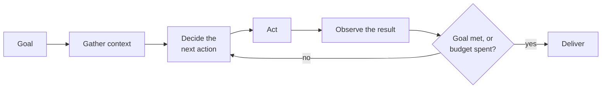

# What an agent is, and how much autonomy it needs

*Part of [AI agents for the product leader](./README.md)*

## TL;DR

Strip away every framework and vendor pitch, and an agent is a loop: gather context,
decide the next action, take it, observe what happened, and repeat until the goal is met
or a budget runs out. Nothing about that loop requires a particular product, protocol, or
architecture diagram — it's the shape underneath all of them. The single most important
design decision happens before any of that gets built: how much autonomy the task
actually needs. "Agent or not" is the wrong question — autonomy is a dial, running from a
fixed workflow where your code decides every step, through to a fully autonomous loop
where the model decides its own. More autonomy buys flexibility on problems you can't
fully specify in advance. It also costs predictability, latency, money, and the ability to
debug what went wrong.

> 🎯 **For the product leader**
>
> **Why it matters** — "Agent" is used for everything from a scripted pipeline with one
> model call to a fully autonomous system that plans its own steps. If you can't place a
> proposal on the autonomy spectrum, you can't estimate its cost, its risk, or how it will
> fail.
>
> **What it changes in your decisions** — For every "let's build an agent" proposal, the
> first question is whether a fixed workflow with model steps inside it would do the job
> instead — cheaper, faster, and easier to debug.
>
> **Ask yourself** — *"Could I draw this task as a flowchart? If yes, what exactly are we
> paying an agent to rediscover on every request?"*
>
> **Risk if ignored** — An expensive, unpredictable loop ships where a five-step pipeline
> would have worked, or a scripted workflow gets marketed as an autonomous agent and sets
> expectations nothing in the design can meet.

## The mental model: the loop, and the dial next to it

Every "agent" you'll ever evaluate is this loop, plus a setting on one dial: how much of
each step your code decides in advance, versus how much the model decides for itself. At
one end, your code fixes every step and the model only fills in language or judgment
inside it — cheap and predictable. At the other, the model decides its own steps end to
end — flexible, but harder to predict, price, and debug. The full mechanics of the loop —
its anatomy, its failure modes, the industry vocabulary for each piece — are developed in
depth in [What is an agent?](../agentic-ai/what-is-an-agent.md).

## The question that actually scopes an agent proposal

Two heuristics decide most of where a task belongs on that dial. **If an expert could
write down the procedure, encode the procedure** — a fixed workflow that calls a model
only where language or judgment is genuinely needed will be cheaper, faster, and its
failures will stay local and easy to trace. **If the steps genuinely depend on what gets
discovered along the way** — debugging, open-ended research, negotiation — a fixed
pipeline either explodes into unmanageable branches or breaks on the first surprise, and
that's what the loop, with its ability to decide its next move from what it just learned,
is actually for. A third factor sits on top of both: autonomy should shrink as stakes and
irreversibility rise, regardless of how well the task otherwise fits the "agent" shape.

## Why this decision has to happen before the build, not after

Once a team has built an agent, there's a natural pull toward keeping it one — the
sunk cost of the orchestration, the demo that impressed everyone, the narrative that "we
built an agent for this." That pull is exactly why the workflow-versus-agent question
belongs at the very start of scoping, before any of that momentum exists. A proposal that
can't clearly answer "why does this need to decide its own steps" is very often a workflow
wearing an agent's name — cost and unpredictability paid for a flexibility the task never
needed.

## Failure modes

- **Agent-washing** — calling a scripted, fully-enumerable workflow an "agent" because the
  label sells better, which mis-sets cost expectations and hides where the real failure
  points are.
- **Maximum autonomy by default** — reaching for a free-roaming agent because a demo of
  one looked impressive, on a task that a five-step pipeline would have handled for a
  fraction of the cost and risk.
- **Autonomy that doesn't shrink with stakes** — the same open-ended agent design applied
  to a low-stakes draft and an irreversible production action, with no dial turned down
  for the second one.

## Practitioner checklist

- [ ] For this proposal: where exactly does it sit on the spectrum from fixed workflow to
      full autonomy, and could one notch less do the job for less?
- [ ] Could an expert write down this task's steps in advance? If yes, why is a model
      deciding them fresh on every request?
- [ ] Does autonomy actually shrink as an action's stakes or irreversibility rise, or is
      it the same dial setting regardless of what's at risk?
- [ ] If the word "agent" were removed from this pitch, would the design still make sense
      on its own merits?

## Related lessons

- [Planning, reasoning & reliability across a run](./planning-reasoning-and-reliability-across-a-run.md)
  — what happens once the loop above is actually running.
- [When not to build an agent](./when-not-to-build-an-agent.md) — the economics that
  often answer the autonomy question before the design does.
- [What is an agent?](../agentic-ai/what-is-an-agent.md) — the full mechanics, anatomy,
  and industry vocabulary behind this lesson's mental model.
