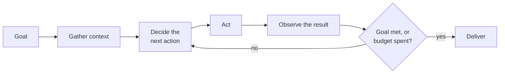

# What an agent is, and how much autonomy it needs

*Part of [AI agents for the product leader](./README.md)*

*Last reviewed: 2026-09 · Volatility: fast*

## TL;DR

An agent is a loop. It gathers context, decides the next action, takes it, and observes
the result. It repeats until the goal is met or a budget runs out. Nothing about that loop
needs a special product, protocol, or architecture. It is the shape underneath all of
them.

The first design decision comes before any build: how much autonomy does the task need?
"Agent or not" is the wrong question. Autonomy is a dial. At one end, your code decides
every step. At the other end, the model decides its own. More autonomy buys flexibility on
problems you cannot specify in advance. It costs predictability, speed, money, and the
ability to debug.

Anthropic draws the same line. A **workflow** runs a large language model (LLM) and tools along paths your code
defines. An **agent** lets the LLM direct its own process and tool use. Their advice is to
start with the simplest approach and add complexity only when it is needed.

> 🎯 **For the product leader**
>
> **Why it matters** — "Agent" describes everything from a scripted pipeline with one
> model call to a system that plans its own steps. If you cannot place a proposal on the
> dial, you cannot estimate its cost, its risk, or how it will fail.
>
> **What it changes in your decisions** — For every "let's build an agent" proposal, ask
> first whether a fixed workflow with model steps inside would do the job. It is cheaper,
> faster, and easier to debug.
>
> **Ask yourself** — *"Could I draw this task as a flowchart? If yes, what are we paying
> an agent to rediscover on every request?"*
>
> **Risk if ignored** — An expensive, unpredictable loop ships where a five-step pipeline
> would have worked. Or a scripted workflow is sold as an autonomous agent, and sets
> expectations the design cannot meet.

## The mental model: the loop, and the dial next to it


```mermaid
flowchart LR
  G["Goal"] --> GATHER["Gather context"]
  GATHER --> DECIDE["Decide the<br/>next action"]
  DECIDE --> ACT["Act"]
  ACT --> OBS["Observe the result"]
  OBS --> CHECK{"Goal met, or<br/>budget spent?"}
  CHECK -->|"no"| DECIDE
  CHECK -->|"yes"| DONE["Deliver"]
```

Every agent you will evaluate is this loop plus one setting: how much of each step your
code decides in advance, and how much the model decides. At one end, your code fixes every
step. The model only fills in language or judgment inside a step. That is cheap and
predictable. At the other end, the model picks its own steps from start to finish. That is
flexible, but harder to predict, price, and debug.

The full mechanics of the loop are in [What is an agent?](../agentic-ai/what-is-an-agent.md).

## Where a task belongs on the dial

Two questions place most tasks.

**Could an expert write down the procedure?** If yes, encode it. A fixed workflow calls
the model only where language or judgment is needed. It is cheaper and faster. Its
failures stay local and easy to trace.

**Do the steps depend on what is found along the way?** Debugging, open-ended research,
and negotiation work this way. A fixed pipeline either explodes into branches or breaks on
the first surprise. Here the loop earns its cost, because it chooses its next move from
what it just learned.

A third factor sits on top of both. Autonomy should shrink as stakes and irreversibility
rise, however well the task fits the agent shape.

## Worked example: a refund-triage proposal

*This example is invented, to show the method. The numbers are illustrative.*

A support lead proposes "an agent that handles refund requests." You ask four questions.

1. **Can an expert write the steps?** Mostly. Check the order, check the refund window,
   check the amount, then refund or escalate. Six of every seven requests follow this path.
2. **What is unpredictable?** One in seven has a messy case: a damaged item, a disputed
   charge, or a customer in distress. These need judgment.
3. **What are the stakes?** Refunds under a set amount are reversible. Larger refunds and
   account closures are not.
4. **Where does that put it on the dial?** A fixed workflow for the routine path. A model
   step to read the customer's message and draft the reply. A human approval gate for large
   refunds. An agent loop only for the messy one in seven, with a low spending limit.

The result is not "an agent." It is a workflow with one model step, one approval gate, and
one small agent for the hard cases. That design costs far less to run than an agent on
every request, and its failures are easy to locate.

## Tradeoffs and decisions

- **Flexibility vs. predictability.** More autonomy handles surprises. It also produces
  surprises of its own.
- **Cost and speed.** Anthropic notes that agentic systems often trade latency and cost
  for better task performance. Pay that price only where the task needs it.
- **Debuggability.** In a workflow, a failure points to one step. In an agent, a failure
  can sit anywhere in a chain of choices. Plan for tracing before you plan the model.
- **Stakes.** Turn the dial down as an action becomes harder to undo.

## Why the decision comes before the build

Once a team has built an agent, it wants to keep one. The orchestration is a sunk cost.
The demo impressed people. The story is "we built an agent for this."

That pull is why the question belongs at the start of scoping. A proposal that cannot say
why the model must choose its own steps is often a workflow wearing an agent's name. You
pay for flexibility the task never needed.

## Failure modes

- **Agent-washing.** A scripted workflow is called an "agent" because the label sells
  better. This mis-sets cost expectations and hides the real failure points.
- **Maximum autonomy by default.** A free-roaming agent is chosen because its demo looked
  good. A five-step pipeline would have done the job for a fraction of the cost.
- **Autonomy that ignores stakes.** The same open-ended design is used for a low-stakes
  draft and an irreversible production action.

## Under the hood

The difference between a workflow and an agent is who owns the control flow. Here is the
same task both ways, in outline.

```python
# Workflow: your code owns the control flow. Model calls sit inside fixed steps.
def handle_refund(request):
    order = lookup_order(request.order_id)            # plain code
    if not within_refund_window(order):
        return escalate(request, reason="outside window")
    reply = llm("Draft a reply.", context=[order, request.text])   # one model step
    return send(reply)

# Agent: the model owns the control flow. Your code owns the limits.
def run_agent(goal, tools, max_steps=8, max_cost=0.50):
    history, cost = [goal], 0.0
    for _ in range(max_steps):                        # a budget, not a hope
        step = llm_decide(history, tools)             # the model picks the next action
        cost += step.cost
        if step.is_final or cost > max_cost:
            return step.answer
        result = tools[step.tool](**step.args)        # act
        history.append((step, result))                # observe, then loop
    return escalate(goal, reason="step budget spent")
```

Three points matter to an engineer.

- **The limits live in your code.** The step cap and cost cap are not the model's choice.
- **Each result feeds the next decision.** That is why context grows, and why long runs get
  expensive. See [Context & memory](../agentic-ai/context-and-memory.md).
- **Tools are how an agent acts.** [Tool calling](../tool-calling/README.md) covers how a
  model requests a tool and how your code runs it.

**Two protocols you will hear named.** The **Model Context Protocol (MCP)** is an open
standard for connecting an AI application to tools and data. In December 2025 Anthropic
donated it to the Agentic AI Foundation, a directed fund under the Linux Foundation. The
**Agent2Agent protocol (A2A)** lets separate agents discover each other and delegate work.
Google donated it to the Linux Foundation in June 2025. MCP connects an agent to tools. A2A
connects an agent to other agents. Neither changes the loop above. For the honest state of
each, read [multi-agent and protocols](../agentic-ai/multi-agent-and-protocols.md).

## Practitioner checklist

- [ ] Where does this proposal sit on the dial, from fixed workflow to full autonomy? Could
      one notch less do the job for less?
- [ ] Could an expert write down the task's steps? If yes, why is a model choosing them
      fresh on every request?
- [ ] Does autonomy shrink as an action's stakes or irreversibility rise?
- [ ] If the word "agent" were removed from the pitch, would the design still make sense?
- [ ] Are the step limit and cost limit set in code, not left to the model?

## Related lessons

- [Planning, reasoning & reliability across a run](./planning-reasoning-and-reliability-across-a-run.md)
  — what happens once the loop is running.
- [When not to build an agent](./when-not-to-build-an-agent.md) — the economics that often
  settle the autonomy question.
- [What is an agent?](../agentic-ai/what-is-an-agent.md) — the full mechanics and
  vocabulary behind this lesson.
- [Tool calling](../tool-calling/README.md) — how an agent acts.

## Sources

- Anthropic, [Building effective agents](https://www.anthropic.com/engineering/building-effective-agents)
  (Dec 2024): the definitions of workflow and agent, and the advice to use the simplest
  solution first. Checked 2026-09.
- Anthropic, [Donating MCP to the Agentic AI Foundation](https://www.anthropic.com/news/donating-the-model-context-protocol-and-establishing-of-the-agentic-ai-foundation)
  (Dec 2025): the donation and MCP's description. Checked 2026-09.
- Google Cloud, [Agent2Agent protocol is getting an upgrade](https://cloud.google.com/blog/products/ai-machine-learning/agent2agent-protocol-is-getting-an-upgrade)
  (2025): confirms the A2A donation to the Linux Foundation in June 2025. Checked 2026-09.
