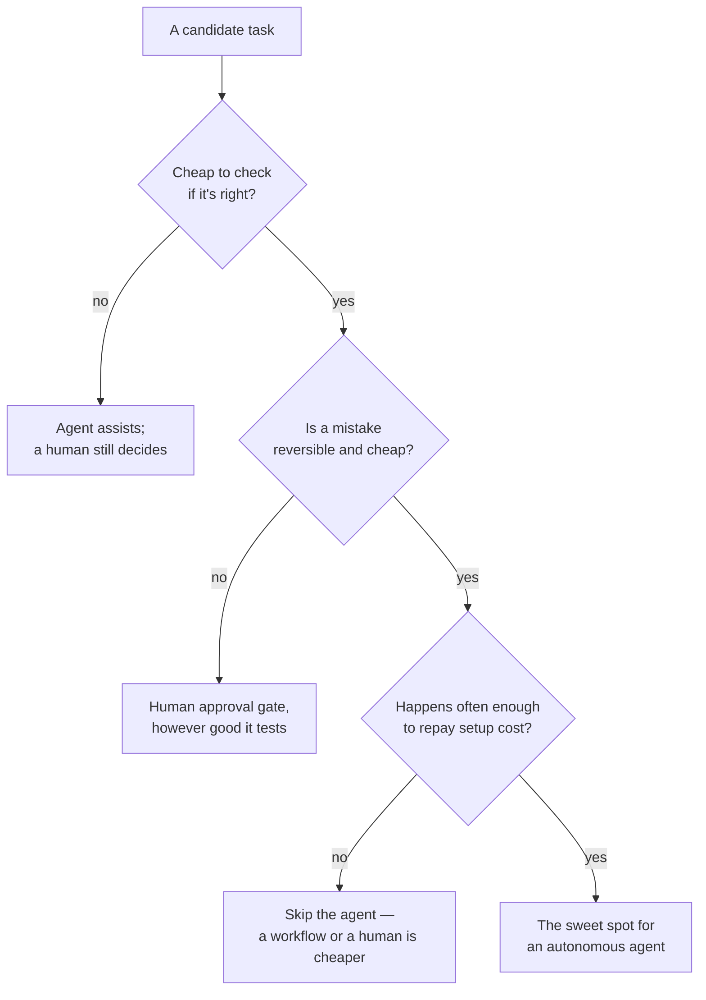

# When not to build an agent

*Part of [AI agents for the product leader](./README.md)*

## TL;DR

An agent is a real economic bet, not a free upgrade to an existing feature: it costs money
per run, it needs supervision proportional to how often it's wrong, and building it
properly — evals, tooling, security review — costs real money before it ever ships. That
bet only pays off in a specific place: work that happens often enough to amortize the
setup cost, that's cheap to check when it's done, and where being wrong sometimes is
survivable. Outside that zone — low-volume work, work that's expensive or slow to verify,
or work where a single mistake is costly or irreversible — an agent is usually a more
expensive, less predictable way to do something a fixed workflow, or a human, was already
doing well enough.

> 🎯 **For the product leader**
>
> **Why it matters** — This is the highest-leverage call in the whole module. Getting it
> right before the build starts is far cheaper than discovering it after the invoice or
> the incident.
>
> **What it changes in your decisions** — An agent proposal gets evaluated on stakes,
> verifiability, and volume before it gets evaluated on how impressive the demo looked.
>
> **Ask yourself** — *"For this task: what does the agent cost, what does checking its
> work cost, and what did doing it the old way cost — all in?"*
>
> **Risk if ignored** — An agent ships on low-volume, high-stakes, hard-to-verify work,
> looks fine in testing, and one bad run erases a year of the savings it was supposed to
> deliver.

## The mental model: three questions, one lane

Three questions, asked in this order, catch most of the bad agent bets before they're
built. **Can you check the work cheaply?** If not, autonomy caps out at "drafts for a
human to approve" — the checking cost never goes away, it just moves earlier or later.
**Is a mistake reversible and low-cost?** If not, a human gate belongs in the loop
regardless of how well the agent tests, because one bad irreversible action can erase far
more value than the automation ever produced. **Does this happen often enough?** Building
an agent properly has real fixed costs, and a task done rarely never earns them back. The
full unit-economics model — cost per task, the honest *supervised* cost that includes the
human checking it, and how these numbers should shift as model prices keep falling — is
developed in depth in [Agentic AI as a product](../agentic-ai/agentic-ai-as-a-product.md).

## The honest number is the supervised cost, not the per-run cost

The number that actually decides whether an agent is worth it isn't what one run costs —
it's that cost plus what it costs to catch the runs that go wrong, compared honestly to
what the task cost before the agent existed. An agent that's cheap per run but wrong often
enough to need full review on every output can end up costing *more* than the old way did.
It hasn't reduced the work — it's just moved it from doing the task to checking the
agent's version of it. This is the single most common way an agent proposal looks
economical on a slide and isn't in production, and it's why the supervised-cost question
belongs in the pitch, not discovered after launch.

## The trap of demo appeal

An agent that free-roams through an open-ended task tends to demo better than a boring
fixed workflow, and that demo appeal is exactly the wrong basis for the build-or-not
decision. The task that looks most impressive as an autonomous agent is not necessarily
the task where autonomy actually pays for itself — it's frequently the opposite, since the
most impressive-looking demos tend to involve exactly the open-ended, hard-to-verify work
where checking the result costs the most. Evaluating a proposal on stakes, verifiability,
and volume, before anyone in the room has seen it run, is the practical way to keep the
demo from making the decision for you.

## Failure modes

- **Wrong-lane deployment** — full autonomy shipped on low-volume, high-stakes,
  hard-to-verify work because the demo went smoothly, with no plan for what one bad run
  costs.
- **The checking treadmill** — an agent that technically automated a task but converted
  the team that used to do it into full-time reviewers of its output, with none of the
  promised savings showing up anywhere.
- **Sunk-cost autonomy** — a workflow that should have replaced a struggling agent doesn't,
  because the agent was already built and nobody wants to admit the build-or-not call was
  wrong the first time.
- **Static economics on falling costs** — a task ruled uneconomical once, never
  revisited, while the model prices that made it uneconomical keep dropping underneath it.

## Practitioner checklist

- [ ] Can this task's output be checked cheaply, or does every output still need a human
      review that the agent didn't remove?
- [ ] If a mistake happens, is it reversible and low-cost — and if not, is there an
      actual human approval gate, not just good-looking test results?
- [ ] Does this task happen often enough to repay the real fixed cost of building an
      agent properly?
- [ ] Have we calculated the *supervised* cost — including catching the agent's
      mistakes — against the honest cost of the old way, not against the agent's cost
      alone?

## Related lessons

- [What an agent is, and how much autonomy it needs](./what-an-agent-is-and-how-much-autonomy-it-needs.md)
  — the workflow-versus-agent call this lesson's economics often settle.
- [Planning, reasoning & reliability across a run](./planning-reasoning-and-reliability-across-a-run.md)
  — why verifiability is also what makes an agent's work checkable at all.
- [Agentic AI as a product](../agentic-ai/agentic-ai-as-a-product.md) — the full unit
  economics, agent UX, and business-model depth behind this lesson.
