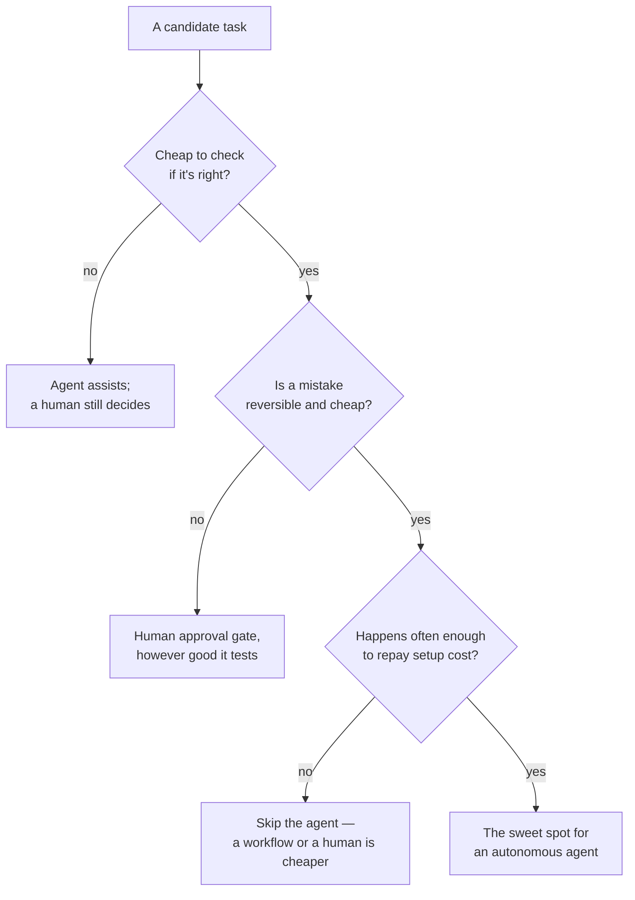

# When not to build an agent

*Part of [AI agents for the product leader](./README.md)*

*Last reviewed: 2026-09 · Volatility: fast*

## TL;DR

An agent is an economic bet, not a free upgrade. It costs money on every run. It needs
supervision in proportion to how often it is wrong. Building it properly, with evals,
tooling, and security review, costs real money before it ships.

The bet pays off in one place: work that happens often enough to repay the setup cost,
that is cheap to check when it is done, and where an occasional mistake is survivable.
Outside that zone, an agent is a costlier, less predictable way to do something that a
fixed workflow, or a person, already did well enough. The zone is: low-volume work,
work that is slow or costly to verify, and work where one mistake is costly or cannot be
undone.

> 🎯 **For the product leader**
>
> **Why it matters** — This is the highest-leverage call in the module. Getting it right
> before the build is far cheaper than finding out from the invoice or the incident.
>
> **What it changes in your decisions** — Judge an agent proposal on stakes,
> verifiability, and volume before you judge how good the demo looked.
>
> **Ask yourself** — *"For this task, what does the agent cost, what does checking its
> work cost, and what did the old way cost, all in?"*
>
> **Risk if ignored** — An agent ships on low-volume, high-stakes, hard-to-check work. It
> looks fine in testing. One bad run erases a year of the savings it was meant to deliver.

## The mental model: three questions, one lane


```mermaid
flowchart TB
  TASK["A candidate task"] --> VERIFY{"Cheap to check<br/>if it's right?"}
  VERIFY -->|"no"| ASSIST["Agent assists;<br/>a human still decides"]
  VERIFY -->|"yes"| STAKES{"Is a mistake<br/>reversible and cheap?"}
  STAKES -->|"no"| GATE["Human approval gate,<br/>however good it tests"]
  STAKES -->|"yes"| VOLUME{"Happens often enough<br/>to repay setup cost?"}
  VOLUME -->|"no"| SKIP["Skip the agent —<br/>a workflow or a human is cheaper"]
  VOLUME -->|"yes"| BUILD["The sweet spot for<br/>an autonomous agent"]
```

Ask the three questions in this order. They catch most bad agent bets before they are
built.

**Can you check the work cheaply?** If not, autonomy stops at "drafts for a human to
approve." The checking cost never goes away. It only moves earlier or later.

**Is a mistake reversible and low-cost?** If not, a human gate belongs in the loop, however
well the agent tests. One bad, irreversible action can erase more value than the
automation ever made.

**Does this happen often enough?** Building an agent properly has fixed costs. A task done
rarely never earns them back.

The full unit-economics model is in
[Agentic AI as a product](../agentic-ai/agentic-ai-as-a-product.md).

## The honest number is the supervised cost

The number that decides whether an agent is worth it is not the cost of one run. It is
that cost, plus the cost of catching the runs that go wrong, compared honestly with what the
task cost before.

An agent that is cheap per run but wrong often enough to need full review on every output
can cost more than the old way. It did not reduce the work. It moved the work from doing
the task to checking the agent's version of it. This is the most common way a proposal
looks economical on a slide and is not in production.

Real cost data points the same way. Anthropic reported, from building its own multi-agent
research system, that agents use about four times the tokens of a chat, and multi-agent
systems about fifteen times. Token use is not the whole cost, but it shows how fast the
per-run price rises as autonomy rises.

## Worked example: a supervised-cost break-even

*This example is invented, to show the method. Every number is illustrative. Replace them
with your own.*

A team spends 2,000 hours a month on a research task. A person costs 50 an hour, so the
task costs 100,000 a month.

They propose an agent.

| Cost line | Per month |
| --- | --- |
| Model and tool cost for 4,000 runs at 5 each | 20,000 |
| Human review of every run, at 6 minutes each (400 hours at 50) | 20,000 |
| Rework on runs the reviewer rejects (10% of runs, 30 minutes each: 200 hours at 50) | 10,000 |
| Platform, monitoring, and upkeep | 10,000 |
| **Supervised total** | **60,000** |

The agent saves 40,000 a month against the 100,000 baseline. The setup cost was 300,000.
Break-even arrives after 7.5 months.

Now change one number. If reviewers must check every output for 20 minutes instead of 6,
review cost rises to 66,700 and the supervised total to 106,700. The agent now costs more
than the old way. The whole case rests on how cheap the checking is. That is why
"cheap to check" comes first in the three questions.

## The trap of demo appeal

A free-roaming agent tends to demo better than a fixed workflow. That appeal is the wrong
basis for the decision.

The task that looks most impressive as an autonomous agent is often not the task where
autonomy pays. It is often the opposite. The most impressive demos tend to use open-ended,
hard-to-check work, where checking the result costs the most. Judge a proposal on stakes,
verifiability, and volume before anyone sees it run.

## Tradeoffs and decisions

- **Autonomy vs. checking cost.** More autonomy saves doing and adds checking. The saving
  depends on how cheap the check is.
- **Build now vs. wait.** Model prices keep falling. A task ruled out once may pass later.
  Set a date to re-run the numbers.
- **Agent vs. workflow.** A workflow gives up flexibility for predictable cost. Choose it
  wherever an expert can write the steps.
- **Human gate vs. throughput.** A gate is slow and costs staff time. It is the price of
  making a mistake reversible.

## Failure modes

- **Wrong-lane deployment.** Full autonomy is shipped on low-volume, high-stakes,
  hard-to-check work because the demo went well. There is no plan for what one bad run
  costs.
- **The checking treadmill.** The agent automates the task, and the team that did it becomes
  a full-time review desk. The promised saving never appears.
- **Sunk-cost autonomy.** A workflow should replace a struggling agent. It does not,
  because the agent is already built and nobody wants to admit the first call was wrong.
- **Static economics on falling costs.** A task is ruled out once and never revisited, while
  the prices that ruled it out keep dropping.
- **Agent-washing on the buy side.** A vendor sells a rebranded chatbot or script as an
  agent. See [Choosing and acceptance-testing an agent](./choosing-and-acceptance-testing-an-agent.md).

## Under the hood

The break-even above is a small model. Keep it in code, so a change in any input updates the
answer.

```python
def supervised_cost(runs, run_cost, review_min, reject_rate, rework_min, hourly, fixed):
    review = runs * (review_min / 60) * hourly
    rework = runs * reject_rate * (rework_min / 60) * hourly
    return runs * run_cost + review + rework + fixed

baseline = 2000 * 50                      # hours x hourly rate, per month
agent    = supervised_cost(runs=4000, run_cost=5, review_min=6,
                           reject_rate=0.10, rework_min=30, hourly=50, fixed=10_000)
saving   = baseline - agent               # 40,000 per month in the example
months_to_break_even = 300_000 / saving   # 7.5 months
```

Sweep `review_min`, `reject_rate`, and `run_cost` to find which one breaks the case.
Usually it is review time. Two engineering inputs feed `run_cost`: the number of steps per
run and the context carried at each step. Long runs re-send a growing history on every
step. See [Context & memory](../agentic-ai/context-and-memory.md) and
[Cost optimization](../cost-optimization/README.md).

## Practitioner checklist

- [ ] Can this task's output be checked cheaply, or does every output still need a human
      review the agent did not remove?
- [ ] If a mistake happens, is it reversible and low-cost? If not, is there a real human
      approval gate, not just good test results?
- [ ] Does the task happen often enough to repay the fixed cost of building properly?
- [ ] Have we calculated the *supervised* cost against the honest cost of the old way?
- [ ] Have we sensitivity-tested review time, since it usually decides the case?
- [ ] Is there a date to revisit the numbers as model prices fall?

## Related lessons

- [What an agent is, and how much autonomy it needs](./what-an-agent-is-and-how-much-autonomy-it-needs.md)
  — the workflow-versus-agent call this lesson's economics often settle.
- [Planning, reasoning & reliability across a run](./planning-reasoning-and-reliability-across-a-run.md)
  — why cheap-to-check work is the work agents do well.
- [Choosing and acceptance-testing an agent](./choosing-and-acceptance-testing-an-agent.md)
  — how to test the bet before you make it.
- [Agentic AI as a product](../agentic-ai/agentic-ai-as-a-product.md) — the full unit
  economics, agent UX, and business-model depth.

## Sources

- Anthropic, [How we built our multi-agent research system](https://www.anthropic.com/engineering/multi-agent-research-system)
  (Jun 2025): agents use about 4x the tokens of chat, and multi-agent systems about 15x.
  Checked 2026-09.
- The worked example and the code are invented and illustrative, not data from a real
  company.
