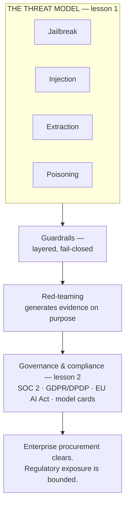

# AI security & guardrails for the product leader

*Part of the [Generative AI family](../GENERATIVE_AI_ROADMAP.md).*

An LLM mixes trusted instructions and untrusted data in one channel, and it's usually
serving more than one customer from shared infrastructure. That combination produces
attacks that don't exist in ordinary software, and defending against them takes more than
a filter — it takes an architecture, and a paper trail proving the architecture works.

**A note on scope.** This is one of the most exhaustively covered topics in the
curriculum, for the same reason evaluation and observability was.
[Safety engineering](../content/05-safety-multitenancy/safety-engineering.md) and
[Multi-tenant isolation](../content/05-safety-multitenancy/multi-tenant-isolation.md)
already develop prompt injection, the lethal trifecta, data leakage, and cross-tenant
isolation in full engineering depth.
[Safety, security & governance for agents](../agentic-ai/safety-security-and-governance.md)
already develops least privilege, sandboxing, human-in-the-loop approval, audit trails,
and organizational governance in full. Re-deriving any of that here would only restate it.
This module exists to answer the two questions those deep-dive lessons don't lead with:
the full **threat taxonomy** guardrails have to cover — jailbreak, injection, extraction,
and poisoning are four different attacks, not one — and how governance becomes
**compliance evidence** a regulator or an enterprise buyer can actually check. That is
why this module is two lessons, not seven.

## The knowledge graph

Read it as one argument in two parts. **The threat model**: "guardrails" is not one
control, it's a layered defense against four distinct attacks, each of which needs its own
countermeasure and fails in its own way. **Governance & compliance**: the internal
discipline of controlling an AI system only pays off in the moments that matter — a
security review, a regulator's request — if it produces evidence someone outside the
company can actually check.

## The lessons

- [**The threat model, and guardrails as architecture**](./the-threat-model-and-guardrails.md)
  — jailbreak vs. injection vs. extraction vs. poisoning, and why a guardrail system has to
  fail closed.
- [**Governance, audit & compliance**](./governance-audit-and-compliance.md) — SOC 2, the
  EU AI Act's risk tiers, GDPR's automated-decision rules, and red-teaming as the practice
  that generates proof before an incident does.

Each lesson pairs the product framing with a **🎯 For the product leader** briefing — why
it matters, the decision it changes, the question to ask your team, and the risk if
ignored — plus a diagram. For the engineering depth behind every mechanic mentioned here,
follow the spokes into
[Safety engineering](../content/05-safety-multitenancy/safety-engineering.md),
[Multi-tenant isolation](../content/05-safety-multitenancy/multi-tenant-isolation.md), and
[Safety, security & governance for agents](../agentic-ai/safety-security-and-governance.md).

**📌 Close out the module:** [Recap & real-world examples](./recap.md).
