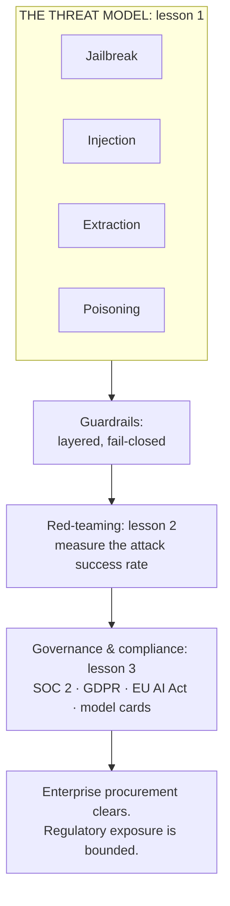

# AI security & guardrails for the product leader

*Part of the [Generative AI family](../GENERATIVE_AI_ROADMAP.md).*

An LLM mixes trusted instructions and untrusted data in one channel. It often serves many
customers from shared infrastructure. That combination creates attacks that ordinary
software does not face. Defending against them takes more than a filter. It takes an
architecture, a way to test it, and a paper trail that proves it works.

**A note on scope.** This topic is already covered in depth elsewhere in the curriculum.
[Safety engineering](../content/05-safety-multitenancy/safety-engineering.md) and
[Multi-tenant isolation](../content/05-safety-multitenancy/multi-tenant-isolation.md)
develop prompt injection, the lethal trifecta, data leakage and cross-tenant isolation.
[Safety, security & governance for agents](../agentic-ai/safety-security-and-governance.md)
develops least privilege, sandboxing, human approval, audit trails and governance. This
module does not repeat them. It answers three questions those lessons do not lead with.

1. Which **four attacks** must guardrails cover? Jailbreak, injection, extraction and
   poisoning are four different attacks, not one.
2. How do you **test** the defenses, and measure the result?
3. How does the work become **compliance evidence** that a regulator or an enterprise
   buyer can check?

## Where the depth lives

Each lesson here summarizes an idea and points to the lesson that covers it in full.

| If you want the full depth on | Read |
| --- | --- |
| Prompt injection, the lethal trifecta, permission boundaries | [Safety engineering](../content/05-safety-multitenancy/safety-engineering.md) |
| Keeping one tenant's data away from another's | [Multi-tenant isolation](../content/05-safety-multitenancy/multi-tenant-isolation.md) |
| Least privilege, sandboxing, human approval, agent governance | [Safety, security & governance for agents](../agentic-ai/safety-security-and-governance.md) |
| Limits, approval gates and the kill switch for a running agent | [Running an agent in production](../ai-agents/running-an-agent-in-production.md) |
| Who may do what: roles, attributes, tokens and policy engines | [Access control](../access-control/README.md) |
| The general eval practice that red-team suites build on | [Evaluation and observability](../evaluation-and-observability/README.md) |
| The general privacy discipline | [Security & privacy sense](../technical-product-sense/security-and-privacy.md) |

## The knowledge graph

```mermaid
flowchart TB
  subgraph THREAT["THE THREAT MODEL: lesson 1"]
    JB["Jailbreak"]
    PI["Injection"]
    EX["Extraction"]
    PO["Poisoning"]
  end
  THREAT --> GR["Guardrails:<br/>layered, fail-closed"]
  GR --> RT["Red-teaming: lesson 2<br/>measure the attack success rate"]
  RT --> GOV["Governance & compliance: lesson 3<br/>SOC 2 · GDPR · EU AI Act · model cards"]
  GOV --> OUT["Enterprise procurement clears.<br/>Regulatory exposure is bounded."]
```

Read it as one argument in three parts. **The threat model:** "guardrails" is a layered
defense against four attacks. Each has its own countermeasure and fails in its own way.
**Red-teaming:** a guardrail you have not attacked is a guess, so measure it and keep every
finding. **Governance and compliance:** internal control pays off at the moments that
matter, such as a security review or a regulator's request, only if it produces evidence
that an outsider can check.

## The lessons

- [**The threat model, and guardrails as architecture**](./the-threat-model-and-guardrails.md)
  — jailbreak, injection, extraction and poisoning, how they map to OWASP and NIST, and why
  guardrails must fail closed.
- [**Red-teaming: testing your defenses**](./red-teaming-and-proving-your-defenses.md) — who
  attacks, what to measure, and how to turn findings into a release gate.
- [**Governance, audit & compliance**](./governance-audit-and-compliance.md) — SOC 2, GDPR's
  automated-decision rules, the EU AI Act timeline after the 2026 Digital Omnibus, and the
  evidence register.

Each lesson has a **🎯 For the product leader** briefing, a labeled worked example, an "Under
the hood" section for engineers, and a Sources list. Rules and dates in this area change
fast, so every lesson carries a review date.

**📌 Close out the module:** [Recap & real-world examples](./recap.md), which ends with a
self-test.
