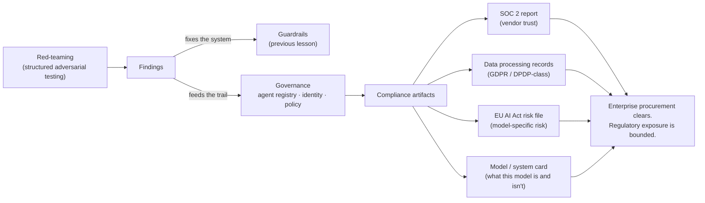

# Governance, audit & compliance

*Part of [AI security & guardrails for the product leader](./README.md)*

## TL;DR

Security controls answer *can this be attacked*. Governance and compliance answer a
different, harder question: *can we prove it, to someone who wasn't in the room.* An agent
registry and an audit trail are necessary and not sufficient — the enterprise buyer's
security team and the regulator both want evidence in a specific, checkable shape.
**SOC 2** answers the vendor-trust question every enterprise deal now asks. Sector rules
like **GDPR** and its DPDP-class cousins answer the personal-data question. The **EU AI
Act** now answers the model-risk question specifically, with real teeth and reach beyond
Europe. **Red-teaming** is how that evidence gets generated on your own schedule, instead
of an incident generating it for you on a much worse one.

> 🎯 **For the product leader**
>
> **Why it matters** — Enterprise AI deals stall in security review, not the demo. A
> compliance artifact you don't have is now a line item that can sink a quarter.
>
> **What it changes in your decisions** — Red-teaming and compliance certifications get
> budgeted as roadmap items with an owner and a date, not handled as "we'll sort it out
> before the audit."
>
> **Ask your eng team** — *"If an enterprise security team or a regulator asked for our AI
> risk documentation tomorrow, what would we actually hand them?"*
>
> **Risk if ignored** — A deal that dies quietly in procurement, or a regulatory finding,
> because nobody owned the evidence trail until someone outside the company asked for it.

## From governance to evidence

[Governance](../agentic-ai/safety-security-and-governance.md) — an agent registry, agent
identity, org-wide policy, and a named owner per agent — is the internal discipline that
makes the rest of this stick at company scale. This lesson picks up exactly where that
one leaves off: governance is the internal control. **Compliance is the same control,
turned into evidence someone outside the company can check.**

### SOC 2 — the default enterprise gate

SOC 2 isn't AI-specific — it's a general vendor-trust audit against five **Trust Services
Criteria** (security, availability, processing integrity, confidentiality, privacy) — but
it's become the near-universal first question in enterprise AI procurement, because
buyers have no faster way to check "does this vendor take security seriously" than asking
for the report. **Type I** attests controls exist at a point in time; **Type II** — the
one buyers actually want — attests they operated effectively over a period, usually six to
twelve months. That lead time is the trap: a company that starts its SOC 2 process only
when a six-figure deal demands it has already lost the quarter, because Type II cannot be
rushed. For an AI vendor specifically, the auditor will also expect **model change
management** as a control: who approved this model or prompt version, when, and against
what evaluation.

### GDPR, DPDP-class laws, and the AI-specific wrinkle

[Security & privacy sense](../technical-product-sense/security-and-privacy.md) develops
the general privacy discipline — minimize at the spec, make deletion real, let consent
follow use — in full. The AI-specific addition is **automated decision-making**: GDPR-class
regimes give individuals rights around decisions made "solely by automated means" with
legal or similarly significant effect — a loan denial, a hiring rejection, a content
takedown. If a model is making or materially driving that class of decision, the
regulatory bar includes a right to meaningful human review and an explanation a person can
actually act on, not a confidence score.

### The EU AI Act — risk-tiered, and reaching past Europe

The AI Act (in force since August 2024, obligations phasing in through 2026–27) is the
first horizontal law that regulates the model itself rather than only the data around it,
and it's organized around **risk tiers**: **unacceptable risk** is banned outright
(social scoring, certain biometric surveillance); **high-risk** covers use cases like
hiring, credit, and medical triage, and carries real obligations — a conformity
assessment, logging, human oversight, and documented risk management; **limited risk**
gets a transparency duty (tell the user they're talking to an AI); **minimal risk**
carries no specific obligation. The part product leaders miss is the reach: the Act
applies to any provider whose AI system's output is used within the EU, **regardless of
where the company is based**. A team that classifies a hiring-screening feature as
"limited risk" without checking whether it actually functions as an employment decision
tool is one product review away from discovering it's high-risk after the obligations
were due.

### Red-teaming — generating the evidence on purpose

**Red-teaming** is structured adversarial testing aimed at finding failures before
launch, run either **internally** (a dedicated team or rotation whose job is breaking the
product) or **externally** (bug-bounty-style programs that pay outside researchers for
verified findings). Its output does double duty. Findings that reveal a real gap feed
back into [the guardrail set](./the-threat-model-and-guardrails.md) and the
[eval suite](../technical-product-management/tpm-for-ai-products.md) as new adversarial
cases, closing the loop other lessons in this family describe. And the *record* of having
run it — scope, findings, remediation, dates — is itself compliance evidence: proof of
diligence a regulator or an enterprise buyer can check, not a claim they have to take on
faith. Treat it as a recurring practice tied to model and prompt changes, not a one-time
pre-launch event; a red team report from a year and three model versions ago answers a
question nobody is asking anymore.

### The model or system card

A **model card** (or system card, for the product wrapped around it) is the artifact that
answers, in one place, what this model actually is: its intended use, known limitations,
the data it was trained or fine-tuned on, and its evaluated failure modes. It's the
document an enterprise security reviewer or a regulator reaches for first, and the
document most teams discover they don't have exactly when someone asks for it.

## A worked pass: the deal that stalled in security review

A mid-market SaaS company has an AI feature two weeks from closing its largest deal ever.
The buyer's security team sends the standard enterprise questionnaire: a current SOC 2
Type II report, a data flow diagram showing where customer data goes, a model or system
card for the AI feature specifically, and a summary of the last red-team engagement. The
company has none of the four — security was handled ad hoc, by engineers, as they went.
Producing a SOC 2 Type II report takes six to twelve months of audited history; it cannot
be compressed by hiring a faster auditor. The deal doesn't die. It slips two quarters,
while the company starts a SOC 2 engagement it should have started a year earlier, and
writes a model card and data flow diagram in a week under deal pressure that should have
existed since launch. The lesson generalizes past this one company: **compliance
artifacts have lead time that a live deal doesn't have**, which means they belong on the
roadmap as insurance against a deal that hasn't been sourced yet, not as a response to one
that already has a signature pending.

## Failure modes

- **Governance without evidence** — an agent registry and an internal policy exist, but
  nothing regulator- or auditor-facing was ever produced from them.
- **Compliance as fire drill** — the SOC 2 process starts only when a specific deal
  demands it, adding a two-to-four-quarter delay that was avoidable a year earlier.
- **The EU AI Act blind spot** — a high-risk use case (hiring, credit, medical) ships
  without the conformity assessment, logging, and human oversight the tier requires,
  discovered only when a regulator or customer's legal team asks.
- **Red-teaming as a one-time PR event** — a single pre-launch engagement, never repeated,
  while the model and prompts keep changing underneath it.
- **No model card** — nobody can answer "what is this model supposed to do, and what
  should we not trust it to do" without reverse-engineering the answer from the code.

## Practitioner checklist

- [ ] Do we have a current SOC 2 report, or is the process at least underway well before
      any specific deal needs it?
- [ ] Can we name which of our AI features make or materially drive an automated
      decision with legal or similarly significant effect?
- [ ] Have we actually classified our AI use cases against the EU AI Act's risk tiers —
      including whether any output reaches EU users regardless of where we're based?
- [ ] Is red-teaming a recurring practice tied to model/prompt changes, with findings
      that feed back into guardrails and evals?
- [ ] Does every AI feature have a model or system card someone can hand a reviewer
      today, not draft under deadline pressure?

## Related lessons

- [The threat model, and guardrails as architecture](./the-threat-model-and-guardrails.md)
- [Safety, security & governance for agents](../agentic-ai/safety-security-and-governance.md)
  — the internal governance discipline this lesson turns into external evidence.
- [Security & privacy sense](../technical-product-sense/security-and-privacy.md) — the
  general privacy discipline this lesson adds the AI-specific layer to.
- [TPM for AI products](../technical-product-management/tpm-for-ai-products.md) — where
  red-team findings land in the eval-driven development loop.
