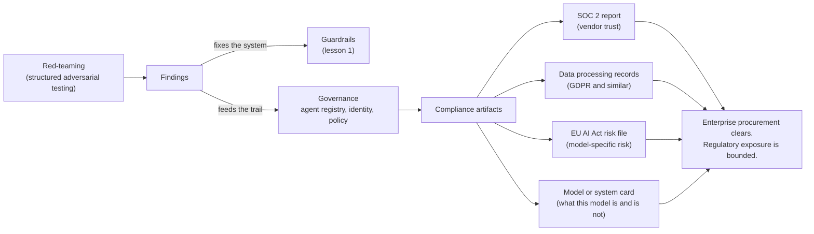

# Governance, audit & compliance

*Part of [AI security & guardrails for the product leader](./README.md)*

*Last reviewed: 2026-10 · Volatility: fast*

## TL;DR

Security controls answer "can this be attacked?" Governance and compliance answer a harder
question: "can we prove it to someone who was not in the room?" An agent registry and an
audit trail are necessary. They are not enough. An enterprise buyer and a regulator each
want evidence in a specific, checkable shape.

- **System and Organization Controls (SOC) 2** answers the vendor-trust question that
  nearly every enterprise deal asks.
- The **General Data Protection Regulation (GDPR)**, the EU's data protection law, and
  similar laws answer the personal-data question.
- The **EU AI Act** answers the model-risk question, with real penalties and reach beyond
  Europe.
- **Red-teaming**, covered in the [previous lesson](./red-teaming-and-proving-your-defenses.md),
  creates the evidence on your own schedule. Otherwise an incident creates it for you, on a
  worse one.

The theme is lead time. Most of this evidence cannot be produced in a week.

> 🎯 **For the product leader**
>
> **Why it matters** — Enterprise AI deals stall in security review, not in the demo. A
> compliance artifact you do not have can sink a quarter.
>
> **What it changes in your decisions** — You budget compliance work as roadmap items with
> an owner and a date. You do not wait for the audit.
>
> **Ask your eng team** — *"If an enterprise security team or a regulator asked for our AI
> risk documentation tomorrow, what would we hand them?"*
>
> **Risk if ignored** — A deal dies quietly in procurement, or a regulator finds a gap,
> because nobody owned the evidence until an outsider asked for it.

## The mental model: from governance to evidence


```mermaid
flowchart LR
  RT["Red-teaming<br/>(structured adversarial testing)"] --> FIND["Findings"]
  FIND -->|"fixes the system"| GR["Guardrails<br/>(lesson 1)"]
  FIND -->|"feeds the trail"| REG["Governance<br/>agent registry, identity, policy"]
  REG --> ART["Compliance artifacts"]
  ART --> SOC["SOC 2 report<br/>(vendor trust)"]
  ART --> GDPR["Data processing records<br/>(GDPR and similar)"]
  ART --> EUAI["EU AI Act risk file<br/>(model-specific risk)"]
  ART --> CARD["Model or system card<br/>(what this model is and is not)"]
  SOC & GDPR & EUAI & CARD --> UNLOCK["Enterprise procurement clears.<br/>Regulatory exposure is bounded."]
```

[Governance](../agentic-ai/safety-security-and-governance.md) is the internal discipline: an
agent registry, agent identity, org-wide policy, and a named owner per agent. This lesson
picks up where that one stops. **Compliance is the same control, turned into evidence that
someone outside the company can check.**

## SOC 2: the default enterprise gate

SOC 2 is not specific to AI. It is a general audit of a vendor's controls, run by an
independent auditor against the **Trust Services Criteria** of the American Institute of CPAs
(AICPA). The current version is
the 2017 criteria with revised points of focus from 2022. There are five categories:
security, availability, confidentiality, processing integrity and privacy. Security is
required. The other four are optional, and you choose them to fit the service.

Buyers ask for the report because it is the fastest way to check "does this vendor take
security seriously?" Two report types exist.

- **Type I** says the controls exist at one point in time.
- **Type II** says the controls worked over a period. Buyers usually want this one. The
  period is often several months, and the buyer decides what it accepts.

Here is the trap. Type II needs a history of operation, so it cannot be rushed. A company
that starts only when a large deal asks has already lost the quarter. For an AI vendor, an
auditor may also look at **model change management**: who approved this model or prompt
version, when, and against which evaluation. Ask your auditor how they treat it.

Buyers may also ask for **ISO/IEC 42001** (December 2023), the first international standard
for an AI management system. Others cite the NIST AI Risk Management Framework (RMF),
released in January 2023, and its Generative AI Profile, NIST AI 600-1 (July 2024). None replaces SOC 2.
Each is a different request for the same thing: proof of how you manage AI risk.

## GDPR and automated decisions

[Security & privacy sense](../technical-product-sense/security-and-privacy.md) covers the
general privacy discipline in full. The AI-specific part is **automated decision-making**.

GDPR Article 22 limits decisions based solely on automated processing that have legal or
similarly significant effects on a person. Examples are a loan denial or a hiring
rejection. Such decisions are allowed only under set exceptions, with safeguards. The
safeguards include human intervention, the chance to state a view, and the chance to
contest the decision.

The Court of Justice of the EU widened the reach in *SCHUFA* (case C-634/21, 7 December
2023). A credit score counts as an automated decision when a third party relies heavily on
it to decide on a contract. So a model that only "scores" can fall under the rule if
someone else acts on its output. If your model drives such a decision, plan for human
review.

Do not assume other laws copy Article 22. India's Digital Personal Data Protection (DPDP)
Rules were notified on 14 November 2025. Their main duties, including notice, consent and
penalties, are scheduled for 13 May 2027. Check each law and each market with counsel.

## The EU AI Act: risk tiers, with a moving timeline

The AI Act is the first broad law that regulates AI systems and models directly. It sorts
uses into **risk tiers**.

- **Unacceptable risk** is banned. Social scoring is an example.
- **High risk** covers uses such as hiring, credit scoring and school admission. It brings a
  conformity assessment, logging, human oversight and documented risk management.
- **Limited risk** brings a transparency duty. For example, tell people they are talking to
  an AI.
- **Minimal risk** has no specific duty.

The part product leaders miss is the reach. The Act applies to providers outside the EU if
their AI system's output is used in the EU. Where your company sits does not matter.

The dates have moved. Regulation (EU) 2026/1744, the "Digital Omnibus on AI," was
published on 24 July 2026 and entered into force on 27 July 2026. Here is the schedule as
reported by law-firm and trade sources, as of October 2026.

| Date | What applies |
| --- | --- |
| 1 Aug 2024 | The Act entered into force |
| 2 Feb 2025 | Banned practices |
| 2 Aug 2025 | Duties for providers of general-purpose AI models |
| 2 Aug 2026 | Most transparency duties (Article 50). The Commission's enforcement powers over general-purpose models start. |
| 2 Dec 2026 | Machine-readable marking of AI content, for systems already on the market before 2 Aug 2026 |
| 2 Dec 2027 | High-risk systems listed in Annex III (stand-alone uses such as hiring and credit) |
| 2 Aug 2028 | High-risk AI built into products already covered by EU product-safety law (Annex I) |

Do not read the delay as a reprieve. The Omnibus moved the high-risk dates. It left most
transparency duties in place. A team that classifies a hiring feature as "limited risk"
without checking whether it works as an employment decision tool may learn it is high-risk
only after the duties apply. Classify first. Dates are secondary.

## The model or system card

A **model card** is the document that says what a model is. A **system card** says the same
for the product built around it. It states the intended use, known limits, the data used,
and tested failure modes. It is the first thing a security reviewer or regulator asks for.
It is also the document most teams find they lack, at the moment someone asks.

## Worked example: the deal that stalled in security review

*This example is invented, to show the method.*

A mid-sized software company has an AI feature. Its largest deal ever is two weeks from
closing. The buyer's security team sends the standard questionnaire. It asks for four
things.

| Evidence asked for | Company has it? | Time to produce |
| --- | --- | --- |
| Current SOC 2 Type II report | No | Many months of audited history |
| Data-flow diagram for the AI feature | No | About a week |
| Model or system card | No | About a week |
| Summary of the last red-team test | No | A few weeks, if the test is run now |

Engineers handled security ad hoc. Nobody owned the paper trail. The company cannot buy a
faster audit. The two quick items get written under deadline pressure. The deal slips by
two quarters while a SOC 2 engagement starts. The lesson: **evidence has lead time that a
live deal does not.** Put it on the roadmap as insurance against a deal you have not
sourced yet.

## Tradeoffs

- **Early vs. late.** Starting compliance work early costs money with no deal attached.
  Starting late costs a deal.
- **Breadth vs. depth.** SOC 2 plus an AI-specific standard covers more buyers. It also
  doubles the upkeep.
- **Documentation vs. speed.** Model cards and change logs slow each release a little. They
  make every later review faster.
- **Build vs. buy.** Compliance tooling can collect evidence for you. It cannot decide your
  risk tier.

## Failure modes

- **Governance without evidence.** A registry and an internal policy exist. Nothing an
  auditor can read was ever produced from them.
- **Compliance as a fire drill.** The SOC 2 process starts when a deal demands it. That adds
  quarters of delay that were avoidable a year earlier.
- **The AI Act blind spot.** A high-risk use ships with no plan for the duties that come
  with its tier. A regulator or a customer's lawyer finds out first.
- **Red-teaming as a one-time event.** One test before launch, never repeated, while the
  model and prompts keep changing.
- **No model card.** Nobody can say what the model should and should not be trusted to do
  without reading the code.
- **Stale dates.** A plan built on 2024 or 2025 reading of the Act, before the Omnibus.

## Under the hood

An **evidence register** is a small table that maps each AI feature to its evidence. Engineers
can keep it in version control next to the code.

```yaml
feature: support-assistant
risk_tier: limited            # decided and signed off by a named person, with the reason
tier_reviewed: 2026-10
owner: head-of-support-platform
evidence:
  model_card: docs/cards/support-assistant.md     # updated on every model or prompt change
  data_flow: docs/dataflow/support-assistant.png
  red_team_summary: docs/redteam/2026-q3.md
  change_log: ci/model-approvals/                 # who approved which model version, against which eval
  soc2_scope: in-scope                            # is this feature inside the audited system?
eu_exposure: true             # output reaches EU users, so the AI Act applies
```

Two habits keep it honest.

- **Generate it, do not hand-edit it.** Have CI fail a release when `model_card` or
  `red_team_summary` is older than the last model change.
- **Review the risk tier on a schedule.** A feature can move into a higher tier when its
  use changes, even if its code does not.

## Practitioner checklist

- [ ] Do we have a current SOC 2 report, or is the process underway before a deal needs it?
- [ ] Can we name each AI feature that makes, or strongly drives, an automated decision with
      legal or similar effect?
- [ ] Have we classified each AI use against the EU AI Act's risk tiers, including whether
      its output reaches EU users?
- [ ] Is our timeline based on the 2026 Omnibus dates, not older ones?
- [ ] Does every AI feature have a model or system card we can hand over today?
- [ ] Is there an evidence register with an owner for each feature?
- [ ] Is red-teaming a recurring practice tied to model and prompt changes?

## Related lessons

- [Red-teaming: testing your defenses](./red-teaming-and-proving-your-defenses.md) — the
  practice that creates much of this evidence.
- [The threat model, and guardrails as architecture](./the-threat-model-and-guardrails.md)
  — the controls this evidence describes.
- [Safety, security & governance for agents](../agentic-ai/safety-security-and-governance.md)
  — the internal governance discipline this lesson turns into external evidence.
- [Security & privacy sense](../technical-product-sense/security-and-privacy.md) — the general
  privacy discipline.
- [TPM for AI products](../technical-product-management/tpm-for-ai-products.md) — where
  findings land in the eval-driven development loop.

## Sources

- EU AI Act timeline after the Digital Omnibus, as of Oct 2026. Regulation (EU) 2026/1744:
  published 24 Jul 2026, in force 27 Jul 2026, high-risk Annex III to 2 Dec 2027 and Annex I to
  2 Aug 2028, Article 50 unchanged, watermarking to 2 Dec 2026 for systems already on the
  market. Taken from law-firm and trade write-ups
  ([Usercentrics](https://usercentrics.com/knowledge-hub/eu-ai-act-high-risk-delay-article-50-transparency-consent/),
  [Baker Botts](https://www.bakerbotts.com/thought-leadership/publications/2026/september/eu-ai-act-article-50-transparency-obligations-go-live),
  [DLA Piper](https://knowledge.dlapiper.com/dlapiperknowledge/globalemploymentlatestdevelopments/2026/The-Digital-AI-Omnibus-Proposed-deferral-of-high-risk-AI-obligations-under-the-AI-Act)).
  The Official Journal text was not read directly. Check it before you rely on a date.
- European Commission,
  [General-purpose AI models in the AI Act: Q&A](https://digital-strategy.ec.europa.eu/en/faqs/general-purpose-ai-models-ai-act-questions-answers):
  duties from 2 Aug 2025 and enforcement powers from 2 Aug 2026. Search-result excerpt.
- Court of Justice of the EU, *SCHUFA Holding (Scoring)*, C-634/21, 7 Dec 2023: a credit
  score is an automated decision under Article 22 when a third party relies heavily on it.
  From law-firm summaries ([A&O Shearman](https://www.aoshearman.com/en/insights/ao-shearman-on-data/cjeu-rules-that-a-credit-score-constitutes-automated-decision-making-under-the-gdpr)).
- India, [DPDP Rules 2025](https://static.pib.gov.in/WriteReadData/specificdocs/documents/2025/nov/doc20251117695301.pdf):
  notified 14 Nov 2025, with phased commencement and main duties after 18 months. Dates
  from secondary summaries.
- AICPA, [SOC suite of services](https://www.aicpa-cima.com/topic/audit-assurance/audit-and-assurance-greater-than-soc-2/):
  the 2017 Trust Services Criteria with revised points of focus (2022), five categories,
  security required. The Type II period is a common practice, not a fixed rule.
- ISO/IEC 42001:2023; NIST AI RMF 1.0 (26 Jan 2023); NIST AI 600-1 (26 Jul 2024). Search-result
  excerpts.
- The deal scenario and the evidence-register sketch are invented and illustrative.
