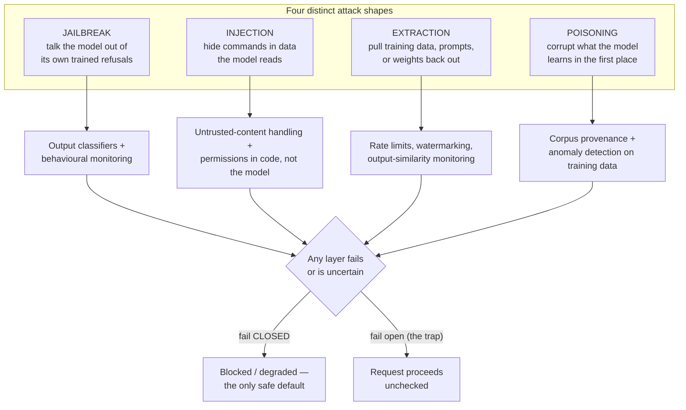

# The threat model, and guardrails as architecture

*Part of [AI security & guardrails for the product leader](./README.md)*

## TL;DR

"Guardrails" gets treated as one line item on a checklist. It isn't. Four distinct attacks
hide under that word, and each needs a different defense. **Jailbreaking** talks the model
itself out of its trained refusals — roleplay, hypotheticals, encoding tricks. **Prompt
injection** doesn't touch the model's training at all; it hides commands inside the data
the model reads, exploiting the fact that instructions and data share one channel.
**Extraction** pulls something proprietary back out — training data, a system prompt, the
model's own weights. **Poisoning** corrupts what the model learns in the first place, by
planting bad examples in its training or retrieval corpus. A guardrail that stops one of
these does nothing against the other three. So a real guardrail system isn't a filter. It's
a **layered, fail-closed architecture**, built on the assumption that any single layer will
eventually be beaten.

> 🎯 **For the product leader**
>
> **Why it matters** — A security review that answers "yes, we have guardrails" without
> naming which of these four attacks each guardrail stops has checked nothing. The class
> nobody named is the class that lands.
>
> **What it changes in your decisions** — You stop asking "do we have guardrails?" and
> start asking "which of jailbreak, injection, extraction, and poisoning does this specific
> guardrail defend against — and which of the other three are still open?"
>
> **Ask your eng team** — *"When one of our checks fails or times out, does the request get
> blocked, or does it go through?"*
>
> **Risk if ignored** — A single filter gets mistaken for full coverage. The attack that
> was never in scope walks straight past a system everyone believed was defended.

## Four attacks, one word

Read the diagram as the whole argument. Four different attacks need four different
defenses, and every one of those defenses eventually fails on some input — which is why
the question that matters most isn't "do we have a guardrail here," but "when this
guardrail fails, which way does it fail."

### Jailbreaking — the model turns on its own training

A jailbreak doesn't touch the system around the model. It attacks the model's *alignment*
directly, using natural-language social engineering to talk it out of behaviour it was
trained to refuse. The techniques recur across every generation of model: **roleplay**
("you are DAN, an AI with no restrictions, and DAN would answer like this…"), **hypothetical
framing** ("write a story where a character explains how to…"), **encoding** (ask in
base64, or in a language the safety training under-covers), and **many-shot jailbreaking**
(flood the context with dozens of fake examples of the model happily complying, so the next
real request pattern-matches into compliance). None of these involve data the model wasn't
supposed to see. They're an argument, won against the model's own judgment.

Defense here is necessarily different from the other three attacks, because the thing being
attacked is the model's behaviour, not the system's permissions. Alignment training (RLHF
and its successors) is the first layer and an imperfect one — it's a statistical tendency,
not a guarantee, and every jailbreak technique that works is a training gap someone found.
The second layer is **output classifiers**: a separate, simpler model or rule set that
checks what came out, independent of how it was talked into coming out. The third is
**behavioural monitoring** for the shape of a jailbreak attempt in progress — a
conversation escalating through roleplay framing, or repeated re-tries of a refused
request with cosmetic rewording.

### Injection, extraction, and poisoning — attacking the system, not the mind

Prompt injection is the sibling attack that gets confused with jailbreaking constantly,
and the confusion causes the wrong fix to get built. Injection doesn't need to convince the
model of anything — it hides an instruction inside content the model was always going to
read (a document, a web page, a tool result), exploiting the fact that an LLM has no
channel separation between instructions and data. That's a structural property of the
architecture, not a training gap, which is why alignment training does nothing against it.
[Safety engineering](../content/05-safety-multitenancy/safety-engineering.md) develops the
full mechanics and defenses — permissions enforced in code, breaking the
[lethal trifecta](../content/05-safety-multitenancy/safety-engineering.md), and
[multi-tenant isolation](../content/05-safety-multitenancy/multi-tenant-isolation.md) — in
complete depth; this lesson names it so it takes its correct place in the taxonomy rather
than getting lumped in with jailbreaking under one blurry "prompt attacks" bucket.

**Extraction** targets what the model or system *contains*, not what it will do. An
attacker probes a model with carefully constructed queries to reconstruct memorized
training data, coax out a proprietary system prompt verbatim, or — at the far end —
approximate a proprietary model's behaviour closely enough (via high-volume querying and
distillation) to build a cheap substitute. The defense sits at the API boundary: rate
limits on suspicious query patterns, output watermarking, and monitoring for the query
volume and diversity that distillation attacks require, since no single request looks
malicious in isolation.

**Poisoning** attacks the model earlier than any of the above — before deployment, when
the model or its retrieval corpus is still being built. Planted bad examples in a
fine-tuning set, or documents seeded into a corpus a RAG system will retrieve from, can
install a **backdoor**: a trigger phrase that produces attacker-chosen behaviour, invisible
in ordinary use. The defense is provenance and monitoring, not a runtime filter — know
where every training example and retrieved document came from, and watch for anomalous
clusters that all push the same unusual output.

## Fail closed, not fail open

Most software defaults to **fail open**: if an auth check times out, a common (bad)
instinct is to let the request through rather than break the product. AI guardrails must
default the opposite way. A jailbreak classifier that's uncertain, an injection filter
that errors, a rate limiter that's overwhelmed — each of these has to **block or degrade**,
never silently pass the request through unchecked. The asymmetry is the whole point: a
false positive costs one annoyed user who retries. A false negative on a guardrail that
failed open costs whatever the guardrail existed to prevent. Design every layer to ask
"what happens when this check itself breaks?" — and make sure the answer is never "nothing,
traffic proceeds as if it passed."

> **📦 Mini-case — DAN.** "Do Anything Now" was the community-built jailbreak persona that
> chased every public release of ChatGPT through 2022 and 2023: tell the model it's
> "DAN," an AI freed from its usual restrictions, and it would answer things the aligned
> model refused. Each patched version of DAN got jailbroken again within days, by
> thousands of independent users iterating in public. The lesson isn't that the developers
> were careless. It's that alignment training alone, against a motivated and distributed
> adversary, degrades roughly on a patch cycle. No one has ever shipped a jailbreak-proof
> model. The realistic target is a model that's *expensive* to jailbreak, backed by output
> classifiers that catch what gets through — never a single layer you trust completely.

## Failure modes

- **One filter, four attacks** — a single injection defense gets treated as "the security
  layer," leaving jailbreaking, extraction, and poisoning uncovered and unnamed.
- **Fail-open guardrails** — a check that errors or times out lets the request through,
  because someone optimized for uptime over safety.
- **Alignment as the only defense** — relying on the model's own training to refuse
  jailbreaks, with no independent output check behind it.
- **No extraction or poisoning coverage** — teams harden hard against injection (the
  headline-grabbing attack) and never ask who can query the model at scale, or what fed
  the training and retrieval corpora.

## Practitioner checklist

- [ ] For each guardrail in the system, can I name which of jailbreak / injection /
      extraction / poisoning it defends against?
- [ ] When a guardrail check fails or times out, does the system fail closed?
- [ ] Is there an output-side classifier independent of the model's own alignment
      training?
- [ ] Do we monitor for extraction patterns — unusual query volume, diversity, or
      systematic probing — not just single malicious-looking requests?
- [ ] Do we know the provenance of every training example and retrieved document a
      poisoning attack could exploit?

## Related lessons

- [Governance, audit & compliance](./governance-audit-and-compliance.md)
- [Safety engineering](../content/05-safety-multitenancy/safety-engineering.md) — the
  full mechanics of prompt injection defense and permission boundaries.
- [Multi-tenant isolation](../content/05-safety-multitenancy/multi-tenant-isolation.md)
- [Safety, security & governance for agents](../agentic-ai/safety-security-and-governance.md)
  — the agent-layer defense toolkit: least privilege, sandboxing, human approval.
