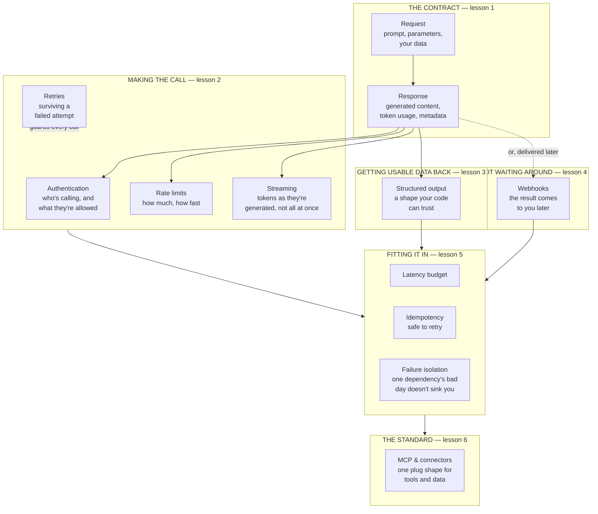

# APIs & integrations for the product leader

*Part of the [Generative AI family](../GENERATIVE_AI_ROADMAP.md).*

A model on its own does nothing for your product until something connects it to the rest
of your system. That connection is an API call: a request sent, a response returned, over
and over, millions of times a day in a real product. Everything that makes an AI feature
feel solid instead of flaky — it doesn't time out, it doesn't double-charge a customer, it
degrades gracefully when a vendor has a bad day — lives in how that connection is built.
Most of this is not exotic AI engineering. It is the same integration discipline that has
always separated a reliable product from a fragile one, applied to a new, less predictable
kind of dependency.

This module teaches that discipline at the altitude a product leader needs: what the
request-and-response contract with a model actually looks like, the practical mechanics of
calling one (authentication, rate limits, streaming, retries), how to get data back in a
shape your systems can trust, how to receive results without your product sitting and
waiting, how to fit an AI call into a system that already exists, and how the emerging
standard for connecting models to tools and data actually works. It hands off early and
often to the deeper spokes elsewhere in this curriculum, because most of the mechanics
here are not new — they're the API and integration craft your engineering team already
knows, meeting a genuinely new kind of dependency.

## The knowledge graph

An API call to a model is a contract, wrapped in the ordinary discipline of building
reliable systems. Every lesson in this module hangs off this picture:

Read it in three passes. **The contract**: every call is a request in, a response out, and
that shape is the foundation everything else builds on. **Making the call work in
practice**: authentication, rate limits, streaming, and retries are the ordinary mechanics
of any production API call, now applied to a dependency that is slower and less
predictable than most. **Fitting it into a real system**: structured output, async
delivery, latency budgets, and failure isolation are what turn "we can call a model" into
"our product can depend on calling a model" — and the emerging MCP standard is changing how
much of that plumbing you have to build yourself.

## The lessons

- [**The request/response contract**](./the-request-response-contract.md) — what a call to
  a model actually sends and returns, and why that shape is a contract like any other.
- [**Calling an LLM API**](./calling-an-llm-api.md) — authentication, rate limits,
  streaming, and retries: the mechanics of a call that actually works in production.
- [**Structured output & JSON mode**](./structured-output-and-json-mode.md) — getting data
  back in a shape your systems can trust, without re-deriving the whole topic here.
- [**Webhooks & async patterns**](./webhooks-and-async-patterns.md) — receiving a result
  without your product sitting and waiting for it.
- [**Integrating into existing systems**](./integrating-into-existing-systems.md) —
  latency budgets, idempotency, and keeping one dependency's bad day from sinking the rest
  of your product.
- [**MCP & standard connectors**](./mcp-and-standard-connectors.md) — the emerging
  standard for plugging tools and data into a model, and what it means for your
  integration strategy.

Each lesson pairs the mechanics with a **🎯 For the product leader** briefing — why it
matters, the decision it changes, the question to ask your team, and the risk if ignored —
plus a diagram. Where a lesson touches deeper mechanics already covered elsewhere, it links
out: to [APIs & contracts](../technical-product-sense/apis-and-contracts.md) for the
general discipline, [Structured output](../content/02-reliable-outputs/structured-output.md)
and [Function calling](../content/02-reliable-outputs/function-calling.md) for the
reliability engineering, and [Tools & function calling](../agentic-ai/tools-and-function-calling.md)
for MCP inside an agent's loop.

**📌 Close out the module:** [Recap & real-world examples](./recap.md).
