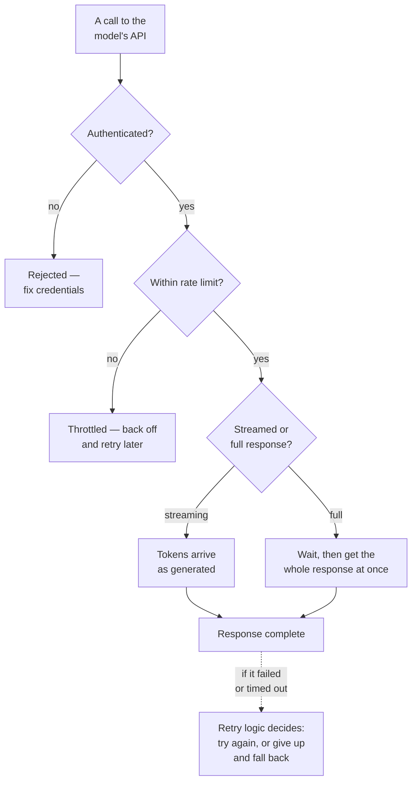

# Calling an LLM API

*Part of [APIs & integrations for the product leader](./README.md)*

## TL;DR

Four mechanics decide whether calling a model's API works reliably in production, and
none of them are exotic — they're the same practical concerns behind any external API call,
now applied to a dependency that is slower and pricier per call than most.
**Authentication** proves who's calling and controls what they're allowed to spend.
**Rate limits** cap how much you can call, and how fast, which a high-traffic product will
hit sooner than a team expects. **Streaming** lets you show tokens as they're generated
instead of making a user stare at a blank screen until the whole response is ready.
**Retries** decide what happens when a call fails or times out, which happens more often
with a model than with most APIs a team is used to. Get these four right and an AI feature
feels solid under real traffic. Get them wrong, and a feature that worked perfectly in a
demo starts failing, timing out, or running up an unexpected bill the moment real users
show up.

> 🎯 **For the product leader**
>
> **Why it matters** — These four mechanics are where a demo and a production feature
> diverge. A demo makes one call, from one place, with nobody watching the clock or the
> bill. A production feature makes thousands of concurrent calls, some of which will fail,
> some of which need to feel instant.
>
> **What it changes in your decisions** — You ask about rate limits, streaming, and retry
> behavior at design time, not after the first outage — the same way you'd ask about them
> for any other critical external dependency.
>
> **Ask yourself** — *"If our model provider had a slow, degraded hour tomorrow, what would
> our users actually experience?"*
>
> **Risk if ignored** — A feature that worked flawlessly in every internal demo hits real
> traffic, gets rate-limited, and either fails visibly or, worse, silently serves broken
> responses nobody notices until a customer complains.

## The mental model: four things any serious integration needs

None of these four ideas are unique to AI. They're the standard checklist for any
external dependency your product leans on — a payment processor, a shipping-rate API, a
weather service. What's different is how often you'll hit each one, because a model call
is slower and more variable than most APIs a team has integrated before.

## Authentication: proving who's calling, and what they're allowed to spend

A model API call carries credentials, the same as any authenticated API. What's worth a
product leader's specific attention is the spending control that usually rides alongside
authentication: most vendors let you set usage caps or budgets per credential, so a bug or
a runaway loop can't silently spend an unbounded amount before anyone notices. Treat that
cap as a real safety control to configure deliberately, not a default to leave untouched.

## Rate limits: how much, how fast

A rate limit caps how many requests, or how many tokens, you can send in a given window of
time. Every vendor has one, and a product growing faster than expected will hit it sooner
than the team planned for. Two practical consequences follow. First, a feature's expected
traffic should be checked against the vendor's limits before launch, not discovered at
launch. Second, when a limit is hit, the response is usually a specific, recognizable
error — and a product that doesn't handle that error gracefully will show a broken
experience to users during exactly the moments of highest demand, which is the worst time
for it to happen.

## Streaming: showing tokens as they're generated

Because a model writes its answer one token at a time, an API can either wait for the whole
answer and send it all at once, or **stream** it — sending each token to your product the
moment it's generated, so a user sees the answer appear progressively instead of staring at
a blank screen. For any interactive feature where a user is watching and waiting, streaming
is close to a required choice, not a nice-to-have: the perceived wait for the first
token arriving is far shorter than the wait for the entire response, even when the total
generation time is the same. For a background job with no one watching, the simpler
full-response call is usually the better engineering choice.

## Retries: surviving a call that fails

A model call fails or times out more often than most APIs a team is used to working with,
simply because generating a response is slower and more variable work than a typical
database lookup. A retry policy decides what happens next: try again immediately, wait and
try again, or give up and show a fallback. Two things make retries safe rather than
dangerous. **Backing off between attempts** — waiting a little longer each time, rather
than hammering a struggling service immediately — gives the underlying issue a chance to
clear instead of making it worse. **Making the retried action safe to repeat** — covered in
depth in the next lesson under idempotency — matters especially when the call being retried
might otherwise trigger a real-world action twice.

## Failure modes

- **No spending cap configured** — leaving a credential's usage limit unset, so a bug or a
  loop can run up an unbounded bill before anyone notices.
- **Discovering the rate limit at launch** — never checking expected traffic against
  vendor limits beforehand, so the first real traffic spike is also the first time the
  limit gets hit.
- **No streaming on an interactive feature** — making a chat-style feature wait for a full
  response, producing a blank-screen delay a streamed version would have avoided.
- **Retrying without backoff or a safe-to-repeat action** — hammering a struggling service
  immediately, or retrying an action that isn't safe to run twice.

## Practitioner checklist

- [ ] Is a spending cap configured on our model API credentials, not left at an unbounded
      default?
- [ ] Have we checked our expected traffic against the vendor's rate limits before launch?
- [ ] Does our interactive, user-facing feature stream its response, rather than making
      users wait for the whole thing?
- [ ] Does our retry logic back off between attempts, and only retry actions that are safe
      to repeat?

## Related lessons

- [The request/response contract](./the-request-response-contract.md) — what's actually
  inside the call this lesson covers making reliably.
- [Integrating into existing systems](./integrating-into-existing-systems.md) — idempotency
  and failure isolation, in full.
- [Cost attribution](../content/04-evals-observability/cost-attribution.md) — turning
  usage data into a tracked, attributed cost.
