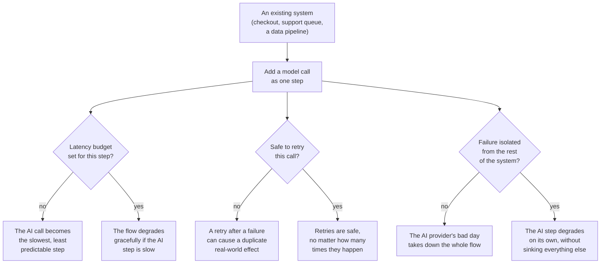

# Integrating into existing systems

*Part of [APIs & integrations for the product leader](./README.md)*

## TL;DR

An AI call rarely lives alone. It sits inside an existing system — a checkout flow, a
support queue, a data pipeline — that had its own latency expectations, its own way of
handling failure, and its own assumptions long before a model was added to it. Fitting a
model call into that system well comes down to three disciplines. **Latency budgeting**
means deciding, in advance, how much of the overall response time an AI call is allowed to
consume, because a model call is typically the slowest single step in any flow it joins.
**Idempotency** means designing so that retrying a call — which will happen, because calls
fail — never causes a duplicate real-world effect, like charging a customer twice.
**Failure isolation** means containing a model provider's bad day so it degrades one
feature, not your whole product. None of these three ideas are unique to AI. They are the
same integration discipline that has always separated resilient systems from fragile ones,
now applied to a dependency that fails more often and takes longer than most of what a
team is used to integrating.

> 🎯 **For the product leader**
>
> **Why it matters** — An AI feature that works perfectly in isolation can still make the
> whole product feel worse, if it's the slowest step in a critical flow, or if its failures
> aren't contained, or if a retried call quietly does something twice.
>
> **What it changes in your decisions** — You review a new AI integration the way you'd
> review any new critical dependency: what's its latency budget, what happens on its
> failure, and is retrying it safe.
>
> **Ask yourself** — *"If our model provider went down for ten minutes right now, what
> exactly would our users experience?"*
>
> **Risk if ignored** — A single AI feature's slowness or downtime degrades an entire
> critical flow — checkout, sign-up, support — because nobody isolated its failure from the
> rest of the system.

## The mental model: a new employee joining an existing team

Adding a model call to an existing system is like adding a new employee to a team that
already has a workflow. The team needs to know how long to expect the new person's part of
the work to take (latency budget), what to do if that person is unavailable one day
(failure isolation), and to make sure asking them twice by mistake doesn't cause a problem
(idempotency). A new team member who ignores all three, however talented, makes the whole
team slower and more fragile, not just their own piece of the work.

## Latency budgeting: deciding how much time is allowed

Every flow a user experiences has an implicit or explicit expectation for how long it
should take. Adding a model call — one of the slower, more variable steps you can add to
any flow — without deciding its share of that budget in advance means discovering the
problem only when a real, slow response makes the whole flow feel broken. The practical
fix is to set an explicit timeout for the AI step, decide what the flow does if that
timeout is hit — a fallback response, a "still working" state, a graceful skip — and test
that fallback deliberately, not just hope it's never needed.

## Idempotency: making a retry safe

Because model calls fail and time out more often than most APIs, retries are not an edge
case — they are a routine, expected part of using this dependency. If a retried call can
trigger a real-world action — sending an email, charging a card, creating a database
record — a naive retry after an ambiguous failure (did it work before it failed, or not?)
can cause that action to happen twice. Idempotency solves this by designing the action so
that repeating it, deliberately or accidentally, has the same effect as doing it once —
often through an idempotency key that lets the receiving system recognize and ignore a
repeat. The mechanics of this pattern are developed in full in
[Function calling](../content/02-reliable-outputs/function-calling.md), and it deserves
the same care here: any AI-driven action with a real-world side effect needs this design
from the start, not as an afterthought once a duplicate has already happened.

## Failure isolation: containing a bad day

A model provider will, at some point, have a slow or degraded period — every external
dependency does. The question is whether that shows up as one feature quietly degrading, or
as your entire product breaking. Isolation techniques that make the difference: a
**circuit breaker** that stops sending requests to a failing dependency for a while instead
of piling up failed calls; a **fallback path** — a simpler, non-AI version of the feature,
or a clear "try again shortly" message — that keeps the surrounding flow usable; and
keeping the AI call **out of the critical path** wherever the feature allows it, so its
failure is a degraded experience, not a blocked one.

## Failure modes

- **No latency budget** — an AI call with no timeout, allowed to make an entire flow wait
  as long as it takes, however long that turns out to be.
- **A retry that isn't safe** — retrying a failed call that has a real-world side effect,
  and occasionally causing that effect to happen twice.
- **No failure isolation** — a model provider's outage cascading into a full outage of a
  critical flow, because the AI call sat directly in that flow's critical path with no
  fallback.
- **Untested fallback behavior** — a fallback path exists in the code but has never
  actually been exercised, and fails in its own way the first time it's needed for real.

## Practitioner checklist

- [ ] Does every AI call in a user-facing flow have an explicit timeout and a defined
      fallback for when it's hit?
- [ ] Is every AI-driven action with a real-world side effect designed to be safe to retry?
- [ ] Do we have a circuit breaker or equivalent, so a struggling provider degrades one
      feature instead of the whole product?
- [ ] Have we actually tested our fallback path, rather than just writing it and hoping
      it's never needed?

## Related lessons

- [Calling an LLM API](./calling-an-llm-api.md) — retries and rate limits, the mechanics
  that make this discipline necessary.
- [Function calling](../content/02-reliable-outputs/function-calling.md) — idempotency,
  in full mechanical depth.
- [Reliability & failure](../technical-product-sense/reliability-and-failure.md) — the
  broader systems-reliability instincts this lesson applies to AI specifically.
