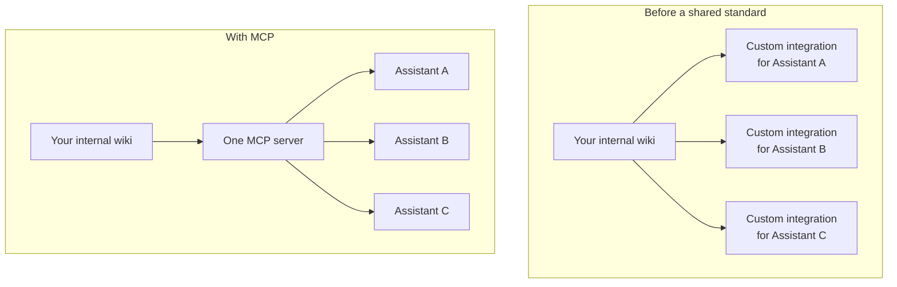

# MCP & standard connectors

*Part of [APIs & integrations for the product leader](./README.md)*

## TL;DR

Before a common standard existed, every product that wanted to connect a model to a tool
or a data source built that connection its own way — a bespoke integration for every
combination of assistant and system. The **Model Context Protocol (MCP)** changes that: it
is a common plug shape, so a tool or data source built once as an MCP server can be used by
any MCP-compatible assistant, without a custom integration for each one. For a product
leader, the strategic question this raises is not "how does MCP work internally" —
that mechanical depth, especially inside an agent's own loop, is covered in
[Tools & function calling](../agentic-ai/tools-and-function-calling.md) — it's "does
building on this standard now save us real integration work later, or add a dependency on
something still settling." This lesson stays at that altitude: what the standard is for,
what it changes about your integration strategy, and how to decide when adopting it is
worth it.

> 🎯 **For the product leader**
>
> **Why it matters** — Every internal system your company might connect to an AI assistant
> — a CRM, an internal wiki, a ticketing system — is a potential integration. A standard
> that lets you build that connection once and have it work with multiple AI products
> changes the economics of doing that work at all.
>
> **What it changes in your decisions** — You evaluate a new internal AI integration by
> asking whether building it as a standard connector, reusable across tools, is worth the
> small extra effort over a one-off, single-purpose integration.
>
> **Ask yourself** — *"If we build this integration as a one-off today, how much of that
> work would we have to redo for the next AI tool that wants the same access?"*
>
> **Risk if ignored** — A company builds five different bespoke integrations to the same
> internal system for five different AI tools, redoing the same work five times because
> nobody adopted the standard that would have let them build it once.

## The mental model: a universal plug instead of a different adapter for everything

Before a shared standard, connecting a device to power meant a different plug for every
country, every manufacturer sometimes inventing its own. A universal plug standard means
building a device once and having it work everywhere that standard is adopted. MCP is that
idea, applied to connecting tools and data sources to AI assistants: build the connector
once, as an MCP server, and any MCP-compatible client can use it.

## What actually changes for a company adopting it

Two things shift once a company builds on the standard instead of bespoke integrations.
**Integration work amortizes.** A connector to an internal system, built once as an MCP
server, is reusable across every current and future AI tool that speaks the standard,
instead of being redone for each one. **Vendor lock-in loosens.** Because the connection
point is standardized, swapping which AI assistant sits on the other end of it becomes a
smaller project than it would be with a bespoke integration wired specifically to one
vendor's format.

## When adopting it is worth it, and when it isn't

Building a standard connector costs a small amount of extra discipline over the fastest
possible one-off integration — designing it to be genuinely reusable, not just functional
for the one case in front of you. That extra effort is worth it when a system is likely to
be connected to more than one AI tool, now or later, or when avoiding vendor lock-in
matters for that system specifically. It's less clearly worth it for a genuinely one-off,
throwaway integration that will never be reused. The standard is still maturing, so this is
also a judgment call about how much you want to build on infrastructure that is real and
adopted, but still evolving.

## Where the deeper mechanics live

The actual mechanics of how an agent uses tools connected through MCP — the protocol
details, sandboxing, permissions, and the craft of designing a good tool for a model to
call — are covered in full in [Tools & function calling](../agentic-ai/tools-and-function-calling.md).
This lesson's job was the integration-strategy question above it: whether and when the
standard is worth building on for your company's specific systems.

## Failure modes

- **Rebuilding the same integration repeatedly** — connecting the same internal system to
  each new AI tool with a fresh, bespoke integration, when a standard connector would have
  been reusable.
- **Over-engineering a genuine one-off** — spending the extra effort to build a reusable
  standard connector for a system that will realistically only ever connect to one tool.
- **Treating the standard as fully settled** — building critical infrastructure on it
  without accounting for the fact that a still-maturing standard can change.
- **Confusing the strategic question with the mechanical one** — spending a leadership
  conversation on protocol internals that belong to the engineering team, instead of on
  the integration-economics question that's actually a product decision.

## Practitioner checklist

- [ ] For each internal system we're considering connecting to an AI tool, is it likely to
      need connecting to more than one tool, now or later?
- [ ] Have we weighed the extra effort of a reusable connector against the cost of
      rebuilding a bespoke integration for each future tool?
- [ ] Are we tracking how the standard is evolving, if we're building on it for something
      important?
- [ ] Is this decision framed as an integration-economics question for product, not just
      a protocol question for engineering?

## Related lessons

- [Tools & function calling](../agentic-ai/tools-and-function-calling.md) — the mechanical
  depth: protocol details, sandboxing, and tool design.
- [Integrating into existing systems](./integrating-into-existing-systems.md) — the
  reliability discipline any connector, standard or bespoke, still needs.
- [The economics of infrastructure](../technical-product-sense/economics-of-infrastructure.md)
  — the build-vs-reuse instincts behind this lesson's decision.
