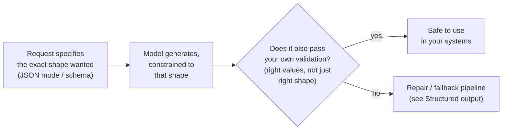

# Structured output & JSON mode

*Part of [APIs & integrations for the product leader](./README.md)*

## TL;DR

A model's natural output is free-form text, but most of what your systems do with that
output needs a strict, predictable shape — a JSON object with specific fields, not a
paragraph a program has to guess at. Many model APIs now offer this directly as a request
feature, often called **JSON mode** or **schema-constrained generation**: you describe the
exact shape you want, and the API constrains generation so the response reliably matches
it, instead of hoping a plain-text instruction like "please respond in JSON" gets followed
every time. This is a genuine, useful mechanism, and it is only the first layer of a
reliable pipeline, not the whole thing — a constrained response can still fail validation,
and your system still needs a plan for what happens then. This lesson covers the request-level
mechanism specifically; the full reliability pipeline built around it — validation, repair,
and fallback — is developed in depth in [Structured output](../content/02-reliable-outputs/structured-output.md)
and is worth reading in full before you ship anything that depends on this working every
time.

> 🎯 **For the product leader**
>
> **Why it matters** — "The API has a JSON mode" sounds like the reliability problem is
> solved. It solves the easy part — constraining generation — and leaves the harder part —
> what happens on the rare time it still doesn't match — as work your team still has to do.
>
> **What it changes in your decisions** — You ask not just "can the API return JSON" but
> "what does our system do on the response that technically parses but has the wrong
> values, or fails our own validation."
>
> **Ask yourself** — *"If a structured response from the model was syntactically valid JSON
> but semantically wrong — right shape, wrong values — would anything catch it before it
> reached our business logic?"*
>
> **Risk if ignored** — A team ships a feature trusting "JSON mode" alone, and discovers in
> production that valid JSON with a wrong or missing value broke a downstream system just
> as badly as malformed text would have.

## The mental model: a form with the format enforced, not the answers checked

Schema-constrained generation is like handing someone a form with the fields already
printed — name here, date here, amount here — instead of a blank sheet of paper. It
dramatically raises the odds the response comes back in the right shape. It does not check
whether the person filled in a sensible name, a real date, or a plausible amount. The form's
structure is enforced; the content inside it still needs to be checked separately.

## What the API-level mechanism actually buys you

Before schema-constrained generation was common, getting structured output meant asking
in plain language for JSON and hoping — a model might add an explanatory sentence before
the JSON, use the wrong field names, or produce syntax a parser would reject. The API-level
mechanism removes most of that specific failure: the response is far more reliably
syntactically valid JSON matching the fields you specified. That is a real, meaningful
improvement, and it is worth using whenever your API supports it, rather than relying on
plain-language instruction alone.

## What it doesn't buy you

Syntactic validity is not semantic correctness. A response can be perfectly valid JSON,
with exactly the fields you asked for, and still have a wrong date, a hallucinated field
value, or a number that doesn't add up. Schema-constrained generation has no way to check
any of that — it constrains the shape, not the truth of what fills it. This is precisely
why the deeper pipeline exists: validating the actual values, repairing a response that
fails validation by feeding the specific error back to the model, and falling back to a
safer default when repair doesn't work either. That full discipline, and the reasoning
behind each step, is the subject of [Structured output](../content/02-reliable-outputs/structured-output.md).

## When to reach for it

Reach for schema-constrained generation whenever a model's response feeds directly into
code — populating a database record, triggering a downstream API call, filling a form.
Skip it for genuinely free-form output meant for a human reader, like a chat reply or a
long-form summary, where forcing an artificial structure adds constraint without adding
value.

## Failure modes

- **Trusting the shape as proof of correctness** — treating "it's valid JSON" as
  equivalent to "it's correct," and skipping value-level validation entirely.
- **Forcing structure on free-form content** — applying a rigid schema to output meant to
  be read naturally by a person, making it stiffer for no real benefit.
- **No plan for the failure case** — using JSON mode with no repair or fallback path for
  the rare response that still doesn't validate.
- **Assuming every API offers the same mechanism the same way** — different vendors
  implement schema constraints differently; assuming a technique from one API works
  identically on another without checking.

## Practitioner checklist

- [ ] For any response feeding directly into code, are we using schema-constrained
      generation rather than a plain-language instruction alone?
- [ ] Do we validate the actual values in a structured response, not just its syntactic
      shape?
- [ ] Do we have a repair or fallback path for a response that fails validation?
- [ ] Have we reserved free-form output for genuinely free-form, human-facing content?

## Related lessons

- [Structured output](../content/02-reliable-outputs/structured-output.md) — the full
  validate-repair-fallback pipeline this lesson's mechanism feeds into.
- [The request/response contract](./the-request-response-contract.md) — where a schema
  parameter fits inside a request.
- [Function calling](../content/02-reliable-outputs/function-calling.md) — structured
  output used specifically to trigger a tool call.
