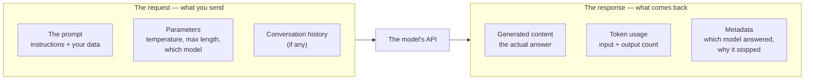

# The request/response contract

*Part of [APIs & integrations for the product leader](./README.md)*

## TL;DR

Every call to a model follows the same basic shape: you send a **request** — the prompt,
some parameters, sometimes your own data — and you get back a **response** — the
generated content, plus metadata like how many tokens it used. That shape is a **contract**:
a promise about what one side sends and what the other side returns, the same idea behind
any API your engineering team has ever integrated with. What makes a model's version of
this contract distinctive is what sits inside it. The request carries a prompt whose
wording changes the outcome, not just a fixed set of parameters. The response is
generated, not retrieved, so its content varies in ways an ordinary database lookup never
would. Understanding the contract's exact shape is the first, cheapest thing a product
leader can do to stop treating an AI feature's engineering as invisible — because
everything downstream, cost, latency, and reliability, is a consequence of what's actually
inside that one request and that one response.

> 🎯 **For the product leader**
>
> **Why it matters** — "We call the model's API" hides a real, structured exchange with
> parts a product leader should be able to name: what goes in, what comes back, and what
> each part costs or risks.
>
> **What it changes in your decisions** — You can read an API's documentation well enough
> to ask a sharp question — "what happens if we omit this parameter," "what's actually in
> the response object" — instead of treating the integration as entirely opaque to you.
>
> **Ask yourself** — *"Could I sketch, on a whiteboard, what our product actually sends to
> the model and what it gets back?"*
>
> **Risk if ignored** — A team makes a scoping or cost decision without knowing that a
> parameter they never touch is quietly shaping the response, or that the response carries
> usage data that should be feeding their cost tracking and isn't.

## The mental model: an order form and a receipt

A request is an order form: what you're asking for, filled out in a specific format the
other side expects. A response is the receipt: what you got, plus a record of what it cost.
An API contract is the agreement about exactly what fields that order form has, and exactly
what the receipt will contain — so both sides can build around it reliably.

## What's inside the request

- **The prompt.** Everything covered in the [LLMs module](../llms/README.md) about tokens
  and prompting lives here — this is the part of the request that most directly shapes
  quality, and it's text you control completely.
- **Parameters.** Settings like [temperature](../llms/temperature-sampling-and-determinism.md),
  a maximum response length, and which specific model answers the request. These are
  ordinary structured fields, the same kind you'd find in any API request.
- **History, if any.** A multi-turn conversation sends the prior turns back with every new
  request, because the model itself remembers nothing between calls — a direct
  consequence of [how inference works](../llms/what-is-an-llm.md).

## What's inside the response

- **The generated content.** The actual text, image, or other output the model produced.
- **Token usage.** How many tokens the request used and how many the response used — the
  raw numbers your [cost tracking](../content/04-evals-observability/cost-attribution.md)
  should be built on, not an afterthought.
- **Metadata.** Which exact model version answered, and often a field explaining why
  generation stopped — it finished naturally, it hit a length limit, or it was cut off by
  a safety filter. This last field is worth watching: a response silently truncated by a
  length limit looks, at a glance, like a complete answer.

## Why this is a contract, not just a format

Calling it a contract, not just a data format, matters because contracts have the
properties a product leader already reasons about in other systems: they can be
**versioned** (a vendor changes the shape of the response over time, and your integration
has to handle that), they can **break** (a field renamed or removed stops your code
working, the same as any API), and they carry **implicit promises** about what's guaranteed
and what isn't. The full discipline of thinking about contracts this way — versioning,
breaking changes, what a promise actually covers — is developed in
[APIs & contracts](../technical-product-sense/apis-and-contracts.md), and it applies to a
model's API exactly the way it applies to any other one your product depends on.

## Failure modes

- **Treating the response as a black box** — never looking at what fields actually come
  back, and missing that usage or stop-reason data was available all along.
- **Ignoring the stop-reason field** — displaying a truncated response as if it were
  complete, because nobody checked why generation actually stopped.
- **No plan for a contract change** — a vendor updates the response shape and the
  integration breaks in production, because nobody treated the contract as something that
  could change.
- **Confusing the prompt with a fixed parameter** — treating prompt wording as a one-time
  setting instead of the part of the request that most directly and continuously shapes
  quality.

## Practitioner checklist

- [ ] Can I describe what our product actually sends in a request, and what comes back in
      the response?
- [ ] Is our cost tracking built on the token-usage data the response already provides?
- [ ] Do we check the stop-reason field, so a truncated response isn't displayed as
      complete?
- [ ] Do we have a plan — a version pin, a monitoring alert — for when a vendor changes the
      contract's shape?

## Related lessons

- [APIs & contracts](../technical-product-sense/apis-and-contracts.md) — the general
  discipline of contracts, versioning, and breaking changes.
- [Calling an LLM API](./calling-an-llm-api.md) — the practical mechanics of making this
  call work in production.
- [What an LLM actually is](../llms/what-is-an-llm.md) — why the model itself remembers
  nothing between requests.
