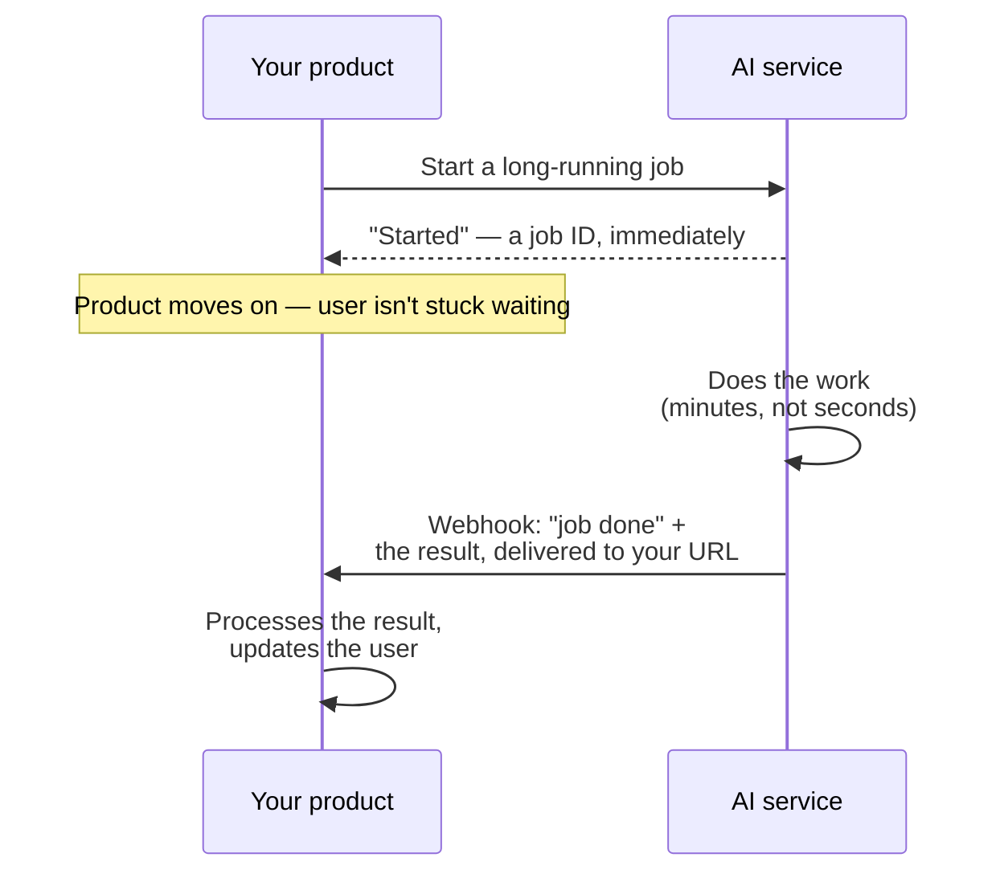

# Webhooks & async patterns

*Part of [APIs & integrations for the product leader](./README.md)*

## TL;DR

Not every AI task fits inside the time a user is willing to wait on a screen. Generating a
long report, processing a large batch of documents, or running a multi-step agent can take
far longer than a single request-response call is meant to hold open. The answer is to stop
waiting: kick off the work, let your product move on, and get notified when the result is
ready. A **webhook** is the most common way that notification arrives — instead of you
repeatedly asking "is it done yet," the other side calls a URL you provide the moment it
is. This is **asynchronous**, or async, work: the request that starts a job and the
response that delivers its result are two separate events, not one connected call. Getting
this pattern right changes what your product can promise. Getting it wrong produces
features that either time out on slow work or force a user to sit staring at a spinner far
longer than any interface should ask of them.

> 🎯 **For the product leader**
>
> **Why it matters** — Some of the most valuable AI features — a thorough research report,
> a batch of processed documents, a long agent run — take minutes, not seconds. A product
> built only around synchronous, wait-for-it calls simply cannot offer these without either
> a broken timeout or an unacceptably long, blocking wait.
>
> **What it changes in your decisions** — You design the user experience around "start now,
> notify later" for long-running work from the outset, instead of discovering the timeout
> problem after building a synchronous version first.
>
> **Ask yourself** — *"For each AI feature we're planning, is the work fast enough for a
> user to wait on, or does it need a start-now-notify-later design instead?"*
>
> **Risk if ignored** — A promising feature ships as a sluggish, timeout-prone
> synchronous call because nobody planned for the async pattern the underlying work
> actually needed.

## The mental model: ordering food versus a drive-through window

A synchronous call is a drive-through window: you ask, you wait right there, you get your
food before you drive off. It only works when the wait is short. An async pattern is more
like ordering food for delivery: you place the order and go about your day, and the
delivery — the webhook — arrives on its own schedule, with the result.

## The two common shapes

- **Webhooks.** You register a URL in advance; the other side calls it when the job
  finishes, pushing the result to you. This is the more efficient pattern — no wasted
  calls asking "is it done yet" — and it's the shape most modern async AI services default
  to.
- **Polling.** Your product periodically asks "is it done yet," instead of waiting to be
  told. It's simpler to build, especially when you don't control a public URL a webhook
  could reach, but it's less efficient and adds a delay between the job finishing and your
  product noticing.

Both are valid, and the right choice often comes down to what's practical for your
infrastructure — a public endpoint that can receive a webhook, or a background process
that can poll on a schedule.

## What makes a webhook design actually reliable

A webhook is, from your product's point of view, an unplanned inbound request that can
arrive at any time — which means it needs the same care as any other public endpoint.
**Verify it's genuine.** A webhook payload should carry a way to confirm it actually came
from the service you expect, not from someone who guessed or found your URL. **Expect
duplicates.** Networks retry; the same webhook can arrive more than once, so processing it
needs to be safe to run twice — the same [idempotency](./integrating-into-existing-systems.md)
discipline that matters everywhere else in this module. **Respond fast, then process.** A
webhook receiver should acknowledge receipt quickly and do the real work afterward, rather
than making the sender wait on your processing before it considers the delivery successful.
**Have a fallback if delivery fails.** A webhook can fail to arrive — your endpoint was
briefly down, a network hiccup dropped it — so a long-running job also needs a way to check
status directly, as a backstop when the notification itself doesn't show up.

## Designing the user experience around it

Async work changes what a product shows a user, not just what it does behind the scenes. A
user starting a long job needs to see that it started, some sense of progress or an honest
estimate of how long it will take, and a clear signal when it's done — through a
notification, an updated screen, or an email, depending on the product. Treating a
long-running AI task as if it were instant, with no acknowledgment that it's running at
all, is a common and avoidable source of a product feeling broken when it's actually just
working.

## Failure modes

- **Forcing a long task through a synchronous call** — building a feature on a
  request-response pattern that times out or blocks for minutes, when the underlying work
  was never going to be fast.
- **An unverified webhook endpoint** — accepting any request to your webhook URL as
  genuine, with no way to confirm it actually came from your service provider.
- **Processing not safe to repeat** — a webhook arrives twice, due to an ordinary network
  retry, and the duplicate delivery causes a duplicate action in your system.
- **No fallback for a missed webhook** — a notification silently fails to arrive, and
  nothing in your system ever notices the job actually finished.
- **No user feedback during the wait** — leaving a user with no indication a long job is in
  progress, so they assume the feature is broken and abandon it.

## Practitioner checklist

- [ ] For each AI feature, have we matched the pattern — synchronous or async — to how long
      the underlying work actually takes?
- [ ] Do we verify that an incoming webhook genuinely came from our service provider?
- [ ] Is our webhook processing safe to run twice, in case of a duplicate delivery?
- [ ] Do we have a status-check fallback for the case where a webhook notification never
      arrives?
- [ ] Does the user experience acknowledge a long-running job is in progress, rather than
      leaving the user guessing?

## Related lessons

- [Calling an LLM API](./calling-an-llm-api.md) — the synchronous call this pattern is an
  alternative to, for work that doesn't fit inside it.
- [Integrating into existing systems](./integrating-into-existing-systems.md) — idempotency
  and failure isolation, which webhook processing depends on directly.
- [Agentic workflows](../agentic-ai/README.md) — long-running, multi-step work that often
  needs exactly this pattern.
