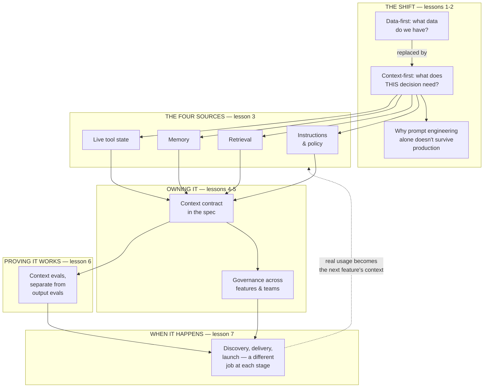

# Context engineering for the product leader

For a decade, the default product question was "what data do we have?" AI features break
that pattern: the model already has access to more raw text than any team could ever
read manually, and it still gets decisions wrong. What it lacked was never data. It was
the right slice of it, assembled for the moment — instructions, retrieved facts, memory
of what happened before, live state from tools. **Context engineering** is the
discipline of deciding what a model sees at the instant it has to act. Get it right, and
an AI feature reasons over grounded, current, relevant information. Get it wrong, and the
same feature reasons fluently over nothing in particular — and the failure reads as "the
model is bad" when the model never had a chance.

**A note on scope.** This curriculum already covers context in real engineering depth:
[Context engineering](../content/00-foundations/context-engineering.md) (the context
window as a scarce, ordered resource) and [Context & memory](../agentic-ai/context-and-memory.md)
(an agent's working-memory hierarchy). [Memory & context](../memory-and-context/README.md)
covers memory specifically as a product-trust decision. This module is the layer above
all three: the strategic argument for context engineering as a product leader's
discipline, how to spec it, audit it, govern it at scale, and evaluate it — not the
mechanics of fitting things in a token budget, and not memory alone. Every lesson spokes
out to the deeper engineering treatment behind the mechanic it names, rather than
re-deriving it.

## The knowledge graph

Every lesson in this module hangs off one picture: the four things "context" actually
means, and where the discipline sits at each stage of a product's life.

Read it in three passes. **The shift:** the question that predicts AI-feature quality
changed from "what data do we have" to "what does this decision need," and prompt
engineering alone can't answer that question at scale. **The system:** four distinct
context sources feed every decision, each spec-able, each governable, each testable on
its own. **The loop:** real usage becomes the raw material for better context on the
next feature — the same compounding logic as any flywheel, aimed at what the model sees
rather than just what it does.

## The lessons

- [**What is context engineering, for a product leader?**](./what-is-context-engineering.md)
  — the data-first-to-context-first shift, and the four things "context" actually means.
- [**Why prompt engineering doesn't scale**](./why-prompt-engineering-doesnt-scale.md) —
  fragility, no reuse across use cases, and no memory, as a diagnostic, not a lecture.
- [**The anatomy of a context pipeline**](./the-anatomy-of-a-context-pipeline.md) —
  auditing who owns each stage, and the unowned seams where quality actually leaks.
- [**Context as a spec-able requirement**](./context-as-a-spec-able-requirement.md) — the
  context contract: what a PRD should name before an engineer has to guess.
- [**Context governance at scale**](./context-governance-at-scale.md) — keeping shared
  policy, corpora, and org memory consistent across many features and teams.
- [**Evaluating context quality**](./evaluating-context-quality.md) — grading whether the
  context was right, separately and faster than grading whether the answer was good.
- [**Context engineering across the product lifecycle**](./context-across-the-product-lifecycle.md)
  — the different job context work does at discovery, delivery, and launch.

Each lesson pairs the strategic framing with a **🎯 For the product leader** briefing —
why it matters, the decision it changes, the question to ask your team, and the risk if
ignored — plus a diagram, and spokes out to the engineering-depth lesson behind every
mechanic it names.

## Connects to other tracks

- [Context engineering (engineering depth)](../content/00-foundations/context-engineering.md)
  and [Context & memory](../agentic-ai/context-and-memory.md) — the mechanics behind
  every context source this module names.
- [Memory & context for the product leader](../memory-and-context/README.md) — the
  product-trust treatment of memory specifically, one of this module's four context types.
- [TPM for AI products](../technical-product-management/tpm-for-ai-products.md) — the
  eval-driven operating loop and data flywheel this module's context evals and lifecycle
  lesson connect to.
- [Technical sense for AI systems](../technical-product-sense/technical-sense-for-ai.md)
  — the full request pipeline this module's audit lesson is aimed at.
- [Knowledge graphs](../knowledge-graphs/README.md) — a structured, governed knowledge
  asset is one of the richest possible retrieval sources a context pipeline can draw on.

**📌 Close out the module:** [Recap & real-world examples](./recap.md).
