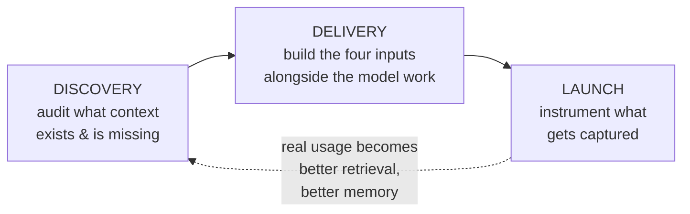

# Context engineering across the product lifecycle

*Part of [Context engineering for the product leader](./README.md)*

## TL;DR

Context work isn't a step that happens once, during implementation. It has a different
job at each stage of building an AI feature, and treating it as one undifferentiated
task — "the engineers will handle context" — is how a feature ships with the wrong
context assembled at exactly the stage where fixing it is most expensive.
**Discovery** audits what context already exists and what's missing. **Delivery** builds
the four context inputs alongside the model work, not after it. **Post-launch**, real
usage becomes the raw material that makes context better — a distinct flywheel from the
general eval-and-model flywheel covered in
[TPM for AI products](../technical-product-management/tpm-for-ai-products.md), specific
to the sources feeding the pipeline, not just the model's behavior.

> 🎯 **For the product leader**
>
> **Why it matters** — A context gap found in discovery costs a conversation. The same
> gap found after launch costs a rebuild, a user-trust incident, or both.
>
> **What it changes in your decisions** — Context work gets a line in the project plan
> at each phase — an audit task in discovery, a build task in delivery, an instrumentation
> task at launch — instead of living entirely inside "prompt engineering," done once, late.
>
> **Ask yourself** — *"Did we audit what context this feature needs before we started
> building, or did we discover the gaps while debugging after launch?"*
>
> **Risk if ignored** — A feature that's context-complete for its demo script and
> context-incomplete for the first real, messy case a user actually brings.

## The mental model: a different job at each stage

The loop closes back into discovery for the *next* feature, not the current one — real
usage tells you what context the next context contract should assume exists.

## Discovery: the context audit

Before scoping behavior, ask what context is genuinely available versus assumed to
exist: does the retrieval corpus this feature needs actually exist, indexed and current?
Is there an owner for the policy this feature needs to encode? Has anyone checked what a
competitor's equivalent feature already has access to, that yours doesn't? A discovery
spike that returns "the corpus exists but hasn't been updated in eight months" is a real
finding — cheaper to learn now than after the feature ships confidently wrong.

## Delivery: build the contract, don't discover it in code review

Once [the context contract](./context-as-a-spec-able-requirement.md) is written, delivery
work splits cleanly: retrieval and memory infrastructure often has its own timeline,
separate from prompt and model work, and frequently *longer* — a retrieval pipeline
that needs new indexing takes weeks; a prompt iteration takes an afternoon. Sequencing
the model work before the context infrastructure is ready is the single most common
reason an AI feature demos well internally and then needs a second, quieter rebuild
before it's trustworthy with real data.

## Launch: capture becomes the next feature's context

Two things worth instrumenting at launch that don't show up in a standard analytics
plan: which retrieved documents actually got used in an accepted answer (this becomes
labeled training signal for improving retrieval ranking, not just a usage log), and which
questions the pipeline had *no* good context for at all — the clearest, cheapest signal
for what to add to the corpus next. Both feed the context sources for the *next* feature
or the *next* iteration, distinct from the eval-and-model flywheel in
[TPM for AI products](../technical-product-management/tpm-for-ai-products.md): that
flywheel improves the model's behavior over time; this one improves what the model gets
shown.

## Failure modes

- **Context as an afterthought** — scoping behavior and the eval bar, then discovering
  during implementation that the retrieval corpus doesn't exist yet.
- **Sequencing risk backward** — building the prompt first and the context
  infrastructure last, so the riskiest, longest-lead-time work starts latest.
- **Capturing usage but not context gaps** — instrumenting whether users liked the
  answer, without ever logging which questions had no good context to draw on.

## Practitioner checklist

- [ ] Did discovery include an explicit audit of what context sources exist, are
      current, and have an owner — before behavior was scoped?
- [ ] Is context infrastructure (retrieval, memory) on the delivery timeline as its own
      workstream, sequenced by its own lead time — not folded silently into "the AI
      work"?
- [ ] Are we capturing which questions had no good context available, as a distinct
      signal from "did the user like the answer"?

## Related lessons

- [Context as a spec-able requirement](./context-as-a-spec-able-requirement.md)
- [TPM for AI products (the operating loop & data flywheel)](../technical-product-management/tpm-for-ai-products.md)
- [Discovery to delivery](../technical-product-management/discovery-to-delivery.md)
