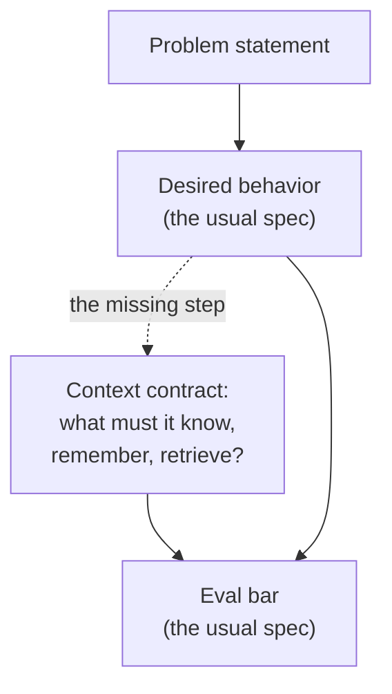

# Context as a spec-able requirement

*Part of [Context engineering for the product leader](./README.md)*

## TL;DR

A PRD for an AI feature usually specs the eval bar and forgets to spec what the model
gets to *see*. That gap is exactly why "the prompt doesn't work for this edge case" so
often lands as an engineering surprise late in a build, instead of a scoping decision
made up front. **A context contract** closes it: for every AI feature, name what the
system must know, remember, and retrieve for the feature to be trustworthy, and where
each of those comes from — the same rigor a PM already applies to acceptance criteria,
just aimed one step earlier, at what the model is shown rather than what it produces.

> 🎯 **For the product leader**
>
> **Why it matters** — Specs that jump straight from "what should it do" to "how do we
> know it's good" skip the step that actually determines both: what does it need to see?
> Skipping that step is where most AI feature timelines quietly slip.
>
> **What it changes in your decisions** — Context requirements become a section of the
> spec you write and review, not a decision an engineer makes unilaterally while
> implementing the prompt.
>
> **Ask yourself** — *"Does this feature's spec name what the model must know, remember,
> and retrieve — or does it stop at 'the AI will handle it'?"*
>
> **Risk if ignored** — A feature that demos well on the examples the spec happened to
> cover, then fails on the first real case that needed context nobody wrote down.

## The mental model: the missing layer in most AI specs

Most AI specs draw a straight line from "what it should do" to "how we'll grade it,"
skipping the layer in the middle that actually makes the other two achievable. Writing
that middle layer down is the single highest-leverage addition a PM can make to an AI
spec, because it's the layer engineering otherwise has to guess at while building.

## Writing a context contract

Add this alongside the eval thresholds in
[specs, PRDs & RFCs](../technical-product-management/specs-prds-and-rfcs.md), answering
four questions using the four context types from
[the opening lesson](./what-is-context-engineering.md):

- **Instructions & policy** — which rules, tone, and boundaries does this feature need
  encoded, and who owns updating them when policy changes?
- **Retrieval** — what knowledge must be fetched at query time, from where, and how
  fresh does it need to be? (This is a scoping question, not an implementation detail —
  see [RAG architecture](../content/03-rag/rag-architecture.md) for how it gets built.)
- **Memory** — what, if anything, must carry forward across turns or sessions, for whom?
  If the answer is "nothing," write that down too — it's a decision, not a default. (Full
  framing in [Memory & context](../memory-and-context/README.md).)
- **Live state** — what must be true *right now* for a correct answer, and which tool
  supplies it?

A feature whose spec can answer all four specifically is ready to build. A feature where
any answer is "we'll figure that out later" is the feature most likely to need a rewrite
after the first week of real usage.

## Worked example: a renewal-risk assistant

Proposal: flag accounts at risk of churning before a renewal call. A behavior-only spec
says "identify at-risk accounts and summarize why." A context contract adds the missing
layer: **instructions** — the company's definition of "at risk," reviewed by the CS
lead, not invented by whoever writes the prompt; **retrieval** — usage trends, support
ticket sentiment, and contract terms, refreshed daily, not whatever's cached from
onboarding; **memory** — the rep's own notes from the last call, carried forward per
account, visible only to that rep's team; **live state** — the current contract status
pulled from the CRM at call time, not a stale snapshot. Each answer is a build item with
an owner, discovered during scoping instead of during a support ticket six weeks after
launch.

## Failure modes

- **Behavior-only specs** — a PRD that states what the feature should do and how it's
  graded, with no section on what it's shown, leaving that decision to whoever
  implements the prompt.
- **"The AI will figure it out"** — treating context sourcing as an implementation
  detail beneath the PM's attention, then being surprised when the implementation
  guessed wrong.
- **A contract nobody revisits** — writing the context contract once at kickoff and
  never updating it as policy, data sources, or scope change underneath the feature.

## Practitioner checklist

- [ ] Does my current AI feature's spec name what it must know, remember, and retrieve —
      as its own section, not folded into "acceptance criteria"?
- [ ] For each of the four context types: is there a named owner, or does the answer
      default to "engineering decided"?
- [ ] When policy or data sources change, is there a step that updates the context
      contract, or does it silently go stale?

## Related lessons

- [What is context engineering, for a product leader?](./what-is-context-engineering.md)
- [Specs, PRDs & RFCs](../technical-product-management/specs-prds-and-rfcs.md)
- [The anatomy of a context pipeline](./the-anatomy-of-a-context-pipeline.md)
- [Evaluating context quality](./evaluating-context-quality.md)
