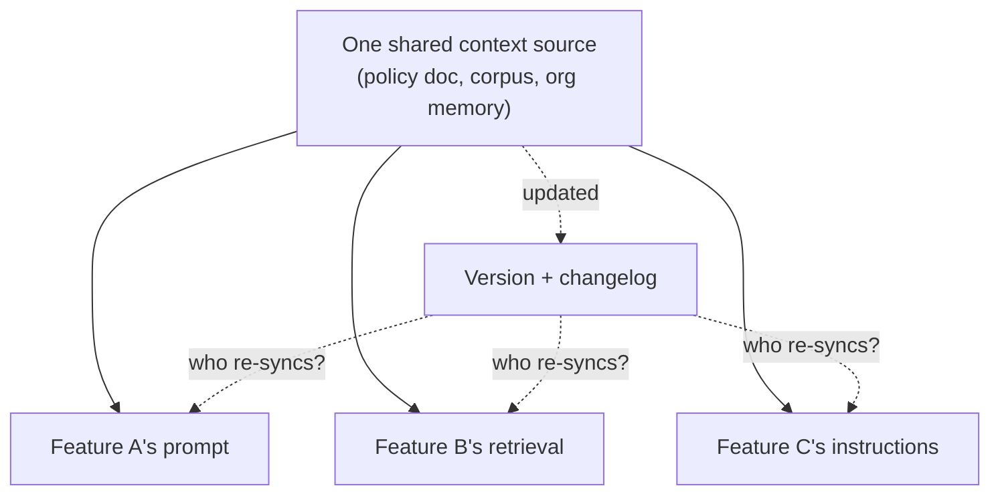

# Context governance at scale

*Part of [Context engineering for the product leader](./README.md)*

## TL;DR

One AI feature's context pipeline is a product-design problem. Twenty AI features'
context pipelines, sharing policies, retrieval corpora, and memory stores across teams,
is a governance problem — and it fails in ways a single-feature review never catches.
The same refund policy gets encoded three different ways in three different prompts. A
retrieval corpus gets updated for one feature and silently goes stale for another that
shares it. Nobody can answer, after an incident, exactly what a specific model call saw
six weeks ago. **Context governance** is the organizational layer that keeps context
consistent and auditable *across* features, not just correct *within* one.

> 🎯 **For the product leader**
>
> **Why it matters** — At small scale, context problems are a support ticket. At
> multi-team scale, an inconsistent or stale shared context source is a compliance
> exposure, a legal discovery problem, or a customer-facing contradiction between two
> different AI features.
>
> **What it changes in your decisions** — You treat shared context sources — policy
> documents, retrieval corpora, org-level memory — as owned, versioned assets with a
> single source of truth, the same way you'd govern a shared database, instead of letting
> each feature team maintain its own copy.
>
> **Ask yourself** — *"If two of our AI features gave a customer contradictory answers
> about the same policy today, could we find out why within an hour?"*
>
> **Risk if ignored** — Every team's AI feature quietly drifts from every other team's,
> until a customer notices the contradiction before anyone internally does.

## The mental model: one source, many consumers

The failure isn't the source going stale — sources always eventually change. It's that
each consumer copied the source at a different point in time, with no mechanism telling
them a newer version exists. Governance is the answer to "who re-syncs, and how do we
know when they haven't?"

## What this covers, and what it deliberately doesn't

This lesson is scoped to **shared context sources across features and teams**: policy
documents, retrieval corpora, and org-level memory stores that more than one AI feature
draws from. Two adjacent governance questions already have dedicated, deeper treatments
elsewhere, and this lesson spokes out to them rather than restating them:
**user-facing memory trust** — staleness, leakage, and the right to be forgotten for an
individual user's data — is covered in
[When memory goes wrong](../memory-and-context/when-memory-goes-wrong.md).
**Knowledge-asset governance** — provenance, permissions, and quality metrics for a
structured knowledge graph specifically — is covered in
[Governance, quality & trust](../knowledge-graphs/governance-quality-and-trust.md).

## The three governance moves that actually scale

- **A single source of truth, versioned.** Every shared policy or corpus lives in one
  place with a version and a changelog, not copy-pasted into each feature's prompt. A
  policy change becomes one edit, not a hunt across every team's codebase.
- **A registry of consumers.** For every shared source, know which features read from
  it. Without this, "we updated the refund policy" can't be followed by "so we notified
  the three features that use it" — because nobody knows there are three.
- **A staleness SLA.** Decide, per source, how old is too old — a policy doc reviewed
  quarterly, a retrieval corpus refreshed daily — and alert when a consumer falls behind
  its source's SLA, not just when the source itself goes untouched.

## Failure modes

- **Policy drift** — the same rule encoded independently in multiple features, updated
  in one and silently left stale in the others.
- **The untraceable answer** — after an incident or a compliance request, nobody can
  reconstruct what a specific past model call actually saw.
- **Governance theater** — a governance document exists, but no registry connects a
  shared source to the features that consume it, so the document can't actually be acted
  on when something changes.

## Practitioner checklist

- [ ] For each shared context source (policy, corpus, org memory): do we have a version,
      a changelog, and a list of which features consume it?
- [ ] If a shared policy changed today, is there a step that notifies every consuming
      feature, or does each team have to notice on its own?
- [ ] Could we reconstruct, for a specific past model call, exactly what context it was
      given — for an audit, an incident review, or a legal request?

## Related lessons

- [The anatomy of a context pipeline](./the-anatomy-of-a-context-pipeline.md)
- [When memory goes wrong](../memory-and-context/when-memory-goes-wrong.md)
- [Governance, quality & trust (knowledge graphs)](../knowledge-graphs/governance-quality-and-trust.md)
- [Evaluating context quality](./evaluating-context-quality.md)
